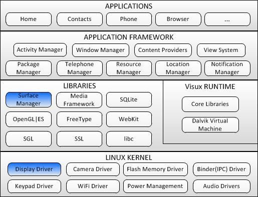
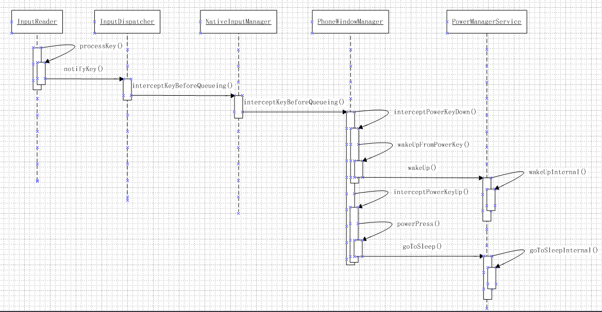
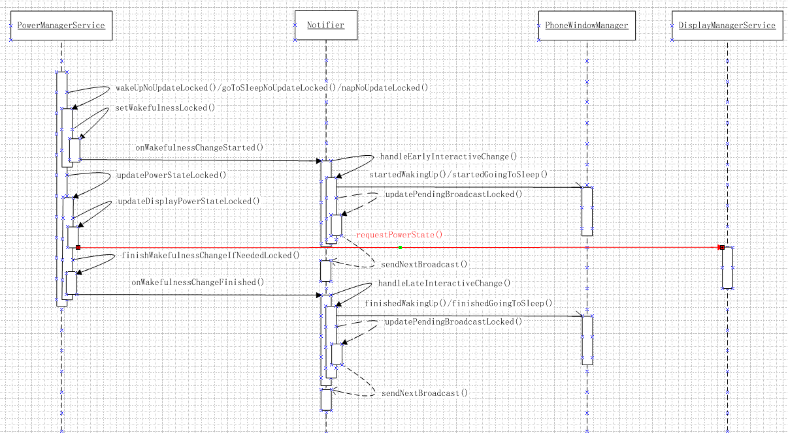
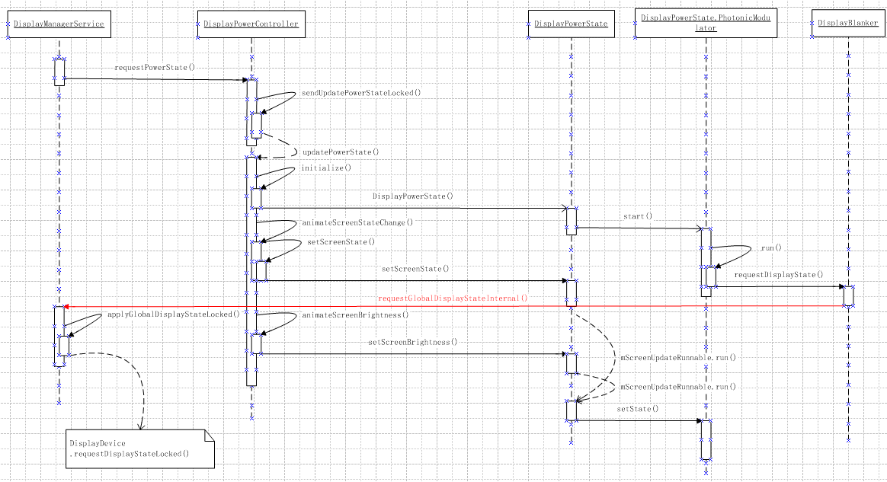

# Display Manager

## 〇、导言

Android显示(android.view.Display)相关的内容，主要内容包括：DisplayManager、Surface、SurfaceFlinger等。本文介绍DisplayManager，后续专题介绍SurfaceFlinger。

## 一、Display架构



如上图所示，与Android其他模块类似，从上到下依次为应用和框架层、支持库和虚拟机、（HAL）、内核层。

- 应用程序层（用户空间），其中包括Android应用程序以及框架和系统运行库，和底层相关的是系统运行库，而其中和显示相关的就是Android的Surface Manager, 它负责对显示子系统的管理，并且为多个应用程序提 供了2D和3D图层的无缝融合。
- 用户空间与Kernel空间交互的部分称之为*HAL - HW Abstraction Layer*。HAL其实就是用户空间的驱动程序。在display部分，HAL的实现code在copybit中，应用程序直接操作这些接口即可。
- Linux kernel，其中和显示部分相关的就是Linux的FrameBuffer，它是Linux系统中的显示部分驱动程序接口。Linux工作在保护模式下，User空间的应用程序无法直接调用显卡的驱动程序来直接画屏，FrameBuffer机制模仿显卡的功能，将显卡硬件结构抽象掉，可以通过Framebuffer的读写直接对显存进行操作。用户可以将Framebuffer看成是显示内存的一个映像，将其映射到进程地址空间之后，就可以直接进行读写操作，而写操作可以立即反应在屏幕上。这种操作是抽象的，统一的。用户不必关心物理显存的位置、换页机制等等具体细节。这些都是由Framebuffer设备驱动来完成的。
- 高通显卡的驱动程序，和高通显示部分硬件相关以及外围LCD相关的驱动都被定义在kernel中。

## 二、DisplayManager

### Display

表示一块逻辑显示设备的相关信息，显示区域可以按以下两种方式描述：
1. 应用显示区域：可能包含应用窗口的一块显示区域，因为系统需要留出空间显示系统装饰（比如状态栏），所以可能比实际的显示设备要小。
2. 实际显示区域：包含系统装饰的显示区域，但是仍然可能比实际的显示设备要小。比如Window Manager模拟了一个小的显示区域(adb shell am display-size)。

一个逻辑显示设备不一定必须是一个特定的物理显示设备，Display显示的内容会由于实际连接的显示设备和参数设置不同而显示到一个或多个物理设备上。

DisplayInfo用来表示逻辑显示设备的特性/参数。

### DisplayDevice

表示一个物理显示设备，如内置屏、外接屏或者Wifi显示屏。

DisplayDeviceInfo用来表示物理显示设备的特性/参数。

### DisplayManagerService

Display Manager管理Android设备中的显示设备(内置的、外接的、虚拟的等)。提供API给应用：查询可用显示设备的列表，查询显示设备状态，广播显示设备状态变化，创建虚拟显示设备以及Wifi Display的使用方法。

DisplayAdapter用来把Display Device暴露给系统，并且在设备连接或者断开时协助发现设备。
- LocalDisplayAdapter：用于Surface Flinger管理的显示设备（如内置屏、HDMI连接的屏）
- WifiDisplayAdapter：用于Wifi连接的显示设备
- OverlayDisplayAdapter：用于Overlay Window模拟的第二块显示屏，调试功能，可以通过开发选项打开
- VirtualDisplayAdapter：用于基于应用的虚拟显示设备

### Wifi Display

通过Wifi Direct来发现和与显示设备配对，与显示设备相连后，Media Server打开一个基于Miracast协议的RSTP连接，然后就可以开始处理显示。

com.android.server.display.WifiDisplayAdapter负责管理Media Server、Surface Flinger以及Display Manager间的连接和交互。

### DisplayPowerController

负责控制Display的电源状态。

像其他系统服务一样，DisplayManagerService也是在SystemServer启动过程中启动的startBootstrapServices()。Display的电源状态更新是由PowerManagerService间接的通过DisplayManagerInternal.requestPowerState()触发。

初始化过程：
PowerManagerService.systemReady()
->DisplayManagerInternal.initPowerManagement()
->DisplayManagerService.LocalService.initPowerManagement()
->DisplayPowerController()

状态更新过程见后面亮灭屏流程图。

## 三、亮灭屏流程(Fwk)

Power键亮灭屏的流程：
1. Power按键事件处理
   
2. PowerManagerService对屏幕状态的处理
   

   

其他情况，比如指纹亮屏或者超时灭屏，只是第一部分逻辑不同，第二部分屏幕状态处理类似。

从流程可以看到，屏幕状态更新走到后面分为两部分：屏幕显示状态更新和屏幕背光更新。最终是操作DisplayDevice进行背光开关和屏幕显示更新。对于内置屏幕是LocalDisplayDevice，分别调用SurfaceControl.setDisplayPowerMode()和Light.setBrightness()，再进一步就是native的方法，后面的部分进行讨论。

影响屏幕状态的因素很多，以下这些参数发生了变化，都需要更新屏幕状态updatePowerStateLocked()。
```Java
    // Dirty bit: mWakeLocks changed
    private static final int DIRTY_WAKE_LOCKS = 1 << 0;
    // Dirty bit: mWakefulness changed
    private static final int DIRTY_WAKEFULNESS = 1 << 1;
    // Dirty bit: user activity was poked or may have timed out
    private static final int DIRTY_USER_ACTIVITY = 1 << 2;
    // Dirty bit: actual display power state was updated asynchronously
    private static final int DIRTY_ACTUAL_DISPLAY_POWER_STATE_UPDATED = 1 << 3;
    // Dirty bit: mBootCompleted changed
    private static final int DIRTY_BOOT_COMPLETED = 1 << 4;
    // Dirty bit: settings changed
    private static final int DIRTY_SETTINGS = 1 << 5;
    // Dirty bit: mIsPowered changed
    private static final int DIRTY_IS_POWERED = 1 << 6;
    // Dirty bit: mStayOn changed
    private static final int DIRTY_STAY_ON = 1 << 7;
    // Dirty bit: battery state changed
    private static final int DIRTY_BATTERY_STATE = 1 << 8;
    // Dirty bit: proximity state changed
    private static final int DIRTY_PROXIMITY_POSITIVE = 1 << 9;
    // Dirty bit: dock state changed
    private static final int DIRTY_DOCK_STATE = 1 << 10;
    // Dirty bit: brightness boost changed
    private static final int DIRTY_SCREEN_BRIGHTNESS_BOOST = 1 << 11;
```

任何因素导致的屏幕状态更新，都有可能更新屏幕状态(亮/灭/Dream/Doze)
```Java
    /**
     * Wakefulness: The device is asleep.  It can only be awoken by a call to wakeUp().
     * The screen should be off or in the process of being turned off by the display controller.
     * The device typically passes through the dozing state first.
     */
    public static final int WAKEFULNESS_ASLEEP = 0;

    /**
     * Wakefulness: The device is fully awake.  It can be put to sleep by a call to goToSleep().
     * When the user activity timeout expires, the device may start dreaming or go to sleep.
     */
    public static final int WAKEFULNESS_AWAKE = 1;

    /**
     * Wakefulness: The device is dreaming.  It can be awoken by a call to wakeUp(),
     * which ends the dream.  The device goes to sleep when goToSleep() is called, when
     * the dream ends or when unplugged.
     * User activity may brighten the screen but does not end the dream.
     */
    public static final int WAKEFULNESS_DREAMING = 2;

    /**
     * Wakefulness: The device is dozing.  It is almost asleep but is allowing a special
     * low-power "doze" dream to run which keeps the display on but lets the application
     * processor be suspended.  It can be awoken by a call to wakeUp() which ends the dream.
     * The device fully goes to sleep if the dream cannot be started or ends on its own.
     */
    public static final int WAKEFULNESS_DOZING = 3;
```

[参考资料](http://blog.csdn.net/BonderWu/article/details/5805961)
