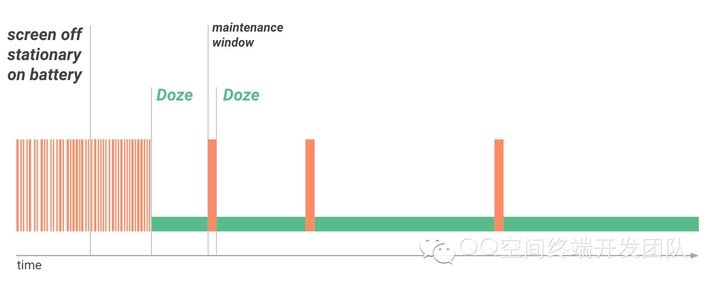
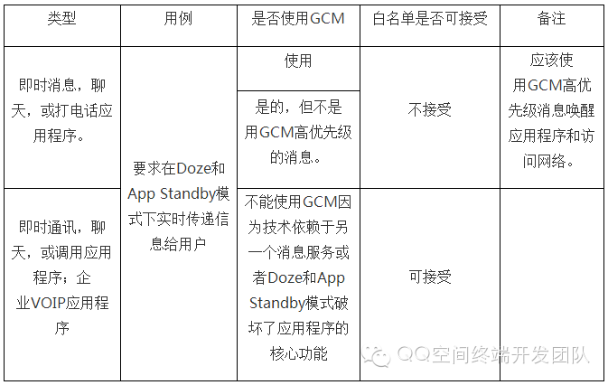

#### Optimizing for Doze and App Standby

1. 从 Android6.0 开始， Android 提供了两种省电延长电池寿命的功能： Doze 和 App Standby；
2. 表现形式：当设备没有连接到电源，设备进入 Doze 模式时，系统将通过延迟最近用户没有使用的应用程序的后台 CPU 运作及网络活动，让应用程序处于 App Standby 状态，以此来减少电池消耗。谷歌表示，在 Nexus5 和 Nexus6 上测试，当屏幕处于关闭状态，平均续航时间提高 30%；
3. 版本要求： Android6.0 （ API level 23 ）及其更高版本；
4. 开发者影响：为了保证用户的最佳体验，开发者有必要在 Doze 和 App Standby 模式下测试应用程序，及其对代码进行相应的调整。

#### Understanding Doze

1、设备进入 Doze 睡眠模式时机：  
用户不操作设备一段时间  
屏幕关闭  
设备未连接电源充电  
2、Doze 模式下应用程序有什么变化：   
系统试图通过限制应用程序访问网络和 CPU 密集型服务节省电池；  
防止应用程序访问网络，推延应用程序的工作，同步，和标准的警报；  
系统定期提供一个短暂的时间让应用程序完成延迟的工作活动，在这个时间片里，系统将提供维持性窗口应用程序访问网络，运行在等待的同步，工作，和报警等活动。

>Doze 模式的五种状态 ，分别如下：  
ACTIVE ：手机设备处于激活活动状态   
INACTIVE ：屏幕关闭进入非活动状态   
IDLE_PENDING ：每隔 30 分钟让 App 进入等待空闲预备状态   
IDLE ：空闲状态   
IDLE_MAINTENANCE ：处理挂起任务

如下图所示，Doze 期间提供间隔一小段时间（ 30s ）供应用程序使用网络和处理挂起的活动。    
    
从这张图我们可以看到，系统进入 Doze 模式后，系统会隔一段时间处理正在挂起的任务，随着时间推移，后面间隔的时间会越来越长，以此来减少电量消耗。    
3、退出 Doze 模式（系统退出休眠，所有的应用程序恢复正常活动）：    
用户唤醒装置移动，打开屏幕, 或者设备连接电源.    
4、Doze 有哪些限制？    
网络连接会被禁止   
Wake Lock 会被屏蔽   
AlarmManager 定时任务延迟到下一个 maintenance window 进行处理，除非使用 AlarmManager 提供的方法： setAndAllowWhileIdle() 或者 setExactAndAllowWhileIdle()   
系统将不扫描热点 WIFI   
同步工作将被禁止   
不允许 JobScheduler 进行任务调度   
5、适配 Doze 模式有什么方法？   
Doze 影响到 AlarmManager 闹钟和定时器管理活动，在 Android6.0 引入了两个新方法： setAndAllowWhileIdle() 和 setExactAndAllowWhileIdle() ，调用两个方法可以在 Doze 模式下让系统响应定时任务   
Doze 模式下限制了网络的连接，如果应用程序依赖于实时信息，那么这个将影响 App 的体验。那么你需要使用 Google Cloud Messaging (GCM) 谷歌云消息（后面详细讲解）   
6、测试 Doze 和 App Standby 模式的方法（ Adb 命令）

##### 测试 Doze 模式

1、首先确保你的硬件或虚拟设备是 Android6.0 或更高版本系统；   
2、连接设备到开发机上并安装你的 app；   
3、运行 app 并让其运行活动；   
4、关闭设备的屏幕；   
5、运行以下 adb 命令使系统进入 Doze 模式：    

```shell
$ adb shell dumpsys battery unplug    
$ adb shell dumpsys deviceidle step
```
6、观察你的 app 表现行为是否有需优化改进的地方。

##### 测试 App Standby 模式

步骤 1-3 同测试 Doze 模式

4、运行以下 adb 命令迫使系统进入 App Standby 模式：

```shell
$ adb shell dumpsys battery unplug    
$ adb shell am set-inactive <packageName> true
```
5、模拟唤醒你的应用程序使用以下命令：
```shell
$ adb shell am set-inactive <packageName> false    
$ adb shell am get-inactive <packageName>
```
6、观察你的 App ，确保应用程序恢复正常从待机模式过程中， App 的通知及其背部活动能达到预期结果。

#### Understanding App Standby

当用户不触摸使用应用程序一段时间时，该应用程序处于 App Standby 状态，系统将把该 App 标志为空闲状态。除非触发以下任意条件，应用程序将退出 App Standby 状态：

1. 用户主动启动该 App;
2. 该 App 当前有一个前台进程（或包含一个活动的前台服务，或被另一个 activity 或前台 service 使用）;
3. App 生成一个用户所能在锁屏或通知托盘看到的 Notification, 而当用户设备插入电源时，系统将会释放 App 的待机状态，允许他们自由的连接网络及其执行未完成的工作和同步。如果设备空闲很长一段时间，系统将允许空闲 App 一天一次访问网络。

##### Doze 和 App Standby 的区别：

Doze 模式需要屏幕关闭（通常晚上睡觉或长时间屏幕关闭才会进入），而 App Standby 不需要屏幕关闭， App 进入后台一段时间也会受到连接网络等限制。

#### Using GCM to Interact with Your App While the Device is Idle

##### 什么是 GCM?

Google Cloud Messaging(GCM) 是一个云到设备的服务，可以让你支持实时在云端服务和 Android 设备上应用程序之间的消息传递。

GCM 提供了一个持久连接到云端的链接，让所有需要实时消息传递应用程序可以共享此链接。这个共享链接显著优化电池消耗，使其不必让多个应用程序各位维护自己单独的持久链接而使电池迅速耗尽。

由于这个原因，官方建议：如果你的应用需要消息传递与后端服务集成，我们强烈建议尽可能的使用 GCM ，而不是单独维护自己的网络链接。

GCM 消息拥有高优先级，不影响 Doze 模式，且不会不影响其他应用程序的状态。这意味着你的应用程序可以使用它们进行通信，同时最大限度地减少电池在整个系统和设备的影响。

以下来 GCM 自官方解释：

一个 GCM 实现包括谷歌连接服务器，在你的环境中通过 HTTP 或 XMPP 协议的连接服务器进行交互的应用程序服务器和客户端应用程序。

生命周期流程:

- 注册启用 GCM： 客户端应用程序注册为接收消息。
- 发送和接收下行消息：
>发送一个消息， 该应用程序服务器发送信息到客户端应用程序：
>- 该应用程序服务器发送消息给 GCM 连接服务器；
>- 当设备处于脱机状态，该 GCM 连接服务器入队并存储消息；
>- 当设备联机时， GCM 连接服务器将邮件发送到该设备；
>- 在设备上，所述客户端应用程序根据该特定平台实现接收该消息。

>接收消息，客户端应用程序收到一条消息从 GCM 连接服务器。

- 发送和接收上游的消息： 如果您使用的是此功能只提供 XMPP 连接服务器 。
>发送一个消息， 客户端应用程序将消息发送到应用服务器：
>- 在设备上，客户端应用程序将消息发送到 XMPP 连接 server；
>- 如果该服务器已断开连接，该 XMPP 服务器连接入队并存储信息；
>- 当应用程序服务器重新连接后， XMPP 连接服务器将邮件发送到应用程序服务器。

>接收消息， 一个应用服务器从 XMPP 连接服务器接收邮件，然后执行以下操作：
>- 解析消息头，以验证客户端应用程序发送的信息；
>- 发送“确认”的 XMPP 连接服务器以确认收到该消息；
>- 任选解析该消息有效载荷，由客户端应用程序所定义的。

除了 GCM ， Android6.0 及更高版本还提供了 Doze 模式白名单列表，通过设置应用程序进入白名单列表可逃脱 Doze 模式的各种限制。

检测应用程序是否存在白名单 list 里面，可使用 PowerManager 的 isIgnoringBatteryOptimizations() 方法。

用户也可手动设置应用程序进入白名单列表里面，路径为：设置 > 电池 > 电池优化白名单.

#### 客户端使用方法：

1. App 程序可发送 action 为 ACTION_IGNORE_BATTERY_OPTIMIZATION_SETTINGS 的 intent 引导用户进入设置界面将应用程序设置进白名单列表里。
2. 应用程序还可以使用 AREQUEST_IGNORE_BATTERY_OPTIMIZATIONS 权限来触发一个系统对话来让用户添加到白名单里，而无需进入设置界面去设置。

当然，官方也提供用户把你的 App 移除电池优化白名单的选项。这个白名单也会被 Android M 的另一个新特性 App Standby 使用，所以用户只能简单的进行控制，也就是说设备并不会完全相信这个白名单。

官方举了一下白名单例子：



```shell
$ adb shell dumpsys deviceidle whitelist +<packageName>
$ adb shell dumpsys deviceidle
```

#### 总结：

Doze 模式的推出本身是为了减少电池的消耗，且 Google 希望统一使用 GCM 来传递消息进行通讯，而对于国内开发来讲，确实带来了很大的麻烦：

1. 国内开发的一些消息推送机制（ PUSH ）将受到影响；
2. 若使用 GCM ，在国内使用 GCM 延迟高，对于即时通讯产品来说选择还需勇气啊；
3. 国内第三方手机厂商如华为、小米、三星，定制的 Rom 也将使用定制的推送消息机制。这让同一款 App 如何选择哪种推送机制才能兼容呢？

##### 解决方法：

1. 用户添加应用程序到电池优化白名单列表；
2. 开发者使用 Google 提供的 ACTION_IGNORE_BATTERY_OPTIMIZATION_SETTINGS 意图和 AREQUEST_IGNORE_BATTERY_OPTIMIZATIONS 权限设置以此忽略（推荐）；
3. 使用 Google 提供的 GCM；
4. 通过 so 绕过 Doze 模式。

来源： [tuicool](http://www.tuicool.com/articles/aMnqUbb)

官方文档：[Docs](../../_attach/Android/Doze_AppStandby.pdf)