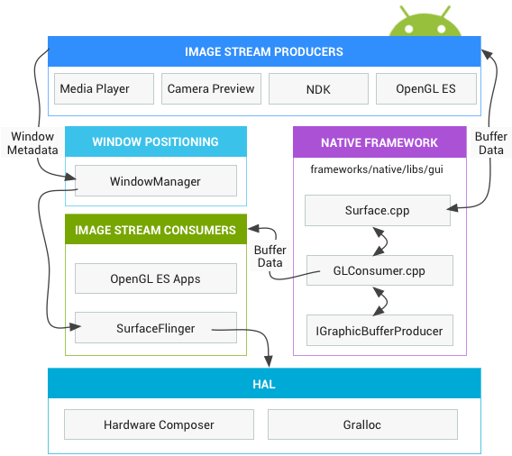
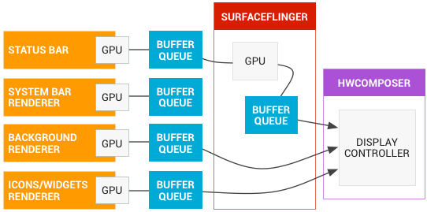

# Android Graphics

## 0. 图形显示系统

Android框架提供了多种2D和3D图形渲染API，用来与厂商的显示驱动交互。应用可以通过两种方式将图形绘制到屏幕：Canvas和OpenGL。Canvas是一种2D图形API。Android中通过Canvas绘制所有的图形和视图，硬件加速模块把这些绘制转换为GPU可以执行的OpenGL命令。另外也可以直接通过OpenGL ES绘制到surface上，而不用Canvas。

对于使用了GPU不支持的2D UI绘制命令的View，只能通过软件方式来渲染。具体的做法是将创建一个新的Canvas，这个Canvas的底层是一个Bitmap，也就是说，绘制都发生在这个Bitmap上。绘制完成之后，这个Bitmap再被绘制到其Parent View中。

不论用那种方式，所有的显示内容都会绘制到surface。surface代表的是一块图形缓存Graphic Buffer，硬件加速渲染和软件渲染一样，在开始渲染之前，都是要先向SurfaceFlinger服务申请一个Graphic Buffer。不过对硬件加速渲染来说，这个Graphic Buffer会被封装成一个ANativeWindow，在Android系统中，ANativeWindow和Surface可以是认为等价的，只不过是ANativeWindow常用于Native层中，而Surface常用于Java层中。

上图就是涉及到各个组件：
- Image Stream Producers：生成图形数据的所有组件，如OpenGL ES、Canvas、Camera等。
- Image Stream Consumers：最常用的图形数据消费者是SurfaceFlinger，它获取当前可见的所有surface，根据Window Manager提供的信息合成以后发送到屏幕显示。SurfaceFlinger是唯一可以修改显示内容的服务，它通过OpenGL和HWComposer合成一组surface。其他OpenGL ES应用也可以消费图形数据，比如Camera应用可以处理相机预览数据。ImageReader类也可以作为消费者。
- Window Manager：控制Window的系统服务，Window是视图的容器，后台实际是一个Surface。WM监管Window的生命周期、输入和焦点事件、屏幕方向、跳转、动画、位置、变形，以及Z-order等。它把Window的元数据发给SurfaceFinger用于合成Surfaces。
- Hardware Composer：显示子系统的硬件抽象。SurfaceFlinger把某些合成工作派给HWComposer，减轻OpenGL和GPU的负载。这时SurfaceFlinger通过OpenGL ES合成缓存里的数据，比让GPU进行所有的运算功耗低一些。HWComposer主导剩下的工作，它是Android图形显示的中点。
- Gralloc：图形存储分配器，用来给图像生成模块分配存储空间。

下图表示的是Android图形系统的数据流：

## 1. BufferQueue & gralloc

BufferQueue把图形数据生产者和消费者连接起来，gralloc通过厂商定义的HAL接口实现Buffer的分配。

### BufferQueue

BufferQueue是各组件间的粘合剂，有一对队列来调节从生产者到消费者的缓存的循环。一旦生产者释放缓存，SurfaceFlinger就负责把所有内容合成到屏幕。下图是典型的BufferQueue通信过程。

BufferQueue中包含绑定生产者和消费者的逻辑，它通过一个队列管理缓存池，通过Binder IPC在进程间传递缓存。生产者接口IGraphicBufferProducer，然后用GLConsumer进行处理。生产者和消费者可以在不同进程。

用法很简单，生产者申请一块空闲的buffer（dequeueBuffer()），在申请时指定宽度，高度，像素的格式，以及一组标记。生产者填充缓冲区后，将它送还给队列（queueBuffer()）。之后消费者申请buffer (acquireBuffer())，然后使用对应的buffer数据。当消费者使用完成后，它将buffer返回给队列（releaseBuffer()）。

最新的android设备支持一种叫做sync framework的技术。这允许系统结合硬件来实现对Graphic数据的异步操作。比如说，一个生产者可以一次性提交一系列的OpenGL ES绘制命令，然后在渲染没完成前将其入队到输出缓冲区中。通过一个fence保护，当内容渲染好后，fence会发出信号。当buffer回到空闲列表时，有第二个fence保护，所以消费者可以在缓存内容仍使用的时候释放缓冲区。这种方法提高了buffer在系统中移动的速度和吞吐量。

可以用systrace跟踪BufferQueue的工作流程，使用gfx、view和sched这几个tag。

### gralloc

HAL接口定义在`hardware/libhardware/include/hardware/gralloc.h`。

gralloc分配器是在native堆上分配空间，有些情况下分配的空间用户层无法访问。这些是由分配时传入的标记决定的，相关属性有：
- 主要从软件访问（CPU）
- 主要从硬件访问（GPU）
- 是否用做OpenGL ES 纹理
- 是否被视频编码器使用

## 2. VSYNC

设备的显示刷新频率是一个特定的值，一般是60帧每秒。如果显示内容刷新不同步，就可能出现显示撕裂的情况。按照周期来更新显示的内容至关重要，当显示系统可以安全的更新内容时，它会发送一个信号给系统。基于历史原因，我们将这个信号称之为VSYNC信号。

设备的刷新率可能随时间变化，基于不同的场景，一些型号的刷新率可能在58到62之间变化。对于一个连接了HDMI的电视，这个值理论上可以下降到24或者48。因为只能在每个刷新周期上更新屏幕内容，那么以200fps的频率来提交buffer的数据是一种浪费，大多数的数据并不会被显示。因为不会在每次app提交buffer数据时就做相应操作，只会在显示系统可以接受数据时才唤醒SurfaceFlinger。

当VSYNC信号到达时，SurfaceFlinger会遍历它的layer/surface列表来查找新的buffer。如果查找到一个，SurfaceFlinger将请求它（acquires），否则的话，SurfaceFlinger将继续使用之前的数据。SurfaceFlinger总是需要一些数据来显示，因此它依赖于buffer。如果一个layer/surface没有buffer被提交，那么这个layer/surface将被忽略。

### VSync产生和处理

VSync信号由HW_VSYNC_ON_0、HW_VSYNC_0、VSync-app和VSync-sf四部分构成。

- HW_VSYNC_ON_0：代表硬件的VSync被打开或者关闭，0表示display编号，当SF要求HWComposer打开或者关闭Display的VSync时，就会有这个event记录。
- HW_VSYNC_0：代表硬件发出的VSync信号，0同样表示display编号。其用来调节VSync-app和VSync-sf的event输出。
- VSync-app：App、System UI和System Server等View执行Input、Animation、Traversal的触发器。
- VSync-sf：SurfaceFlinger合成画面的触发器。

Android系统的VSync信号是由硬件源的VSync和软件源的VSync信号组成，硬件源信号实在`HWComposer_hwc1.cpp`中实现的，软件源信号是在`DispSync.cpp`中实现的。

VSync信号不再完全由硬件产生，硬件源信号主要用来做时间校准，VSync信号发生者是DispSyncThread，当DispSyncThread产生的信号得到校准后，硬件VSync会被关闭。

Android中，HW_VSYNC_0、VSync-app和VSync-sf都会按需出现，HW_VSYNC_0根据是否需要调节VSync-app和VSync-sf的event而出现，而sf和app则会调用requestNextVsync()来告诉系统在下一个VSync需要被触发。虽然每秒有60个HW VSync，但是不代表APP和SF每个VSync都要更新画面，在Android里根据软件VSync来更新画面。软件VSync是根据硬件VSync过去发生的时间，推测未来会发生的时间。因此当APP或SF调用`requestNextVsync()`时，软件VSync才会触发VSync-app和VSync-sf。

硬件源的VSync信号负责校准软件源DispSync向SF、APP发出VSync信号的周期、间隔时间等。SurfaceFlinger服务启动时会创建一个HWComposer对象，该对象负责与HAL模块交互，并可接收硬件VSync信号。同时创建一个DispSync对象，该对象启动一个DispSyncThread，用来定时发送软件源的VSync信号。当APP或者SF需要VSync信号时，就会打开硬件源VSync信号接收开关，接收最多不超过32个VSync，通过在`addResyncSample()`中计算软件源VSync信号的差值phase，当结果小于一定值后就关闭硬件源VSync信号开关。

SF在做图像合成的时候会调用`addPresentFence()`检查当前的phase是否符合要求，不符合就重新打开硬件源VSync信号，重新校准phase。

软件源VSync信号有DispSync控制，SF初始化时创建了一个DispSync对象，分别传入2个DispSyncSource中，然后再分别传入两个EventThread中，分别用来控制sf和app这两个VSync信号的发生。

不管是SF还是应用，接收VSync信号都是通过注册Fd事件，写入Fd事件和读取Fd事件来接收信号的。

## 3. 双缓冲

为了避免出现画面撕裂，系统需要双重缓冲：前台缓冲在显示时，后台缓冲则在准备中。在接收到VSYNC信号后，如果后台缓冲已经准备好，你就可以迅速切换到上面。如果总是直接向framebuffer绘入数据，那么这种工作方式就足够了。但是，当我们加入一个合成步骤后，这样就会有问题。

假设frame N正在被显示，而frame N+1已经被Surfaceflinger获取用于下一次VSYNC发生时的显示（假设frame N使用了overylay来做渲染，显示处理完成之前，没办法修改buffer的内容）。当VSYNC信号到来时，HWC投递了缓冲区。当app开始渲染frame N+2 到Frame N用过的缓冲区内时，Surfaceflinger开始检查layer列表，查看是否有更新。此时Surfaceflinger并不会发现任何新的buffer，所以它会准备在下一个VSYNC到来时继续显示N+1帧的内容。一段时间后，app结束了N+2帧的渲染，然后将数据传给Surfaceflinger，但是此时已经为时太晚。这将导致我们最大帧率缩减为一半。

三重缓冲可以解决这个问题。VSYNC信号之前，帧N已经被显示，帧N+1已经合成完毕（或者计划进行overlay），等待被显示，而帧N+2已经在排队等候被Surfaceflinger获取。屏幕一翻转，buffers顺利的进行循环替换。App有略少于一个完整VSYNC周期的时间（当帧率为60时，这个时间为16.7毫秒）去做它的渲染工作并且将buffer入队。在下一个VSYNC到来之前，Surfaceflinger/HWC有一个完整的VSYNC周期去完成合成的工作。坏消息是，app将内容显示在屏幕上，将需要花费两个VSYNC的周期。因为延迟增加了，所以会显得会触摸事件的响应不够灵敏。

## 4. fence

Fence 是一种同步机制，在Android里主要用于图形系统中GraphicBuffer同步。与已有的同步机制相比，fence主要被用来处理跨硬件的情况，尤其是CPU，GPU和HWC之间的同步，另外还可用于多个时间点之间的同步。

Fence 每个线程在到达某种周知的状态时调用栅栏的wait()方法阻塞起来，以等待其它所有参与线程调用wait()方法表明它们也达到了这个状态，一旦所有的线程都达到了栅栏，它们就会集体解除阻塞，并一起继续执行；引起程序调用栅栏的wait()方法进行阻塞的那个状态叫栅栏状态。

每个Layer都有一个acquireFence和releaseFence，每一个系列Layers都有一个retireFence:
- `acquireFence`：禁止显示一个buffer的内容直到该fence被触发，而它是在HWC被setUp前触发->关栈
- `releaseFence`：表示属于这个layer的buffer已经不再被读取了，在一个buffer不再被读取的时候触发这个Fence。->开栈
- `retireFence`：属于多个layer，当完成一个frame的显示后触发这个fence 。

Kernel层与fence相关的结构体：
- sync_timeline : 时间轴，每个流程都有自己的timeline，代表一个自动增加的计数器。
- sync_pt：同步点的概念，代表timeline上的一个特别的值。有三种状态： active，signaled，error。
- sync_fence ：一系列sync_pt 的集合，实际是个文件描述符，可以被传送到用户空间。

## 5. Surface

Surface代表生产者这边的一个BufferQueue，多数情况下都由SurfaceFlinger处理。绘制到Surface就相当于放到缓存，最终传到消费者。

没有硬件加速之前，Canvas通过Skia进行绘制，绘制前通过`lockCanvas()`锁定buffer，防止被其他用户修改，完成后通过`unlockCanvasAndPost()`解锁并发给合成器。当引入硬件加速后，为了兼容老的API，Canvas API也被硬件加速了(有一小部分无法兼容)，比如View的`onDraw()`方法，但是通过Surface的`lockCanvas()`锁定的Canvas没有兼容。

当你为了使用Canvas而锁定一个Surface的时候，”CPU renderer”连接到了BufferQueue的生产者一端，直到Surface被销毁才会断开。大多数其他的生产者（比如GLES）可以断开连接，并且重新连接到一个Surface之上；但是基于CPU渲染的Canvas不行。这意味着，一旦为了使用一个Canvas而lock了一个Surface，你就不能使用GLES绘制这个Surface，也不能将视频解码器生成的帧发送给它。

## 6. OpenGL ES

OpenGL ES 专为嵌入式设备设计的，定义了一组Graphic的渲染API。Android为接口的实现提供了两种类型的实现：硬件实现和软件实现。前者由各个硬件厂商提供，后者在libagl中`frameworks/native/opengl/libagl`。

OpenGL ES并没有定义一个窗口系统。为了让GLES可以工作在不同的平台之上，它设计了一个库，这个库知道如何在指定的操作系统上创建和使用窗口。Android上的这个库叫做EGL。如果你想绘制一个多边形，那么使用GLES的函数；如果你想要将它渲染到屏幕上，你需要使用EGL的调用。

在你使用GLES做事之前，你需要创建一个GL的上下文。具体针对EGL，这意味着创建一个EGLContext 和一个 EGLSurface。GLES的操作作用在当前的上下文，而上下文的访问更多的依赖本地线程的存储而不是参数的传递。这意味着你需要关注你的渲染代码执行在哪个线程之上，并且这个线程的当前上下文是什么。

EGLSurface可以是一个由EGL分配的离屏缓冲区（”pbuffer”）或者一个由操作系统分配的窗口缓冲区。EGL window surfaces由`eglCreateWindowSurface()`函数创建。它持有一个*窗口对象*做为参数，在Android系统上，这个对象可能是一个SurfaceView，一个SurfaceTexture，一个SurfaceHolder，或者一个Surface，所有的这些下面都有一个BuffferQueue。当你调用这个函数时，EGL创建了一个新的EGLSurface对象，并且将它连接到*窗口对象*的BufferQueue的生产者接口上。从这一刻开始，渲染到EGLSurface上将导致一个buffer经历出队，渲染，入队被消费者处理这整个过程。（虽然叫做window，但实际上输出可能并不显示在屏幕上）

EGL并没有提供lock/unlock的调用。先调用绘制命令，然后调用`eglSwapBuffers()`函数去提交当前的帧。这个方法名字来自传统的交换前后缓冲区，但是目前的实现可能会有很大的不同。

一个EGLSurface一次只能关连一个Surface，一次只能有一个生产者连接到一个BufferQueue上，但是可以销毁这个EGLSurface，使得它和BufferQueue的连接断开，这样就可以用其他的东西连接这个BufferQueue了。

一个线程可以通过设置哪个EGLSurface是current的方法来切换不同的EGLSurfaces，一个线程同时只能有一个EGLSurface作为current。

EGLSurface和Surface之间有关系，但是这是两个独立的概念。可以在一个EGLSurface上绘制而不需要一个Surface的支持，也可以不通过EGL而使用一个Surface。EGLSurface只不过给GLES提供了一个绘制的地方而已。

### ANativeWindow

公共的Surface类是由Java实现的。在C/C++层对应的是ANativeWindow类，半暴漏在Android NDK中。可以通过使用`ANativeWindow_fromSurface()`从Surface中获得一个ANativeWindow。就像Java中一样，可以lock，使用软件渲染，然后unlock-and-post。

为了在native中创建一个EGL window surface，需要给`eglCreateWindowSurface()`方法传递一个`EGLNativeWindowType`实例。`EGLNativeWindowType`等同于ANativeWindow，所以你可以在二者之间自由的转换。事实上，Native Window的本质不过是BufferQueue在生产者一侧的包装罢了。

## 7. SurfaceView GLSurfaceView  SurfaceTexture &  TextureView

前面都是底层的组件，这两个属于高层次上组件。

Android的app Framework层的UI是基于View对象的层次结构。即UI元素是通过复杂的测量和布局过程部署在一个矩形区域里面，所有可见的View对象被渲染到SurfaceFlinger创建的Surface里，Surface是在app转到前台时WindowManager生成的。app的UI线程里面执行布局，并渲染界面到一个独立的buffer中。无论是否使用硬件加速，都是一个buffer。

### SurfaceView

一个SurfaceView有跟其他View一样的参数，所以可以设置它的位置和大小等等。当它被渲染时，可以认为它的所有内容都是透明的。SurfaceView的视图部分只不过是一个透明的占位区域。当SurfaceView即将变为可见时，Framework层要求WindowManager请求SurfaceFlinger创建一个新的Surface（这个过程是异步发生的，这就是为什么你应该提供一个回调函数，这样当Surface创建完成时你才能得到通知）。这种情况下应用仍然是生产者。

缺省情况下，新创建的Surface在app UI Surface的下面，但是允许修改默认的Z-ordering将这个Surface放在上面。

渲染在这个Surface（SurfaceView的surface）上的内容将由SurfaceFlinger来混合，而不是由app。这才是SurfaceView的真正作用：这个surface可以被一个独立的线程或者进程来渲染，和app UI上其他的渲染工作分开，这些缓冲区数据将直接传递给SurfaceFlinger。这个Surface、app UI Surface以及其他layer的混合工作将由HWC来完成。

### GLSurfaceView

GLSurfaceView类提供一个辅助类，这些类可以帮助我们管理EGL的上下文，线程通信以及与activity生命周期的交互。当然不需要GLSurfaceView就可以使用GLES。

举例来说，GLSurfaceView创建了一个用来渲染和管理EGL上下文的线程。当activity pause时，它会自动清空所有的状态。大多数应用通过GLSurfaceView来使用GLES时，不需要了解任何和EGL有关的事情。在大多数情况下，GLSurfaceView对处理GLES来说很有帮助。但是在一些情况下，它可能是一种阻碍。仅仅在你需要的时候使用它。

###  SurfaceTexture

SurfaceTexture类是从Android 3.0开始引入的。就像是SurfaceView是一个Surface和view的组合一样，SurfaceTexture某种程度上是一个Surface和GLES纹理的组合。

当创建了一个SurfaceTexture时，就创建了一个BufferQueue，而app则是消费者。当一个新的buffer被生产者入队后，app将会被回调函数通知（`onFrameAvailable()`）。app可以调用`updateTexImage()`函数（会释放先前持有的buffer），从队列中acquire新的buffer，做一些EGL调用，然后buffer可以作为*外部纹理*被GLES处理。

外部纹理（GL_TEXTURE_EXTERNAL_OES）跟由GLES自身创建的纹理（GL_TEXTURE_2D）有些不同。需要配置的renderer略有不同，也有一些事情是不能做的。但重点是：可以使用从BufferQueue中收到的数据直接渲染多边形。

gralloc可是支持各种各样的格式，如何保证buffer中的数据格式可以被GLES正确读取？当SurfaceTexture创建BufferQueue时，它设置消费者的usage flags是GRALLOC_USAGE_HW_TEXTURE，这保证了任何由gralloc创建的buffer都是可以被GLES使用的。

因为SurfaceTexture要和EGL上下文交互，因此务必保证调用的方法来自正确的线程，这个在类的文档中有说明。

创建一个简易Surface的唯一办法是使用一个带有SurfaceTexture参数的构造函数（在API11之前的版本，Surface根本就没有一个公有的构造函数）。在底层，SurfaceTexture实际上是一个GLConsumer，这个名字更能反应出它作为一个BufferQueue的持有者和消费者的角色。当你使用一个SurfaceTexture来创建一个Surface时，实际上做的是创建了BufferQueue（SurfaceTexture持有的）的生产者一侧。

### TextureView

TextureView类是由Android 4.0引入的。它是这几个中的最复杂的类对象，由一个View混合了一个SurfaceTexture而成。

SurfaceTexture实际上是一个‘GL consumer’，消费Graphic缓冲区的数据，并且使他们可以作为纹理。TextureView包装了一个SurfaceTexture，接管了它响应回调函数和申请新的缓冲区的工作。新的缓冲区的到来使得TextureView发出一个View重绘的请求。当被要求绘制时，TextureView使用了最新收到的缓冲区数据作为数据来源，渲染任何View状态指示它做的工作。

可以在TextureView上使用GLES渲染，就像你在SurfaceView上做的一样。只需要在EGL window创建时，把SurfaceTexture传递过去。但是，这样做会暴露一个潜在的问题。

大多数情况下，BufferQueue在不同的进程间传递数据。当我们在TextureView上使用GLES渲染时，生产者和消费者在一个进程内，而且他们很可能被同一个线程来处理。假设我们连续的UI线程上提交数据，EGL需要从BufferQueue中dequeue一个Buffer，但是在知道一个buffer可用时，这个操作才会完成。但是除非消费者acquire了一个buffer用于渲染，否则不会有任何可用的buffer，但这个过程同样发生了UI线程中。现在我们悲剧了。

解决这个问题的办法是：让BufferQueue保证始终都有一个buffer是可以被dequeued的，这样这个过程才不会阻塞。如何才能保证这一点？一个方法是当BufferQueue上有新的buffer被queued时，就丢弃掉之前queue的缓冲区，还要设置最小缓冲区数量的限制和最大acquired缓冲区数量的限制（如果你的队列只有三个缓冲区，但是三个缓冲区都被消费者acquired，这样我们就不能dequeue到任何buffer，阻塞就发生了。因此我们需要阻止消费者acquire两个以上的缓冲区）丢帧一般是不可接受的，因此这个方法只能用在一些特殊的场景里，比如当生产者和消费者在一个进程里面的时候。

### SurfaceView 还是 TextureView

TextureView是普通的View，可以覆盖、被覆盖、变形甚至通过方法获取里面的内容，但是主要问题是合成的性能。SurfaceView的内容是写在SurfaceFlinger创建的一个单独的Surface/Layer里面，合成工作是SurfaceFlinger负责的，理想情况下用overlay方式合成。TextureView肯定是用GLES合成，如果有View在它上面，TextureView更新会导致上面的View也重画。

View渲染完成后，SurfaceFlinger再把app UI layer和其他layers合成。所以实际上所有可见内容都被合成了两次。所以对于全屏视频播放器或者实际是把UI元素放到一个视频上的应用，SurfaceView性能好一点。

DRM保护的内容只能显示到overlay上，所以视频播放器必须用SurfaceView。
