# Binder

Binder源自Be Inc公司开发的OpenBinder框架，后来该框架转移的Palm Inc，由Dianne Hackborn主导开发。OpenBinder的内核部分已经合入Linux Kernel 3.19。

Android Binder是在OpenBinder上的定制实现。原先的OpenBinder框架现在已经不再继续开发，可以说Android上的Binder让原先的OpenBinder得到了重生。

Binder是Android系统中大量使用的IPC（Inter-process communication，进程间通讯）机制。无论是应用程序对系统服务的请求，还是应用程序自身提供对外服务，都需要使用到Binder。因此，Binder机制在Android系统中的地位非常重要，可以说，理解Binder是理解Android系统的绝对必要前提。

在Unix/Linux环境下，传统的IPC机制包括：
- 管道
- 消息队列
- 共享内存
- 信号量
- Socket
  等。

Android系统中对于传统的IPC使用较少（但也有使用，例如：在请求Zygote fork进程的时候使用的是Socket IPC），大部分场景下使用的IPC都是Binder。

Binder相较于传统IPC来说更适合于Android系统，具体原因的包括如下三点：
- Binder本身是C/S架构的，这一点更符合Android系统的架构
- 性能上更有优势：管道，消息队列，Socket的通讯都需要两次数据拷贝，而Binder只需要一次。要知道，对于系统底层的IPC形式，少一次数据拷贝，对整体性能的影响是非常之大的
- 安全性更好：传统IPC形式，无法得到对方的身份标识（UID/GID)，而在使用Binder IPC时，这些身份标示是跟随调用过程而自动传递的。Server端很容易就可以知道Client端的身份，非常便于做安全检查

[大概了解一下](./IPC_brief.md)

## 〇、 整体架构

Binder整体架构如下所示：


从图中可以看出，Binder的实现分为这么几层：
- Framework层
    - Java部分
    - JNI部分
    - C++部分
- 驱动层

驱动层位于Linux内核中，它提供了最底层的数据传递，对象标识，线程管理，调用过程控制等功能。驱动层是整个Binder机制的核心。

Framework层以驱动层为基础，提供了应用开发的基础设施。

Framework层既包含了C++部分的实现，也包含了Java部分的实现。为了能将C++的实现复用到Java端，中间通过JNI进行衔接。

开发者可以在Framework之上利用Binder提供的机制来进行具体的业务逻辑开发。其实不仅仅是第三方开发者，Android系统中本身也包含了很多系统服务都是基于Binder框架开发的。

既然是“进程间”通讯就至少牵涉到两个进程，Binder框架是典型的C/S架构。在下文中，我们把服务的请求方称之为Client，服务的实现方称之为Server。

Client对于Server的请求会经由Binder框架由上至下传递到内核的Binder驱动中，请求中包含了Client将要调用的命令和参数。请求到了Binder驱动之后，在确定了服务的提供方之后，会再从下至上将请求传递给具体的服务。整个调用过程如下图所示：


对网络协议有所了解的读者会发现，这个数据的传递过程和网络协议是如此的相似。

### 初识ServiceManager

前面已经提到，使用Binder框架的既包括系统服务，也包括第三方应用。因此，在同一时刻，系统中会有大量的Server同时存在。那么，Client在请求Server的时候，是如何确定请求发送给哪一个Server的呢？

这个问题，就和我们现实生活中如何找到一个公司/商场，如何确定一个人/一辆车一样，解决的方法就是：每个目标对象都需要一个唯一的标识。并且，需要有一个组织来管理这个唯一的标识。

而Binder框架中负责管理这个标识的就是ServiceManager。ServiceManager对于Binder Server的管理就好比车管所对于车牌号码的的管理，派出所对于身份证号码的管理：每个公开对外提供服务的Server都需要注册到ServiceManager中（通过addService），注册的时候需要指定一个唯一的id（这个id其实就是一个字符串）。

Client要对Server发出请求，就必须知道服务端的id。Client需要先根据Server的id通过ServerManager拿到Server的标识（通过getService），然后通过这个标识与Server进行通信。

整个过程如下图所示：

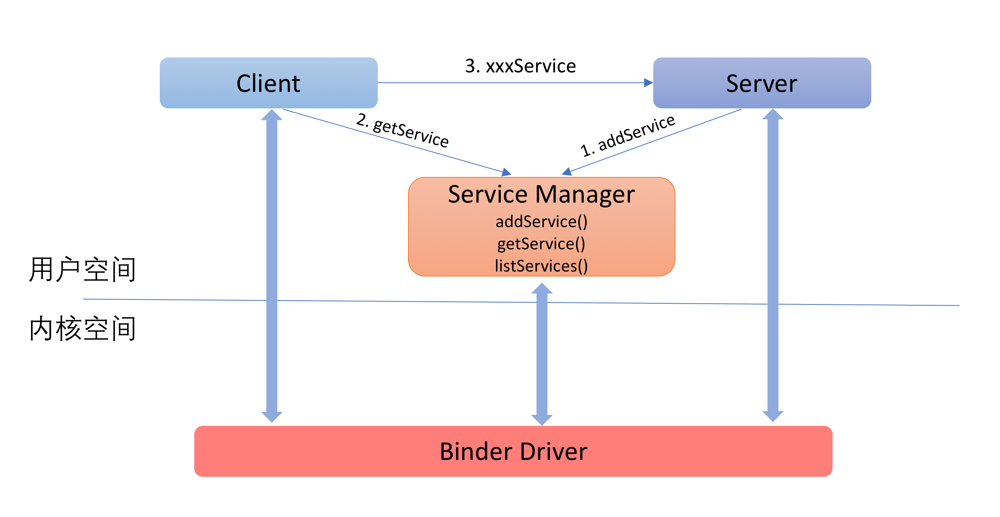

下文会以自下而上的方式来讲解Binder框架。

## 一、 Binder机制：驱动篇

源代码位于kernel中：
```
/kernel/drivers/staging/android/binder.c
/kernel/drivers/staging/android/uapi/binder.h
```

Binder机制的实现中，最核心的就是Binder驱动。 Binder是一个miscellaneous类型的驱动，本身不对应任何硬件，所有的操作都在软件层。 `binder_init`函数负责Binder驱动的初始化工作，该函数中大部分代码是在通过`debugfs_create_dir`和`debugfs_create_file`函数创建debugfs对应的文件。 如果内核在编译时打开了debugfs，则通过`adb shell`连上设备之后，可以在设备的这个路径找到debugfs对应的文件：`/sys/kernel/debug`。Binder驱动中创建的debug文件如下所示：
```
# ls -l /sys/kernel/debug/binder/                                     
total 0
-r--r--r-- 1 root root 0 1970-01-01 00:00 failed_transaction_log
drwxr-xr-x 2 root root 0 1970-05-09 01:19 proc
-r--r--r-- 1 root root 0 1970-01-01 00:00 state
-r--r--r-- 1 root root 0 1970-01-01 00:00 stats
-r--r--r-- 1 root root 0 1970-01-01 00:00 transaction_log
-r--r--r-- 1 root root 0 1970-01-01 00:00 transactions
```
这些文件其实都在内存中的，实时的反应了当前Binder的使用情况，在实际的开发过程中，这些信息可以帮忙分析问题。例如，可以通过查看`/sys/kernel/debug/binder/proc`目录来确定哪些进程正在使用Binder，通过查看transaction_log和transactions文件来确定Binder通信的数据。

`binder_init`函数中最主要的工作其实下面这行：
```C
ret = misc_register(&binder_miscdev);
```
该行代码真正向内核中注册了Binder设备。`binder_miscdev`的定义如下：
```C
static struct miscdevice binder_miscdev = {
    .minor = MISC_DYNAMIC_MINOR,
    .name = "binder",
    .fops = &binder_fops
};
```
这里指定了Binder设备的名称是“binder”。这样，在用户空间便可以通过对/dev/binder文件进行操作来使用Binder。

binder_miscdev同时也指定了该设备的fops。fops是另外一个结构体，这个结构中包含了一系列的函数指针，其定义如下：
```C
static const struct file_operations binder_fops = {
	.owner = THIS_MODULE,
	.poll = binder_poll,
	.unlocked_ioctl = binder_ioctl,
	.compat_ioctl = binder_ioctl,
	.mmap = binder_mmap,
	.open = binder_open,
	.flush = binder_flush,
	.release = binder_release,
};
```
这里除了owner之外，每一个字段都是一个函数指针，这些函数指针对应了用户空间在使用Binder设备时的操作。例如：`binder_poll`对应了`poll`系统调用的处理，`binder_mmap`对应了`mmap`系统调用的处理，其他类同。

这其中，有三个函数尤为重要，它们是：`binder_open`，`binder_mmap`和`binder_ioctl`。 这是因为，需要使用Binder的进程，几乎总是先通过`binder_open`打开Binder设备，然后通过`binder_mmap`进行内存映射。在这之后，通过`binder_ioctl`来进行实际的操作。Client对于Server端的请求，以及Server对于Client请求结果的返回，都是通过ioctl完成的。

这里提到的流程如下图所示：

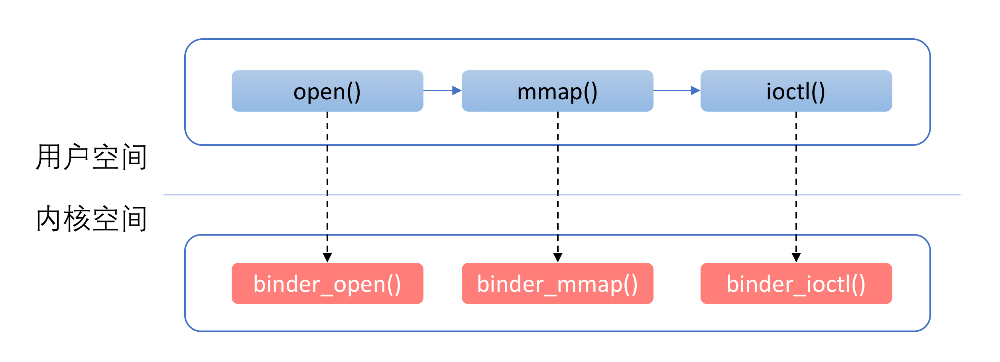

### 主要结构

Binder驱动中包含了很多的结构体。为了便于下文讲解，这里我们先对这些结构体做一些介绍。

驱动中的结构体可以分为两类：
- 一类是与用户空间共用的，这些结构体在Binder通信协议过程中会用到。因此，这些结构体定义在`binder.h`中，包括：

| 结构体名称                       | 说明                         |
| --------------------------- | -------------------------- |
| flat_binder_object          | 描述在Binder IPC中传递的对象，见下文    |
| **binder_write_read**       | 存储一次读写操作的数据                |
| binder_version              | 存储Binder的版本号               |
| transaction_flags           | 描述事务的flag，例如是否是异步请求，是否支持fd |
| **binder_transaction_data** | 存储一次事务的数据                  |
| binder_ptr_cookie           | 包含了一个指针和一个cookie           |
| binder_handle_cookie        | 包含了一个句柄和一个cookie           |
| binder_pri_desc             | 暂未用到                       |
| binder_pri_ptr_cookie       | 暂未用到                       |

> 这其中，`binder_write_read`和`binder_transaction_data`这两个结构体最为重要，它们存储了IPC调用过程中的数据。关于这一点，我们在下文中会讲解。

- Binder驱动中，还有一类结构体是仅仅Binder驱动内部实现过程中需要的，它们定义在`binder.c`中，包括：

| 结构体名称                        | 说明                         |
| ---------------------------- | -------------------------- |
| **binder_node**              | 描述Binder实体节点，即：对应了一个Server |
| **binder_ref**               | 描述对于Binder实体的引用            |
| **binder_buffer**            | 描述Binder通信过程中存储数据的Buffer   |
| **binder_proc**              | 描述使用Binder的进程              |
| **binder_thread**            | 描述使用Binder的线程              |
| binder_work                  | 描述通信过程中的一项任务               |
| binder_transaction           | 描述一次事务的相关信息                |
| binder_deferred_state        | 描述延迟任务                     |
| binder_ref_death             | 描述Binder实体死亡的信息            |
| binder_transaction_log       | debugfs日志                  |
| binder_transaction_log_entry | debugfs日志条目                |

> 这里需要读者关注的结构体已经用加粗做了标注。

### Binder协议

Binder协议可以分为控制协议和驱动协议两类。

控制协议是进程通过`ioctl("/dev/binder")`与Binder设备进行通讯的协议，该协议包含以下几种命令：

| 命令                       | 说明                              | 参数类型              |
| ------------------------ | ------------------------------- | ----------------- |
| **BINDER_WRITE_READ**    | 读写操作，最常用的命令。IPC过程就是通过这个命令进行数据传递 | binder_write_read |
| BINDER_SET_MAX_THREADS   | 设置进程支持的最大线程数量                   | size_t            |
| BINDER_SET_CONTEXT_MGR   | 设置自身为ServiceManager             | 无                 |
| BINDER_THREAD_EXIT       | 通知驱动Binder线程退出                  | 无                 |
| BINDER_VERSION           | 获取Binder驱动的版本号                  | binder_version    |
| BINDER_SET_IDLE_PRIORITY | 暂未用到                            | -                 |
| BINDER_SET_IDLE_TIMEOUT  | 暂未用到                            | -                 |

Binder的驱动协议描述了对于Binder驱动的具体使用过程。驱动协议又可以分为两类：
- 一类是`binder_driver_command_protocol`，描述了*进程发送给Binder驱动的命令*
- 一类是`binder_driver_return_protocol`，描述了*Binder驱动发送给进程的命令*

binder_driver_command_protocol共包含17个命令，分别是：

| 命令                            | 说明                           | 参数类型                    |
| ----------------------------- | ---------------------------- | ----------------------- |
| BC_TRANSACTION                | Binder事务，即：Client对于Server的请求 | binder_transaction_data |
| BC_REPLY                      | 事务的应答，即：Server对于Client的回复    | binder_transaction_data |
| BC_FREE_BUFFER                | 通知驱动释放Buffer                 | binder_uintptr_t        |
| BC_ACQUIRE                    | 强引用计数+1                      | __u32                   |
| BC_RELEASE                    | 强引用计数-1                      | __u32                   |
| BC_INCREFS                    | 弱引用计数+1                      | __u32                   |
| BC_DECREFS                    | 弱引用计数-1                      | __u32                   |
| BC_ACQUIRE_DONE               | BR_ACQUIRE的回复                | binder_ptr_cookie       |
| BC_INCREFS_DONE               | BR_INCREFS的回复                | binder_ptr_cookie       |
| BC_ENTER_LOOPER               | 通知驱动主线程ready                 | void                    |
| BC_REGISTER_LOOPER            | 通知驱动子线程ready                 | void                    |
| BC_EXIT_LOOPER                | 通知驱动线程已经退出                   | void                    |
| BC_REQUEST_DEATH_NOTIFICATION | 请求接收死亡通知                     | binder_handle_cookie    |
| BC_CLEAR_DEATH_NOTIFICATION   | 去除接收死亡通知                     | binder_handle_cookie    |
| BC_DEAD_BINDER_DONE           | 已经处理完死亡通知                    | binder_uintptr_t        |
| BC_ATTEMPT_ACQUIRE            | 暂未实现                         | -                       |
| BC_ACQUIRE_RESULT             | 暂未实现                         | -                       |

binder_driver_return_protocol共包含18个命令，分别是：

| 返回类型                             | 说明                        | 参数类型                    |
| -------------------------------- | ------------------------- | ----------------------- |
| BR_OK                            | 操作完成                      | void                    |
| BR_NOOP                          | 操作完成                      | void                    |
| BR_ERROR                         | 发生错误                      | __s32                   |
| BR_TRANSACTION                   | 通知进程收到一次Binder请求（Server端） | binder_transaction_data |
| BR_REPLY                         | 通知进程收到Binder请求的回复（Client） | binder_transaction_data |
| BR_TRANSACTION_COMPLETE          | 驱动对于接受请求的确认回复             | void                    |
| BR_FAILED_REPLY                  | 告知发送方通信目标不存在              | void                    |
| BR_SPAWN_LOOPER                  | 通知Binder进程创建一个新的线程        | void                    |
| BR_ACQUIRE                       | 强引用计数+1请求                 | binder_ptr_cookie       |
| BR_RELEASE                       | 强引用计数-1请求                 | binder_ptr_cookie       |
| BR_INCREFS                       | 弱引用计数+1请求                 | binder_ptr_cookie       |
| BR_DECREFS                       | 若引用计数-1请求                 | binder_ptr_cookie       |
| BR_DEAD_BINDER                   | 发送死亡通知                    | binder_uintptr_t        |
| BR_CLEAR_DEATH_NOTIFICATION_DONE | 清理死亡通知完成                  | binder_uintptr_t        |
| BR_DEAD_REPLY                    | 告知发送方对方已经死亡               | void                    |
| BR_ACQUIRE_RESULT                | 暂未实现                      | -                       |
| BR_ATTEMPT_ACQUIRE               | 暂未实现                      | -                       |
| BR_FINISHED                      | 暂未实现                      | -                       |

单独看上面的协议可能很难理解，这里我们以一次Binder请求过程来详细看一下Binder协议是如何通信的，就比较好理解了。

这幅图的说明如下：
- Binder是C/S架构的，通信过程牵涉到：Client，Server以及Binder驱动三个角色
- Client对于Server的请求以及Server对于Client回复都需要通过Binder驱动来中转数据
- BC_XXX命令是进程发送给驱动的命令
- BR_XXX命令是驱动发送给进程的命令
- 整个通信过程由Binder驱动控制


这里再补充说明一下，通过上面的Binder协议的说明中我们看到，Binder协议的通信过程中，不仅仅是发送请求和接受数据这些命令。同时包括了对于引用计数的管理和对于死亡通知的管理（告知一方，通讯的另外一方已经死亡）等功能。

这些功能的通信过程和上面这幅图是类似的：一方发送BC_XXX，然后由驱动控制通信过程，接着发送对应的BR_XXX命令给通信的另外一方。因为这种相似性，对于这些内容就不再赘述了。

在有了上面这些背景知识介绍之后，我们就可以进入到Binder驱动的内部实现中来一探究竟了。

PS：上面介绍的这些结构体和协议，因为内容较多，初次看完记不住是很正常的，在下文详细讲解的时候，回过头来对照这些表格来理解是比较有帮助的。

### 1. 打开Binder设备

任何进程在使用Binder之前，都需要先通过`open("/dev/binder")`打开Binder设备。上文已经提到，用户空间的open系统调用对应了驱动中的`binder_open`函数。在这个函数，Binder驱动会为调用的进程做一些初始化工作。`binder_open`函数代码如下所示：
```C
static int binder_open(struct inode *nodp, struct file *filp)
{
	struct binder_proc *proc;

   // 创建进程对应的binder_proc对象
	proc = kzalloc(sizeof(*proc), GFP_KERNEL); 
	if (proc == NULL)
		return -ENOMEM;
	get_task_struct(current);
	proc->tsk = current;
	// 初始化binder_proc
	INIT_LIST_HEAD(&proc->todo);
	init_waitqueue_head(&proc->wait);
	proc->default_priority = task_nice(current);

    // 锁保护
	binder_lock(__func__);

	binder_stats_created(BINDER_STAT_PROC);
	// 添加到全局列表binder_procs中
	hlist_add_head(&proc->proc_node, &binder_procs);
	proc->pid = current->group_leader->pid;
	INIT_LIST_HEAD(&proc->delivered_death);
	filp->private_data = proc;

	binder_unlock(__func__);

	return 0;
}
```
在Binder驱动中，通过`binder_procs`记录了所有使用Binder的进程。每个初次打开Binder设备的进程都会被添加到这个列表中的。

Binder驱动中的几个关键结构体：
```
    binder_proc
    binder_node
    binder_thread
    binder_ref
    binder_buffer
```
在实现过程中，为了便于查找，这些结构体互相之间都留有字段存储关联的结构。

下面这幅图描述了这里说到的这些内容：

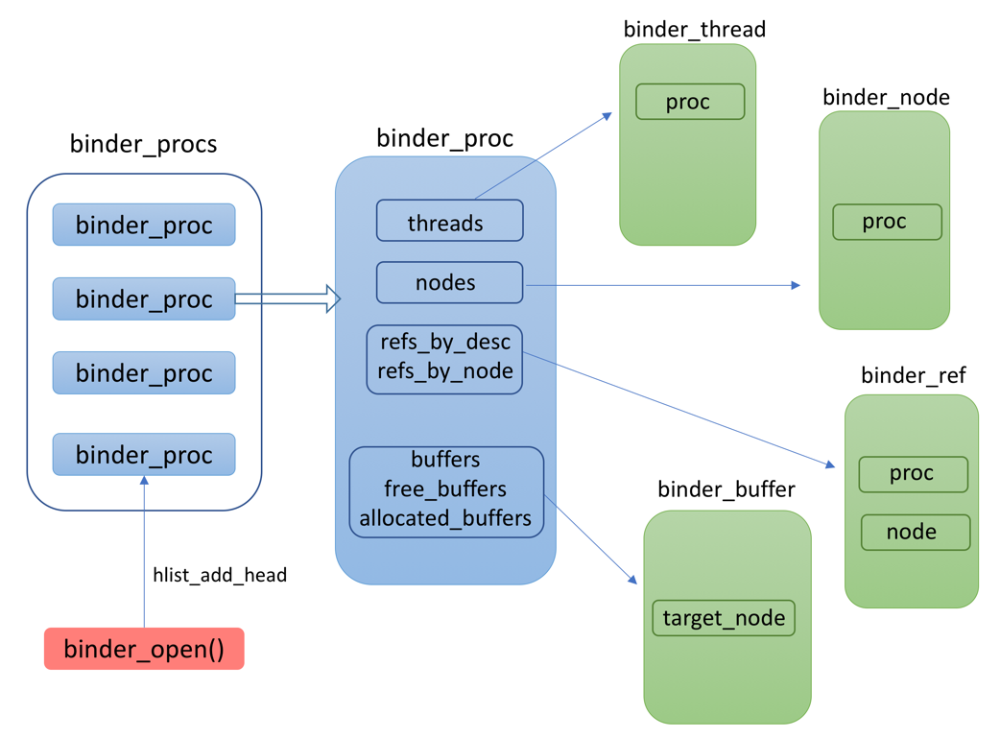

### 2. 内存映射（mmap）

在打开Binder设备之后，进程还会通过`mmap`进行内存映射。`mmap`的作用有如下两个：
- 申请一块内存空间，用来接收Binder通信过程中的数据
- 对这块内存进行地址映射，以便将来访问

`binder_mmap`函数对应了`mmap`系统调用的处理，这个函数也是Binder驱动的精华所在（这里说的`binder_mmap`函数也包括其内部调用的`binder_update_page_range`函数，见下文）。

前文我们说到，使用Binder机制，数据只需要经历一次拷贝就可以了，其原理就在这个函数中。

`binder_mmap`这个函数中，会申请一块物理内存，然后在用户空间和内核空间同时对应到这块内存上。在这之后，当有Client要发送数据给Server的时候，只需一次，将Client发送过来的数据拷贝到Server端的内核空间指定的内存地址即可，由于这个内存地址在服务端已经同时映射到用户空间，因此无需再做一次复制，Server即可直接访问，整个过程如下图所示：

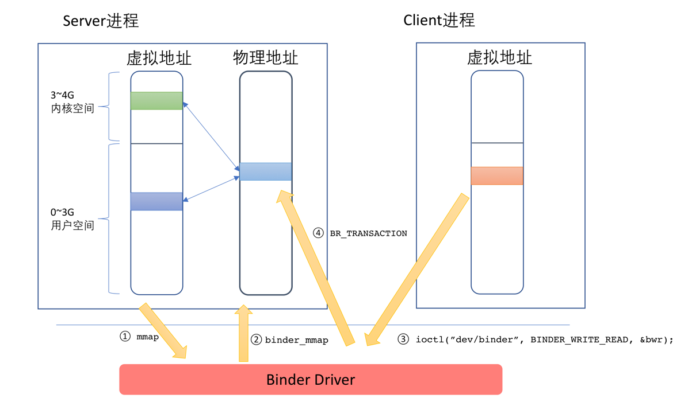

这幅图的说明如下：
1. Server在启动之后，对`/dev/binder`设备调用`mmap`
2. 内核中的`binder_mmap`函数进行对应的处理：申请一块物理内存，然后在用户空间和内核空间同时进行映射
3. Client通过`BINDER_WRITE_READ`命令发送请求，这个请求将先到驱动中，同时需要将数据从Client进程的用户空间拷贝到内核空间
4. 驱动通过`BR_TRANSACTION`通知Server有人发出请求，Server进行处理。由于这块内存也在用户空间进行了映射，因此Server进程的代码可以直接访问

了解原理之后，我们再来看一下Binder驱动的相关源码。这段代码有两个函数：
- `binder_mmap`函数对应了mmap的系统调用的处理
- `binder_update_page_range`函数真正实现了内存分配和地址映射
```C
static int binder_mmap(struct file *filp, struct vm_area_struct *vma)
{
	int ret;

	struct vm_struct *area;
	struct binder_proc *proc = filp->private_data;
	const char *failure_string;
	struct binder_buffer *buffer;

	...
   // 在内核空间获取一块地址范围
	area = get_vm_area(vma->vm_end - vma->vm_start, VM_IOREMAP);
	...
	proc->buffer = area->addr;
	// 记录内核空间与用户空间的地址偏移
	proc->user_buffer_offset = vma->vm_start - (uintptr_t)proc->buffer;
	mutex_unlock(&binder_mmap_lock);

	...
	proc->pages = kzalloc(sizeof(proc->pages[0]) * ((vma->vm_end - vma->vm_start) / PAGE_SIZE), GFP_KERNEL);
	...
	proc->buffer_size = vma->vm_end - vma->vm_start;

	vma->vm_ops = &binder_vm_ops;
	vma->vm_private_data = proc;

	/* binder_update_page_range assumes preemption is disabled */
	preempt_disable();
	// 通过下面这个函数真正完成内存的申请和地址的映射
	// 初次使用，先申请一个PAGE_SIZE大小的内存
	ret = binder_update_page_range(proc, 1, proc->buffer, proc->buffer + PAGE_SIZE, vma);
	...
}

static int binder_update_page_range(struct binder_proc *proc, int allocate,
				    void *start, void *end,
				    struct vm_area_struct *vma)
{
	void *page_addr;
	unsigned long user_page_addr;
	struct vm_struct tmp_area;
	struct page **page;
	struct mm_struct *mm;
	...
	for (page_addr = start; page_addr < end; page_addr += PAGE_SIZE) {
		int ret;
		struct page **page_array_ptr;
		page = &proc->pages[(page_addr - proc->buffer) / PAGE_SIZE];
		...
		// 真正进行内存的分配
		*page = alloc_page(GFP_KERNEL | __GFP_HIGHMEM | __GFP_ZERO);
		...
		tmp_area.addr = page_addr;
		tmp_area.size = PAGE_SIZE + PAGE_SIZE /* guard page? */;
		page_array_ptr = page;
		// 在内核空间进行内存映射
		ret = map_vm_area(&tmp_area, PAGE_KERNEL, &page_array_ptr);
		...
		user_page_addr =
			(uintptr_t)page_addr + proc->user_buffer_offset;
		// 在用户空间进行内存映射
		ret = vm_insert_page(vma, user_page_addr, page[0]);
		...
		/* vm_insert_page does not seem to increment the refcount */
	}
	if (mm) {
		up_write(&mm->mmap_sem);
		mmput(mm);
	}

	preempt_disable();

	return 0;
...	
```
在开发过程中，我们可以通过procfs看到进程映射的这块内存空间：
1. 将Android设备连接到电脑上之后，通过`adb shell`进入到终端
2. 然后选择一个使用了Binder的进程，例如`system_server`，通过`ps|grep system_server`来确定进程号，例如是1889
3. 通过`cat /proc/[pid]/maps | grep "/dev/binder"`过滤出这块内存的地址

### 3. 内存的管理

上文中，我们看到`binder_mmap`的时候，会申请一个`PAGE_SIZE`(通常是4K)的内存。而实际使用过程中，一个`PAGE_SIZE`的大小通常是不够的。

在驱动中，会根据实际的使用情况进行内存的分配。有内存的分配，当然也需要内存的释放。这里我们就来看看Binder驱动中是如何进行内存的管理的。

首先，我们还是从一次IPC请求说起。当一个Client想要对Server发出请求时，它首先将请求发送到Binder设备上，由Binder驱动根据请求的信息找到对应的目标节点，然后将请求数据传递过去。

进程通过`ioctl`系统调用来发出请求：`ioctl(mProcess->mDriverFD, BINDER_WRITE_READ, &bwr)`

> 这行代码来自于Framework层的`IPCThreadState`类。`IPCThreadState`类专门负责与驱动进行通信。

`mProcess->mDriverFD`对应打开Binder设备时的fd。`BINDER_WRITE_READ`对应了具体要做的操作码，这个操作码将由Binder驱动解析。`bwr`存储了请求数据，其类型是`binder_write_read`。

`binder_write_read`是一个相对外层的数据结构，其内部包含一个`binder_transaction_data`结构的数据。`binder_transaction_data`包含了发出请求者的标识，请求的目标对象以及请求所需要的参数。它们的关系如下图所示：

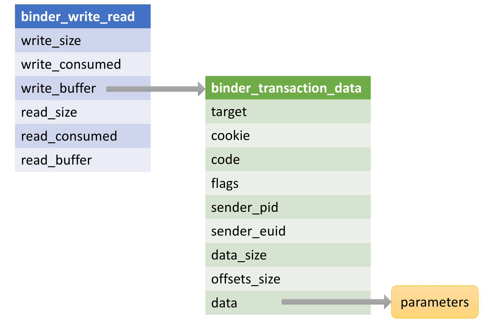

binder_ioctl函数对应了ioctl系统调用的处理。这个函数的逻辑比较简单，就是根据ioctl的命令来确定进一步处理的逻辑，具体如下:
- 如果命令是`BINDER_WRITE_READ`，并且
    - 如果 `bwr.write_size > 0`，则调用`binder_thread_write`
    - 如果 `bwr.read_size > 0`，则调用`binder_thread_read`
- 如果命令是`BINDER_SET_MAX_THREADS`，则设置进程的`max_threads`，即进程支持的最大线程数
- 如果命令是`BINDER_SET_CONTEXT_MGR`，则设置当前进程为`ServiceManager`，见下文
- 如果命令是`BINDER_THREAD_EXIT`，则调用`binder_free_thread`，释放`binder_thread`
- 如果命令是`BINDER_VERSION`，则返回当前的Binder版本号

这其中，最关键的就是`binder_thread_write`方法。当Client请求Server的时候，便会发送一个`BINDER_WRITE_READ`命令，同时框架会将将实际的数据包装好。此时，`binder_transaction_data`中的code将是`BC_TRANSACTION`，由此便会调用到`binder_transaction`方法，这个方法是对一次Binder事务的处理，这其中会调用`binder_alloc_buf`函数为此次事务申请一个缓存。这里提到到调用关系如下：

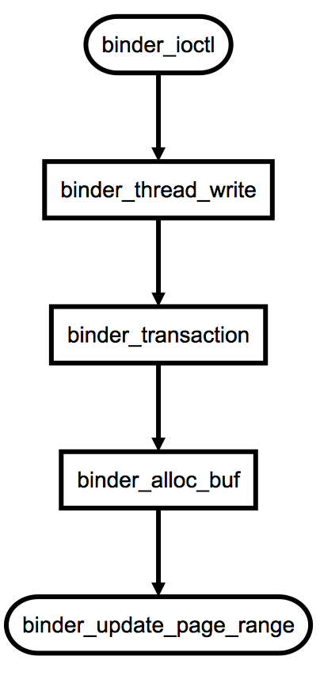

`binder_update_page_range`这个函数在上文中，已经看到过了。其作用就是：进行内存分配并且完成内存的映射。而`binder_alloc_buf`函数，正如其名称那样的：完成缓存的分配。

在驱动中，通过`binder_buffer`结构体描述缓存。一次Binder事务就会对应一个`binder_buffer`，其结构如下所示：
```C
struct binder_buffer {
	struct list_head entry;
	struct rb_node rb_node;
	
	unsigned free:1;
	unsigned allow_user_free:1;
	unsigned async_transaction:1;
	unsigned debug_id:29;

	struct binder_transaction *transaction;

	struct binder_node *target_node;
	size_t data_size;
	size_t offsets_size;
	uint8_t data[0];
};
```
而在`binder_proc`（描述了使用Binder的进程）中，包含了几个字段用来管理进程在Binder IPC过程中缓存，如下：
```C
struct binder_proc {
	...
	struct list_head buffers; // 进程拥有的buffer列表
	struct rb_root free_buffers; // 空闲buffer列表
	struct rb_root allocated_buffers; // 已使用的buffer列表 
	size_t free_async_space; // 剩余的异步调用的空间
	
	size_t buffer_size; // 缓存的上限
  ...
};
```
进程在`mmap`时，会设定支持的总缓存大小的上限（下文会讲到）。而进程每当收到`BC_TRANSACTION`，就会判断已使用缓存加本次申请的和有没有超过上限。如果没有，就考虑进行内存的分配。

进程的空闲缓存记录在`binder_proc`的`free_buffers`中，这是一个以红黑树形式存储的结构。每次尝试分配缓存的时候，会从这里面按大小顺序进行查找，找到最接近需要的一块缓存。查找的逻辑如下：
```C
while (n) {
	buffer = rb_entry(n, struct binder_buffer, rb_node);
	BUG_ON(!buffer->free);
	buffer_size = binder_buffer_size(proc, buffer);

	if (size < buffer_size) {
		best_fit = n;
		n = n->rb_left;
	} else if (size > buffer_size)
		n = n->rb_right;
	else {
		best_fit = n;
		break;
	}
}
```
找到之后，还需要对`binder_proc`中的字段进行相应的更新：
```C
rb_erase(best_fit, &proc->free_buffers);
buffer->free = 0;
binder_insert_allocated_buffer(proc, buffer);
if (buffer_size != size) {
	struct binder_buffer *new_buffer = (void *)buffer->data + size;
	list_add(&new_buffer->entry, &buffer->entry);
	new_buffer->free = 1;
	binder_insert_free_buffer(proc, new_buffer);
}
binder_debug(BINDER_DEBUG_BUFFER_ALLOC,
	     "%d: binder_alloc_buf size %zd got %p\n",
	      proc->pid, size, buffer);
buffer->data_size = data_size;
buffer->offsets_size = offsets_size;
buffer->async_transaction = is_async;
if (is_async) {
	proc->free_async_space -= size + sizeof(struct binder_buffer);
	binder_debug(BINDER_DEBUG_BUFFER_ALLOC_ASYNC,
		     "%d: binder_alloc_buf size %zd async free %zd\n",
		      proc->pid, size, proc->free_async_space);
}
```
下面我们再来看看内存的释放。

`BC_FREE_BUFFER`命令是通知驱动进行内存的释放，`binder_free_buf`函数是真正实现的逻辑，这个函数与`binder_alloc_buf`是刚好对应的。在这个函数中，所做的事情包括：
- 重新计算进程的空闲缓存大小
- 通过`binder_update_page_range`释放内存
- 更新`binder_proc`的`buffers`，`free_buffers`，`allocated_buffers`字段

### Binder中的“面向对象”

Binder机制淡化了进程的边界，使得跨越进程也能够调用到指定服务的方法，其原因是因为Binder机制在底层处理了在进程间的“对象”传递。

在Binder驱动中，并不是真的将对象在进程间来回序列化，而是通过特定的标识来进行对象的传递。Binder驱动中，通过`flat_binder_object`来描述需要跨越进程传递的对象。其定义如下：
```C
enum {
	BINDER_TYPE_BINDER	= B_PACK_CHARS('s', 'b', '*', B_TYPE_LARGE),
	BINDER_TYPE_WEAK_BINDER	= B_PACK_CHARS('w', 'b', '*', B_TYPE_LARGE),
	BINDER_TYPE_HANDLE	= B_PACK_CHARS('s', 'h', '*', B_TYPE_LARGE),
	BINDER_TYPE_WEAK_HANDLE	= B_PACK_CHARS('w', 'h', '*', B_TYPE_LARGE),
	BINDER_TYPE_FD		= B_PACK_CHARS('f', 'd', '*', B_TYPE_LARGE),
};

struct flat_binder_object {
	__u32		type;
	__u32		flags;

	union {
		binder_uintptr_t	binder; /* local object */
		__u32			handle;	/* remote object */
	};
	binder_uintptr_t	cookie;
};
```
当对象传递到Binder驱动中的时候，由驱动来进行翻译和解释，然后传递到接收的进程。

例如当Server把Binder实体传递给Client时，在发送数据流中，`flat_binder_object`中的type是`BINDER_TYPE_BINDER`，同时binder字段指向Server进程用户空间地址。但这个地址对于Client进程是没有意义的（Linux中，每个进程的地址空间是互相隔离的），驱动必须对数据流中的`flat_binder_object`做相应的翻译：将type改成`BINDER_TYPE_HANDLE`；为这个Binder在接收进程中创建位于内核中的引用并将引用号填入`handle`中。对于发生数据流中引用类型的Binder也要做同样转换。经过处理后接收进程从数据流中取得的Binder引用才是有效的，才可以将其填入数据包`binder_transaction_data`的`target.handle`域，向Binder实体发送请求。

由于每个请求和请求的返回都会经历内核的翻译，因此这个过程从进程的角度来看是完全透明的。进程完全不用感知这个过程，就好像对象真的在进程间来回传递一样。

### 驱动层的线程管理

上文多次提到，Binder本身是C/S架构。由Server提供服务，被Client使用。既然是C/S架构，就可能存在多个Client会同时访问Server的情况。 在这种情况下，如果Server只有一个线程处理响应，就会导致客户端的请求可能需要排队而导致响应过慢的现象发生。解决这个问题的方法就是引入多线程。

Binder机制的设计从最底层–驱动层，就考虑到了对于多线程的支持。具体内容如下：
- 使用Binder的进程在启动之后，通过`BINDER_SET_MAX_THREADS`告知驱动其支持的最大线程数量
- 驱动会对线程进行管理。在`binder_proc`结构中，这些字段记录了进程中线程的信息：`max_threads`，`requested_threads`，`requested_threads_started`，`ready_threads`
- `binder_thread`结构对应了Binder进程中的线程
- 驱动通过`BR_SPAWN_LOOPER`命令告知进程需要创建一个新的线程
- 进程通过`BC_ENTER_LOOPER`命令告知驱动其主线程已经ready
- 进程通过`BC_REGISTER_LOOPER`命令告知驱动其子线程（非主线程）已经ready
- 进程通过`BC_EXIT_LOOPER`命令告知驱动其线程将要退出
- 在线程退出之后，通过`BINDER_THREAD_EXIT`告知Binder驱动。驱动将对应的`binder_thread`对象销毁

### 再聊ServiceManager

上文已经说过，每一个Binder Server在驱动中会有一个`binder_node`进行对应。同时，Binder驱动会负责在进程间传递服务对象，并负责底层的转换。另外，每一个Binder服务都需要有一个唯一的名称。由ServiceManager来管理这些服务的注册和查找。

而实际上，为了便于使用，ServiceManager本身也实现为一个Server对象。任何进程在使用ServiceManager的时候，都需要先拿到指向它的标识。然后通过这个标识来使用ServiceManager。

这似乎形成了一个互相矛盾的现象：
- 通过ServiceManager我们才能拿到Server的标识
- ServiceManager本身也是一个Server

解决这个矛盾的办法其实也很简单：Binder机制为ServiceManager预留了一个特殊的位置。这个位置是预先定好的，任何想要使用ServiceManager的进程只要通过这个特定的位置就可以访问到ServiceManager了（而不用通过ServiceManager的接口）。

在Binder驱动中，有一个全局的变量：
```C
static struct binder_node *binder_context_mgr_node;
```
这个变量指向的就是ServiceManager。

当有进程通过`ioctl`并指定命令为`BINDER_SET_CONTEXT_MGR`的时候，驱动被认定这个进程是ServiceManager，`binder_ioctl`函数中有对应的处理。

ServiceManager应当要先于所有Binder Server之前启动。在它启动完成并告知Binder驱动之后，驱动便设定好了这个特定的节点。在这之后，当有其他模块想要使用ServerManager的时候，只要将请求指向ServiceManager所在的位置即可。

在Binder驱动中，通过`handle = 0`这个位置来访问ServiceManager。如`binder_transaction`中，判断如果`target.handler`为0，则认为这个请求是发送给ServiceManager的。

## 二、 Binder机制：C++层

Framework是一个中间层，它对接了底层实现，封装了复杂的内部逻辑，并提供供外部使用的接口。Framework层是应用程序开发的基础。Binder Framework层分为C++和Java两个部分，为了达到功能的复用，中间通过JNI进行衔接。

Binder Framework的C++部分，头文件位于：`/frameworks/native/include/binder/`，实现位于：`/frameworks/native/libs/binder/`。Binder库最终会编译成一个动态链接库：`libbinder.so`，供其他进程链接使用。

为了便于说明，下文中我们将Binder Framework 的C++部分称之为`libbinder`。

### 主要结构

libbinder中，将实现分为Proxy和Native两端。Proxy对应了上文提到的Client端，是服务对外提供的接口。而Native是服务实现的一端，对应了上文提到的Server端。类名中带有小写字母p的（例如BpInterface），就是指Proxy端。类名带有小写字母n的（例如BnInterface），就是指Native端。

Proxy代表了调用方，通常与服务的实现不在同一个进程，因此下文中，我们也称Proxy端为“远程”端。Native端是服务实现的自身，因此下文中，我们也称Native端为”本地“端。

这里，我们先对libbinder中的主要类做一个简要说明，了解一下它们的关系，然后再详细的讲解。

| 类名             | 说明                                       |
| -------------- | ---------------------------------------- |
| BpRefBase      | RefBase的子类，提供remote()方法获取远程Binder        |
| IInterface     | Binder服务接口的基类，Binder服务通常需要同时提供本地接口和远程接口  |
| BpInterface    | 远程接口的基类，远程接口是供客户端调用的接口集                  |
| BnInterface    | 本地接口的基类，本地接口是需要服务中真正实现的接口集               |
| IBiner         | Binder对象的基类，BBinder和BpBinder都是这个类的子类     |
| BpBinder       | 远程Binder，这个类提供transact方法来发送请求，BpXXX实现中会用到 |
| BBinder        | 本地Binder，服务实现方的基类，提供了onTransact接口来接收请求   |
| ProcessState   | 代表了使用Binder的进程                           |
| IPCThreadState | 代表了使用Binder的线程，这个类中封装了与Binder驱动通信的逻辑     |
| Parcel         | 在Binder上传递的数据的包装器                        |

下图描述了这些类之间的关系：


另外说明一下，Binder服务的实现类（图中紫色部分）通常都会遵守下面的命名规则：
- 服务的接口使用I字母作为前缀
- 远程接口使用Bp作为前缀
- 本地接口使用Bn作为前缀

看了上面这些介绍，你可能还是不太容易理解。不过不要紧，下面我们会逐步拆分讲解这些内容。

在这幅图中，浅黄色部分的结构是最难理解的，因此我们先从它们着手。

先来看看IBinder这个类。这个类描述了所有在Binder上传递的对象，它既是Binder本地对象BBinder的父类，也是Binder远程对象BpBinder的父类。这个类中的主要方法说明如下：

| 方法名                    | 说明                                |
| ---------------------- | --------------------------------- |
| localBinder            | 获取本地Binder对象                      |
| remoteBinder           | 获取远程Binder对象                      |
| transact               | 进行一次Binder操作                      |
| queryLocalInterface    | 尝试获取本地Binder，如何失败返回NULL           |
| getInterfaceDescriptor | 获取Binder的服务接口描述，其实就是Binder服务的唯一标识 |
| isBinderAlive          | 查询Binder服务是否还活着                   |
| pingBinder             | 发送PING_TRANSACTION给Binder服务       |

BpBinder的实例代表了远程Binder，这个类的对象将被客户端调用。其中handle方法会返回指向Binder服务实现者的句柄，这个类最重要就是提供了transact方法，这个方法会将远程调用的参数封装好发送到Binder驱动。

由于每个Binder服务通常都会提供多个服务接口，而这个方法中的`uint32_t code`参数就是用来对服务接口进行编号区分的。Binder服务的每个接口都需要指定一个唯一的code，这个code要在Proxy和Native端配对好。当客户端将请求发送到服务端的时候，服务端根据这个code（onTransact方法中）来区分调用哪个接口方法。

BBinder的实例代表了本地Binder，它描述了服务的提供方，所有Binder服务的实现者都要继承这个类（的子类），在继承类中，最重要的就是实现`onTransact`方法，因为这个方法是所有请求的入口。因此，这个方法是和BpBinder中的`transact`方法对应的，这个方法同样也有一个`uint32_t code`参数，在这个方法的实现中，由服务提供者通过code对请求的接口进行区分，然后调用具体实现服务的方法。

IBinder中定义了`uint32_t code`允许的范围：
```C
FIRST_CALL_TRANSACTION  = 0x00000001,
LAST_CALL_TRANSACTION   = 0x00ffffff,
```
Binder服务要保证自己提供的每个服务接口有一个唯一的code，例如某个Binder服务可以将：add接口code设为1，minus接口code设为2，multiple接口code设为3，divide接口code设为4，等等。
讲完了IBinder，BpBinder和BBinder三个类，我们再来看看BpReBase，IInterface，BpInterface和BnInterface。

每个Binder服务都是为了某个功能而实现的，因此其本身会定义一套接口集（通常是C++的一个类）来描述自己提供的所有功能。而Binder服务既有自身实现服务的类，也要有给客户端进程调用的类。为了便于开发，这两中类里面的服务接口应当是一致的，例如：假设服务实现方提供了一个接口为add(int a, int b)的服务方法，那么其远程接口中也应当有一个add(int a, int b)方法。因此为了实现方便，本地实现类和远程接口类需要有一个公共的描述服务接口的基类（即上图中的IXXXService）来继承。而这个基类通常是IInterface的子类，IInterface的定义如下：
```C++
class IInterface : public virtual RefBase
{
public:
            IInterface();
            static sp<IBinder>  asBinder(const IInterface*);
            static sp<IBinder>  asBinder(const sp<IInterface>&);

protected:
    virtual                     ~IInterface();
    virtual IBinder*            onAsBinder() = 0;
};
```
之所以要继承自IInterface类是因为这个类中定义了`onAsBinder`让子类实现。`onAsBinder`在本地对象的实现类中返回的是本地对象，在远程对象的实现类中返回的是远程对象。`onAsBinder`方法被两个静态方法`asBinder`方法调用。有了这些接口之后，在代码中便可以直接通过`IXXX::asBinder`方法获取到不用区分本地还是远程的IBinder对象。这个在跨进程传递Binder对象的时候有很大的作用（因为不用区分具体细节，只要直接调用和传递就好）。

下面，我们来看一下BpInterface和BnInterface的定义：
```C++
template<typename INTERFACE>
class BnInterface : public INTERFACE, public BBinder
{
public:
    virtual sp<IInterface>      queryLocalInterface(const String16& _descriptor);
    virtual const String16&     getInterfaceDescriptor() const;

protected:
    virtual IBinder*            onAsBinder();
};

template<typename INTERFACE>
class BpInterface : public INTERFACE, public BpRefBase
{
public:
                                BpInterface(const sp<IBinder>& remote);

protected:
    virtual IBinder*            onAsBinder();
};
```
这两个类都是模板类，它们在继承自INTERFACE的基础上各自继承了另外一个类。这里的INTERFACE便是我们Binder服务接口的基类。另外，BnInterface继承了BBinder类，由此可以通过复写`onTransact`方法来提供实现。BpInterface继承了BpRefBase，通过这个类的`remote`方法可以获取到指向服务实现方的句柄。在客户端接口的实现类中，每个接口在组装好参数之后，都会调用`remote()->transact`来发送请求，而这里其实就是调用的BpBinder的`transact`方法，这样请求便通过Binder到达了服务实现方的`onTransact`中。这个过程如下图所示：


基于Binder框架开发的服务，除了满足上文提到的类名规则之外，还需要遵守其他一些共同的规约：
- 为了进行服务的区分，每个Binder服务需要指定一个唯一的标识，这个标识通过`getInterfaceDescriptor`返回，类型是一个字符串。通常，Binder服务会在类中定义`static const android::String16 descriptor`;这样一个常量来描述这个标识符，然后在`getInterfaceDescriptor`方法中返回这个常量。
- 为了便于调用者获取到调用接口，服务接口的公共基类需要提供一个`android::sp<IXXX> asInterface`方法来返回基类对象指针。

由于上面提到的这两点对于所有Binder服务的实现逻辑都是类似的。为了简化开发者的重复工作，在libbinder中，定义了两个宏来简化这些重复工作，它们是：
```C++
#define DECLARE_META_INTERFACE(INTERFACE)                            \
    static const android::String16 descriptor;                       \
    static android::sp<I##INTERFACE> asInterface(                    \
            const android::sp<android::IBinder>& obj);               \
    virtual const android::String16& getInterfaceDescriptor() const; \
    I##INTERFACE();                                                  \
    virtual ~I##INTERFACE();                                         \


#define IMPLEMENT_META_INTERFACE(INTERFACE, NAME)                    \
    const android::String16 I##INTERFACE::descriptor(NAME);          \
    const android::String16&                                         \
            I##INTERFACE::getInterfaceDescriptor() const {           \
        return I##INTERFACE::descriptor;                             \
    }                                                                \
    android::sp<I##INTERFACE> I##INTERFACE::asInterface(             \
            const android::sp<android::IBinder>& obj)                \
    {                                                                \
        android::sp<I##INTERFACE> intr;                              \
        if (obj != NULL) {                                           \
            intr = static_cast<I##INTERFACE*>(                       \
                obj->queryLocalInterface(                            \
                        I##INTERFACE::descriptor).get());            \
            if (intr == NULL) {                                      \
                intr = new Bp##INTERFACE(obj);                       \
            }                                                        \
        }                                                            \
        return intr;                                                 \
    }                                                                \
    I##INTERFACE::I##INTERFACE() { }                                 \
    I##INTERFACE::~I##INTERFACE() { }                                \
```
有了这两个宏之后，开发者只要在接口基类（IXXX）头文件中，使用`DECLARE_META_INTERFACE`宏便完成了需要的组件的声明。然后在cpp文件中使用`IMPLEMENT_META_INTERFACE`便完成了这些组件的实现。

### Binder的初始化

在讲解Binder驱动的时候我们就提到：任何使用Binder机制的进程都必须要对`/dev/binder`设备进行`open`以及`mmap`之后才能使用，这部分逻辑是所有使用Binder机制进程共同的。对于这种共同逻辑的封装便是Framework层的职责之一。libbinder中，ProcessState类封装了这个逻辑，相关代码见下文。

ProcessState构造函数中，初始化`mDriverFD`的时候调用了`open_driver`方法打开binder设备，然后又在函数体中，通过`mmap`进行内存映射。

`open_driver`的函数实现如下所示。在这个函数中完成了三个工作：
- 首先通过open系统调用打开了`dev/binder`设备
- 然后通过ioctl获取Binder实现的版本号，并检查是否匹配
- 最后通过ioctl设置进程支持的最大线程数量

关于这部分逻辑背后的处理，在讲解Binder驱动的时候，我们已经讲解过了。
```C++
static int open_driver()
{
    int fd = open("/dev/binder", O_RDWR | O_CLOEXEC);
    if (fd >= 0) {
        int vers = 0;
        status_t result = ioctl(fd, BINDER_VERSION, &vers);
        ...
        size_t maxThreads = DEFAULT_MAX_BINDER_THREADS;
        result = ioctl(fd, BINDER_SET_MAX_THREADS, &maxThreads);
        ...
    } else {
        ALOGW("Opening '/dev/binder' failed: %s\n", strerror(errno));
    }
    return fd;
}
```
ProcessState是一个Singleton（单例）类型的类，在一个进程中，只会存在一个实例。通过`ProcessState::self()`接口获取这个实例。一旦获取这个实例，便会执行其构造函数，由此完成了对于Binder设备的初始化工作。

### 关于Binder传递数据的大小限制

由于Binder的数据需要跨进程传递，并且还需要在内核上开辟空间，因此允许在Binder上传递的数据并不是无无限大的。mmap中指定的大小便是对数据传递的大小限制：
```C++
#define BINDER_VM_SIZE ((1*1024*1024) - (4096 *2)) // 1M - 8k

mVMStart = mmap(0, BINDER_VM_SIZE, PROT_READ, MAP_PRIVATE | MAP_NORESERVE, mDriverFD, 0);
```
这里我们看到，在进行`mmap`的时候，指定了最大size为`BINDER_VM_SIZE`，即 1M - 8k的大小。 因此我们在开发过程中，一次Binder调用的数据总和不能超过这个大小。

对于这个区域的大小，也可以在设备上进行确认。这里以system_server为例。上面我们讲解了通过procfs来获取映射的内存地址，除此之外，也可以通过`showmap`命令，来确定这块区域的大小，相关命令如下：
```Shell
root:/ # ps  | grep system_server                                            
system    1889  526   2353404 135968 SyS_epoll_ 72972eeaf4 S system_server
root:/ # showmap 1889 | grep "/dev/binder"                                   
    1016        4        4        0        0        4        0        0    1 /dev/binder
```
这里可以看到，这块区域的大小正是 1M - 8K = 1016k。

> 通过`showmap`命令可以看到进程的详细内存占用情况。在实际的开发过程中，当我们要对某个进程做内存占用分析的时候，这个命令是相当有用的。建议读者尝试通过showmap命令查看system_server或其他感兴趣进程的完整map，看看这些进程都依赖了哪些库或者模块，以及内存占用情况是怎样的。

### 与驱动的通信

上文提到ProcessState是一个单例类，一个进程只有一个实例。而负责与Binder驱动通信的IPCThreadState也是一个单例类。但这个类不是一个进程只有一个实例，而是一个线程有一个实例。

IPCThreadState负责了与驱动通信的细节处理。这个类中的关键几个方法说明如下：

| 方法                   | 说明                                  |
| -------------------- | ----------------------------------- |
| transact             | 公开接口。供Proxy发送数据到驱动，并读取返回结果          |
| sendReply            | 供Server端写回请求的返回结果                   |
| waitForResponse      | 发送请求后等待响应结果                         |
| talkWithDriver       | 通过ioctl BINDER_WRITE_READ来与驱动通信     |
| writeTransactionData | 写入一次事务的数据                           |
| executeCommand       | 处理binder_driver_return_protocol协议命令 |
| freeBuffer           | 通过BC_FREE_BUFFER命令释放Buffer          |

`BpBinder::transact`方法在发送请求的时候，其实就是直接调用了IPCThreadState对应的方法来发送请求到Binder驱动的。而IPCThreadState::transact方法主要逻辑如下：
```C++
status_t IPCThreadState::transact(int32_t handle,
                                  uint32_t code, const Parcel& data,
                                  Parcel* reply, uint32_t flags)
{
    status_t err = data.errorCheck();
    flags |= TF_ACCEPT_FDS;

    if (err == NO_ERROR) {
        err = writeTransactionData(BC_TRANSACTION, flags, handle, code, data, NULL);
    }

    if (err != NO_ERROR) {
        if (reply) reply->setError(err);
        return (mLastError = err);
    }

    if ((flags & TF_ONE_WAY) == 0) {
        if (reply) {
            err = waitForResponse(reply);
        } else {
            Parcel fakeReply;
            err = waitForResponse(&fakeReply);
        }
    } else {
        err = waitForResponse(NULL, NULL);
    }

    return err;
}
```
这段代码应该还是比较好理解的：首先通过`writeTransactionData`写入数据，然后通过`waitForResponse`等待返回结果。`TF_ONE_WAY`表示此次请求是单向的，即：不用真正等待结果即可返回。而`writeTransactionData`方法其实就是在组装`binder_transaction_data`数据。

对于`binder_transaction_data`在讲解Binder驱动的时候我们已经详细讲解过了。而这里的Parcel我们还不了解，那么接下来我们马上就来看一下这个类。

### 数据包装器：Parcel

Binder上提供的是跨进程的服务，每个服务包含了不同的接口，每个接口的参数数量和类型都不一样。那么当客户端想要调用服务端的接口，参数是如何跨进程传递给服务端的呢？除此之外，服务端想要给客户端返回结果，结果又是如何传递回来的呢？

这些问题的答案就是：Parcel。Parcel就像一个包装器，调用者可以以任意顺序往里面放入需要的数据，所有写入的数据就像是被打成一个整体的包，然后可以直接在Binder上传输。

Parcel提供了所有基本类型的写入和读出接口，下面是其中的一部分：
```C++
...
status_t            writeInt32(int32_t val);
status_t            writeUint32(uint32_t val);
status_t            writeInt64(int64_t val);
status_t            writeUint64(uint64_t val);
status_t            writeFloat(float val);
status_t            writeDouble(double val);
status_t            writeCString(const char* str);
status_t            writeString8(const String8& str);

status_t            readInt32(int32_t *pArg) const;
uint32_t            readUint32() const;
status_t            readUint32(uint32_t *pArg) const;
int64_t             readInt64() const;
status_t            readInt64(int64_t *pArg) const;
uint64_t            readUint64() const;
status_t            readUint64(uint64_t *pArg) const;
float               readFloat() const;
status_t            readFloat(float *pArg) const;
double              readDouble() const;
status_t            readDouble(double *pArg) const;
intptr_t            readIntPtr() const;
status_t            readIntPtr(intptr_t *pArg) const;
bool                readBool() const;
status_t            readBool(bool *pArg) const;
char16_t            readChar() const;
status_t            readChar(char16_t *pArg) const;
int8_t              readByte() const;
status_t            readByte(int8_t *pArg) const;

// Read a UTF16 encoded string, convert to UTF8
status_t            readUtf8FromUtf16(std::string* str) const;
status_t            readUtf8FromUtf16(std::unique_ptr<std::string>* str) const;

const char*         readCString() const;
...
```
因此对于基本类型，开发者可以直接调用接口写入和读出。而对于非基本类型，需要由开发者将其拆分成基本类型然后写入到Parcel中（读出的时候也是一样）。 Parcel会将所有写入的数据进行打包，Parcel本身可以作为一个整体在进程间传递。接收方在收到Parcel之后，只要按写入同样的顺序读出即可。

Parcel既包含C++部分的实现，也同时提供了Java的接口，中间通过JNI衔接。Java层的接口其实仅仅是一层包装，真正的实现都是位于C++部分中，它们的关系如下图所示：

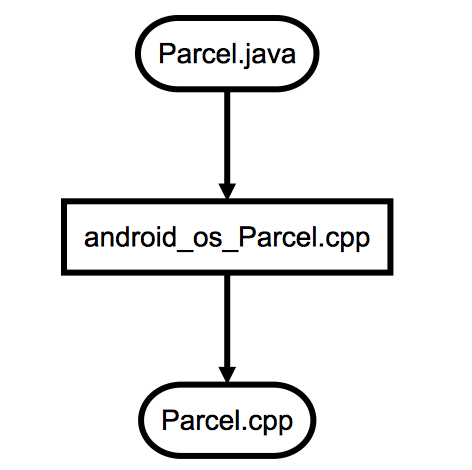

特别需要说明一下的是，Parcel类除了可以传递基本数据类型，还可以传递Binder对象：
```C++
status_t Parcel::writeStrongBinder(const sp<IBinder>& val)
{
    return flatten_binder(ProcessState::self(), val, this);
}
```
这个方法写入的是`sp<IBinder>`类型的对象，而IBinder既可能是本地Binder，也可能是远程Binder，这样我们就不可以不用关心具体细节直接进行Binder对象的传递。这也是为什么IInterface中定义了两个`asBinder`的static方法。

而对于Binder驱动，我们前面已经讲解过：Binder驱动并不是真的将对象在进程间序列化传递，而是由Binder驱动完成了对于Binder对象指针的解释和翻译，使调用者看起来就像在进程间传递对象一样。

### Framework层的线程管理

在讲解Binder驱动的时候，我们就讲解过驱动中对应线程的管理。这里我们再来看看，Framework层是如何与驱动层对接进行线程管理的。

`ProcessState::setThreadPoolMaxThreadCount`方法会通过`BINDER_SET_MAX_THREADS`命令设置进程支持的最大线程数量：
```C++
#define DEFAULT_MAX_BINDER_THREADS 15

status_t ProcessState::setThreadPoolMaxThreadCount(size_t maxThreads) {
    status_t result = NO_ERROR;
    if (ioctl(mDriverFD, BINDER_SET_MAX_THREADS, &maxThreads) != -1) {
        mMaxThreads = maxThreads;
    } else {
        result = -errno;
        ALOGE("Binder ioctl to set max threads failed: %s", strerror(-result));
    }
    return result;
}
```
由此驱动便知道了该Binder服务支持的最大线程数。驱动在运行过程中，会根据需要，并在没有超过上限的情况下，通过`BR_SPAWN_LOOPER`命令通知进程创建线程：

IPCThreadState在收到`BR_SPAWN_LOOPER`请求后，调用`ProcessState::spawnPooledThread`来创建线程：
```C++
status_t IPCThreadState::executeCommand(int32_t cmd)
{
    ...
    case BR_SPAWN_LOOPER:
        mProcess->spawnPooledThread(false);
        break;
    ...
}
```
`ProcessState::spawnPooledThread`方法负责为线程设定名称并创建线程：
```C++
void ProcessState::spawnPooledThread(bool isMain)
{
    if (mThreadPoolStarted) {
        String8 name = makeBinderThreadName();
        ALOGV("Spawning new pooled thread, name=%s\n", name.string());
        sp<Thread> t = new PoolThread(isMain);
        t->run(name.string());
    }
}
```
线程在run之后，会调用`threadLoop`将自身添加的线程池中：
```C++
virtual bool threadLoop()
{
   IPCThreadState::self()->joinThreadPool(mIsMain);
   return false;
}
```
而`IPCThreadState::joinThreadPool`方法中，会根据当前线程是否是主线程发送`BC_ENTER_LOOPER`或者`BC_REGISTER_LOOPER`命令告知驱动线程已经创建完毕。整个调用流程如下图所示：

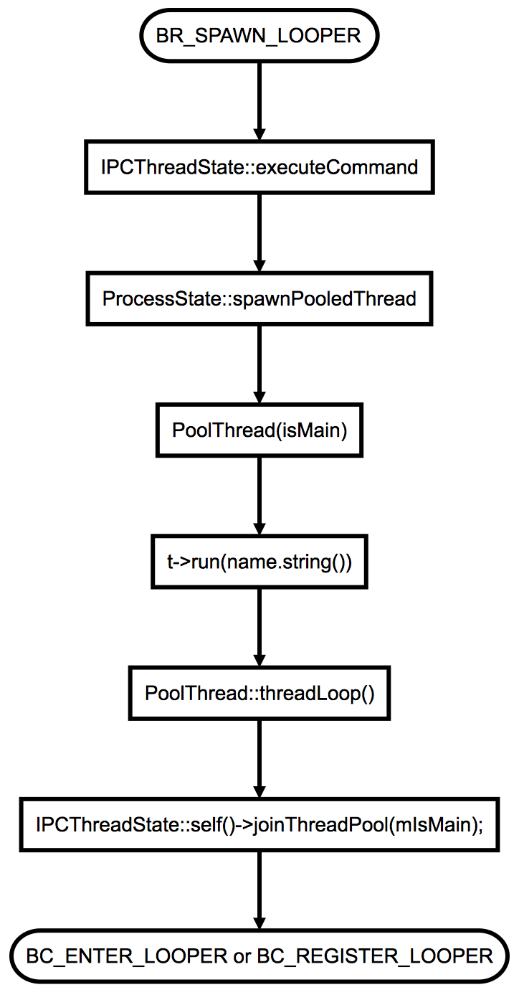

### C++ Binder服务举例

单纯的理论知识也许并不能让我们非常好的理解，下面我们以一个具体的Binder服务例子来结合上文的知识进行讲解。

下面以PowerManager为例，来看看C++的Binder服务是如何实现的。下图是PowerManager C++部分的实现类图（PowerManager也有Java层的接口，但我们这里就不讨论了）。

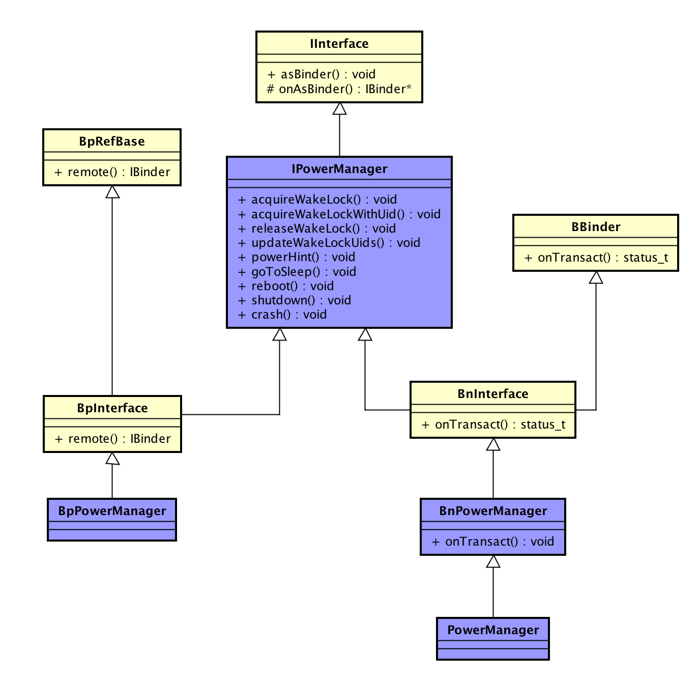

图中Binder Framework中的类我们在上文中已经介绍过了，而PowerManager相关的四个类，便是在Framework的基础上开发的。

IPowerManager定义了PowerManager所有对外提供的功能接口，其子类都继承了这些接口。
- BpPowerManager是提供给客户端调用的远程接口
- BnPowerManager中只有一个`onTransact`方法，该方法根据请求的code来对接每个请求，并直接调用PowerManager中对应的方法
- PowerManager是服务真正的实现

在`IPowerManager.h`中，通过`DECLARE_META_INTERFACE(PowerManager);`声明一些Binder必要的组件。在`IPowerManager.cpp`中，通过`IMPLEMENT_META_INTERFACE(PowerManager, "android.os.IPowerManager");`宏来进行实现。

#### 本地实现：Native端

服务的本地实现主要就是实现BnPowerManager和PowerManager两个类，PowerManager是BnPowerManager的子类，因此在BnPowerManager中调用自身的virtual方法其实都是在子类PowerManager类中实现的。

BnPowerManager类要做的就是复写`onTransact`方法，这个方法的职责是：根据请求的code区分具体调用的是那个接口，然后按顺序从Parcel中读出打包好的参数，接着调用留待子类实现的虚函数。需要注意的是：这里从Parcel读出参数的顺序需要和BpPowerManager中写入的顺序完全一致，否则读出的数据将是无效的。

电源服务包含了好几个接口。虽然每个接口的实现逻辑各不一样，但从Binder框架的角度来看，它们的实现结构是一样。而这里我们并不关心电源服务的实现细节，因此我们取其中一个方法看其实现方式即可。

首先我们来看一下`BnPowerManager::onTransact`中的代码片段：
```C++
status_t BnPowerManager::onTransact(uint32_t code,
                                    const Parcel& data,
                                    Parcel* reply,
                                    uint32_t flags) {
  switch (code) {
  ...
      case IPowerManager::REBOOT: {
      CHECK_INTERFACE(IPowerManager, data, reply);
      bool confirm = data.readInt32();
      String16 reason = data.readString16();
      bool wait = data.readInt32();
      return reboot(confirm, reason, wait);
    }
  ...
  }
}
```
这段代码中我们看到了实现中是如何根据code区分接口，并通过Parcel读出调用参数，然后调用具体服务方的。而PowerManager这个类才真正是服务实现的本体，reboot方法真正实现了重启的逻辑。

通过这样结构的设计，将框架相关的逻辑（BnPowerManager中的实现）和业务本身的逻辑（PowerManager中的实现）彻底分离开了，保证每一个类都非常的“干净”，这一点是很值得我们在做软件设计时学习的。

### 服务的发布

服务实现完成之后，并不是立即就能让别人使用的。上文中说到过：所有在Binder上发布的服务必须要注册到ServiceManager中才能被其他模块获取和使用。而在BinderService类中，提供了`publishAndJoinThreadPool`方法来简化服务的发布，其代码如下：
```C++
static void publishAndJoinThreadPool(bool allowIsolated = false) {
   publish(allowIsolated);
   joinThreadPool();
}

static status_t publish(bool allowIsolated = false) {
   sp<IServiceManager> sm(defaultServiceManager());
   return sm->addService(
           String16(SERVICE::getServiceName()),
           new SERVICE(), allowIsolated);
}

...

static void joinThreadPool() {
   sp<ProcessState> ps(ProcessState::self());
   ps->startThreadPool();
   ps->giveThreadPoolName();
   IPCThreadState::self()->joinThreadPool();
}
```
由此可见，Binder服务的发布其实有三个步骤：
1. 通过`IServiceManager::addService`在ServiceManager中进行服务的注册
2. 通过`ProcessState::startThreadPool`启动线程池
3. 通过`IPCThreadState::joinThreadPool`将主线程加入的Binder中

### 远程接口：Proxy端

Proxy类是供客户端使用的。BpPowerManager需要实现IPowerManager中的所有接口。
我们还是以上文提到的reboot接口为例，来看看`BpPowerManager::reboot`方法是如何实现的：
```C++
virtual status_t reboot(bool confirm, const String16& reason, bool wait)
{
   Parcel data, reply;
   data.writeInterfaceToken(IPowerManager::getInterfaceDescriptor());
   data.writeInt32(confirm);
   data.writeString16(reason);
   data.writeInt32(wait);
   return remote()->transact(REBOOT, data, &reply, 0);
}
```
这段代码很简单，逻辑就是：通过Parcel写入调用参数进行打包，然后调用`remote()->transact`将请求发送出去。

其实BpPowerManager中其他方法，甚至所有其他BpXXX中所有的方法，实现都是和这个方法一样的套路。就是：通过Parcel打包数据，通过`remote()->transact`发送数据。而这里的`remote()`返回的其实就是**BpBinder**对象，由此经由`IPCThreadState`将数据发送到了驱动层。如果你已经不记得，请重新看一下下面这幅图：


另外，需要说明一下的是，这里的REBOOT就是请求的code，而这个code是在IPowerManager中定义好的，这样子类可以直接使用，并保证是一致的。

### 服务的获取

在服务已经发布之后，客户端该如何获取其服务接口然后对其发出请求调用呢？很显然，客户端应该通过BpPowerManager的对象来请求其服务。但看一眼BpPowerManager的构造函数，我们会发现，似乎没法直接创建一个这类的对象，因为这里需要一个`sp<IBinder>`类型的参数。
```C++
BpPowerManager(const sp<IBinder>& impl)
   : BpInterface<IPowerManager>(impl)
{
}
```
那么这个`sp<IBinder>`参数我们该从哪里获取呢？回忆一下前面的内容：Proxy其实是包含了一个指向Server的句柄，所有的请求发送出去的时候都需要包含这个句柄作为一个标识。而想要拿到这个句柄，我们自然应当想到ServiceManager。再看一下ServiceManager的接口自然就知道这个`sp<IBinder>`该如何获取了：
```C++
/**
* Retrieve an existing service, blocking for a few seconds
* if it doesn't yet exist.
*/
virtual sp<IBinder>         getService( const String16& name) const = 0;

/**
* Retrieve an existing service, non-blocking.
*/
virtual sp<IBinder>         checkService( const String16& name) const = 0;
```
这里的两个方法都可以获取服务对应的`sp<IBinder>`对象，一个是阻塞式的，另外一个不是。传递的参数是一个字符串，这个就是服务在`addService`时对应的字符串，而对于PowerManager来说，这个字符串就是”power”。因此，我们可以通过下面这行代码创建出BpPowerManager的对象。
```C++
sp<IBinder> bs = defaultServiceManager()->checkService(serviceName);
sp<IPowerManager> pm = new BpPowerManager(bs);
```
但这样做还会存在一个问题：BpPowerManager中的方法调用是经由驱动然后跨进程调用的。通常情况下，当我们的客户端与PowerManager服务所在的进程不是同一个进程的时候，这样调用是没有问题的。那假设我们的客户端又刚好和PowerManager服务在同一个进程该如何处理呢？

针对这个问题，Binder Framework提供的解决方法是：通过`interface_cast`这个方法来获取服务的接口对象，由这个方法本身根据是否是在同一个进程，来自动确定返回一个本地Binder还是远程Binder。`interface_cast`是一个模板方法，其源码如下：
```C++
template<typename INTERFACE>
inline sp<INTERFACE> interface_cast(const sp<IBinder>& obj)
{
    return INTERFACE::asInterface(obj);
}
```
调用这个方法的时候我们需要指定Binder服务的IInterface，因此对于PowerManager，我们需要这样获取其Binder接口对象：
```C++
const String16 serviceName("power");
sp<IBinder> bs = defaultServiceManager()->checkService(serviceName);
if (bs == NULL) {
  return NAME_NOT_FOUND;
}
sp<IPowerManager> pm = interface_cast<IPowerManager>(bs);
```
再回头看一下`interface_cast`这个方法，这里是在调用`INTERFACE::asInterface(obj)`，而对于IPowerManager来说，其实就是`IPowerManager::asInterface(obj)`。那么`IPowerManager::asInterface`这个方法是哪里定义的呢？

这个正是上文提到的`DECLARE_META_INTERFACE`和`IMPLEMENT_META_INTERFACE`两个宏所起的作用。将“##INTERFACE”通过“PowerManager”代替，得到的结果就是：
```C++
android::sp<IPowerManager> IPowerManager::asInterface(
        const android::sp<android::IBinder>& obj)
{
    android::sp<IPowerManager> intr;
    if (obj != NULL) {
        intr = static_cast<IPowerManager*>(
            obj->queryLocalInterface(
                    IPowerManager::descriptor).get());
        if (intr == NULL) {
            intr = new BpPowerManager(obj);
        }
    }
    return intr;
}
```
这个便是`IPowerManager::asInterface`方法的实现，这段逻辑的含义就是：
- 先尝试通过`queryLocalInterface`看看能够获得本地Binder，如果是在服务所在进程调用，自然能获取本地Binder，否则将返回NULL
- 如果获取不到本地Binder，则创建并返回一个远程Binder。
  由此保证了：我们在进程内部的调用，是直接通过方法调用的形式。而不在同一个进程的时候，才通过Binder进行跨进程的调用。

### C++层的ServiceManager

前文已经两次介绍过ServiceManager了，我们知道这个模块负责了所有Binder服务的管理，并且也看到了Binder驱动中对于这个模块的实现。可以说ServiceManager是整个Binder IPC的控制中心和交通枢纽。这里我们就来看一下这个模块的具体实现。

ServiceManager是一个独立的可执行文件，设备中的进程名称是`/system/bin/servicemanager`，这个也是其可执行文件的路径。

ServiceManager实现源码的位于这个路径：`frameworks/native/cmds/servicemanager/`，其main函数的主要内容如下：
```C++
int main()
{
    struct binder_state *bs;

    bs = binder_open(128*1024);
    if (!bs) {
        ALOGE("failed to open binder driver\n");
        return -1;
    }

    if (binder_become_context_manager(bs)) {
        ALOGE("cannot become context manager (%s)\n", strerror(errno));
        return -1;
    }
    ...

    binder_loop(bs, svcmgr_handler);

    return 0;
}
```
这段代码很简单，主要做了三件事情：
1. `binder_open(128*1024); `是打开Binder，并指定缓存大小为128k，由于ServiceManager提供的接口很简单（下文会讲到），因此并不需要普通进程那么多（1M - 8K）的缓存
2. `binder_become_context_manager(bs)`使自己成为Context Manager。这里的Context Manager是Binder驱动里面的名称，等同于ServiceManager。`binder_become_context_manager`的方法实现只有一行代码：`ioctl(bs->fd, BINDER_SET_CONTEXT_MGR, 0);`看过Binder驱动部分解析的内容，这行代码应该很容易理解了
3. `binder_loop(bs, svcmgr_handler);`是在Looper上循环，等待其他模块请求服务

service_manager.c中的实现与普通Binder服务的实现有些不一样：并没有通过继承接口类来实现，而是通过几个c语言的函数来完成了实现。这个文件中的主要方法如下：

| 方法名称            | 方法说明                             |
| --------------- | -------------------------------- |
| main            | 可执行文件入口函数，刚刚已经做过说明               |
| svcmgr_handler  | 请求的入口函数，类似于普通Binder服务的onTransact |
| do_add_service  | 注册一个Binder服务                     |
| do_find_service | 通过名称查找一个已经注册的Binder服务            |

ServiceManager中，通过`svcinfo`结构体来描述已经注册的Binder服务：
```C++
struct svcinfo
{
    struct svcinfo *next;
    uint32_t handle;
    struct binder_death death;
    int allow_isolated;
    size_t len;
    uint16_t name[0];
};
```
next是一个指针，指向下一个服务，通过这个指针将所有服务串成了链表。handle是指向Binder服务的句柄，这个句柄是由Binder驱动翻译，指向了Binder服务的实体（参见驱动中：Binder中的“面向对象”），name是服务的名称。

ServiceManager的实现逻辑并不复杂，这个模块就好像在整个系统上提供了一个全局的HashMap而已：通过服务名称进行服务注册，然后再通过服务名称来查找。而真正复杂的逻辑其实都是在Binder驱动中实现了。

### ServiceManager的接口

源码路径：
```
frameworks/native/include/binder/IServiceManager.h
frameworks/native/libs/binder/IServiceManager.cpp
```
ServiceManager的C++接口定义如下：
```C++
class IServiceManager : public IInterface
{
public:
    DECLARE_META_INTERFACE(ServiceManager);

    virtual sp<IBinder>         getService( const String16& name) const = 0;
    virtual sp<IBinder>         checkService( const String16& name) const = 0;
    virtual status_t            addService( const String16& name,
                                            const sp<IBinder>& service,
                                            bool allowIsolated = false) = 0;

    virtual Vector<String16>    listServices() = 0;
    enum {
        GET_SERVICE_TRANSACTION = IBinder::FIRST_CALL_TRANSACTION,
        CHECK_SERVICE_TRANSACTION,
        ADD_SERVICE_TRANSACTION,
        LIST_SERVICES_TRANSACTION,
    };
};
```
这里我们看到，ServiceManager提供的接口只有四个，这四个接口说明如下：

| 接口名称         | 接口说明                          |
| ------------ | ----------------------------- |
| addService   | 向ServiceManager中注册一个新的Service |
| getService   | 查询Service。如果服务不存在，将阻塞数秒       |
| checkService | 查询Service，但是不会阻塞              |
| listServices | 列出所有的服务                       |

这其中，最后一个接口是为了调试而提供的。通过`adb shell`连接到设备上之后，可以通过输入`service list`输出所有注册的服务列表。这里”service”可执行文件其实就是通过调用`listServices`接口获取到服务列表的。service命令的源码路径在这里：`frameworks/native/cmds/service`。

普通的Binder服务我们需要通过ServiceManager来获取接口才能调用，那么ServiceManager的接口有如何获得呢？在libbinder中，提供了一个defaultServiceManager方法来获取ServiceManager的Proxy，并且这个方法不需要传入参数。原因我们在驱动篇中也已经讲过了：Binder的实现中，为ServiceManager留了一个特殊的位置，不需要像普通服务那样通过标识去查找。defaultServiceManager代码如下：
```C++
sp<IServiceManager> defaultServiceManager()
{
    if (gDefaultServiceManager != NULL) return gDefaultServiceManager;
    {
        AutoMutex _l(gDefaultServiceManagerLock);
        while (gDefaultServiceManager == NULL) {
            gDefaultServiceManager = interface_cast<IServiceManager>(
                ProcessState::self()->getContextObject(NULL));
            if (gDefaultServiceManager == NULL)
                sleep(1);
        }
    }
    return gDefaultServiceManager;
}
```

## 三、 Binder机制：Java层 

下文所讲内容的相关源码，在AOSP源码树中的路径如下：
```
// Binder Framework JNI
/frameworks/base/core/jni/android_util_Binder.h
/frameworks/base/core/jni/android_util_Binder.cpp
/frameworks/base/core/jni/android_os_Parcel.h
/frameworks/base/core/jni/android_os_Parcel.cpp

// Binder Framework Java接口
/frameworks/base/core/java/android/os/Binder.java
/frameworks/base/core/java/android/os/IBinder.java
/frameworks/base/core/java/android/os/IInterface.java
/frameworks/base/core/java/android/os/Parcel.java
```

### 主要结构

Android应用程序使用Java语言开发，Binder框架自然也少不了在Java层提供接口。

前文中我们看到，Binder机制在C++层已经有了完整的实现。因此Java层完全不用重复实现，而是通过JNI衔接了C++层以复用其实现。

下图描述了Binder Framework Java层到C++层的衔接关系。

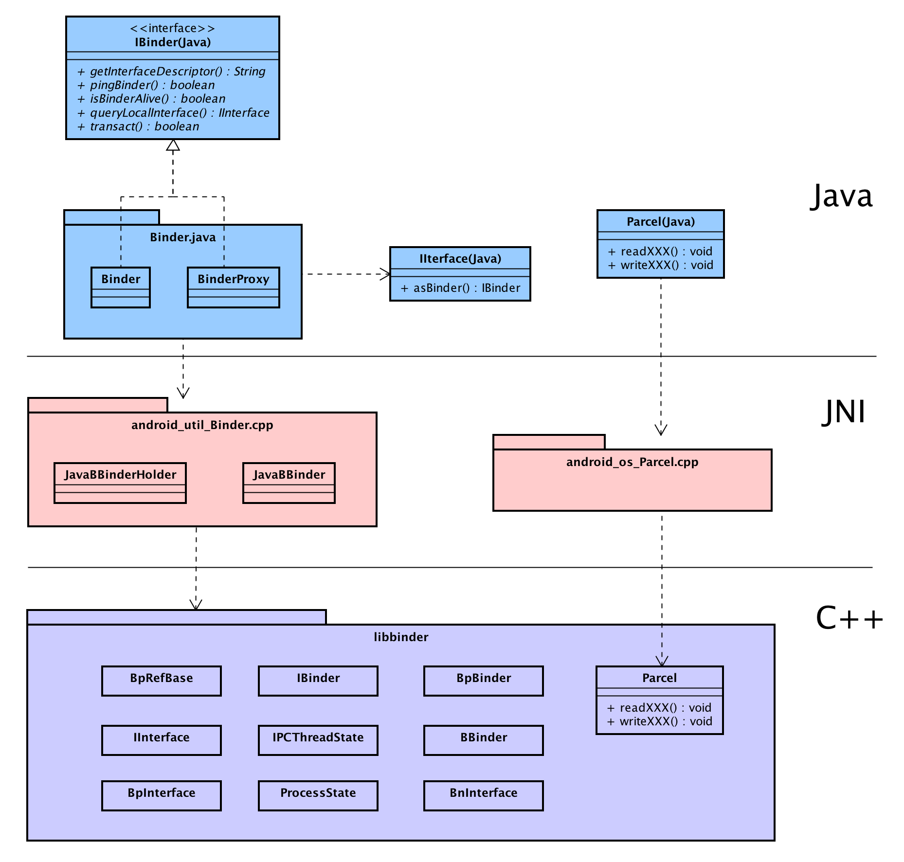

这里对图中Java层和JNI层的几个类做一下说明：

| 名称                | 类型        | 说明                                       |
| ----------------- | --------- | ---------------------------------------- |
| IInterface        | interface | 供Java层Binder服务接口继承的接口                    |
| IBinder           | interface | Java层的IBinder类，提供了transact方法来调用远程服务      |
| Binder            | class     | 实现了IBinder接口，封装了JNI的实现。Java层Binder服务的基类  |
| BinderProxy       | class     | 实现了IBinder接口，封装了JNI的实现。提供transact方法调用远程服务 |
| JavaBBinderHolder | class     | 内部存储了JavaBBinder                         |
| JavaBBinder       | class     | 将C++端的onTransact调用传递到Java端               |
| Parcel            | class     | Java层的数据包装器，见C++层的Parcel类分析              |

这里的IInterface，IBinder和C++层的两个类是同名的。这个同名并不是巧合：它们不仅仅同名，它们所起的作用，以及其中包含的接口都是几乎一样的，区别仅仅在于一个是C++层，一个是Java层而已。

除了IInterface，IBinder之外，这里Binder与BinderProxy类也是与C++的类对应的，下面列出了Java层和C++层类的对应关系：

| C++        | Java层       |
| ---------- | ----------- |
| IInterface | IInterface  |
| IBinder    | IBinder     |
| BBinder    | Binder      |
| BpBinder   | BinderProxy |
| Parcel     | Parcel      |

### JNI的衔接

JNI全称是Java Native Interface，这个是由Java虚拟机提供的机制。这个机制使得native代码可以和Java代码互相通讯。简单来说就是：我们可以在C/C++端调用Java代码，也可以在Java端调用C/C++代码。

实际上，在Android中很多的服务或者机制都是在C/C++层实现的，想要将这些实现复用到Java层，就必须通过JNI进行衔接。AOSP源码中，`/frameworks/base/core/jni/`目录下的源码就是专门用来对接Framework层的JNI实现的。

看一下Binder.java的实现就会发现，这里面有不少的方法都是用native关键字修饰的，并且没有方法实现体，这些方法其实都是在C++中实现的：
```Java
public static final native int getCallingPid();
public static final native int getCallingUid();
public static final native long clearCallingIdentity();
public static final native void restoreCallingIdentity(long token);
public static final native void setThreadStrictModePolicy(int policyMask);
public static final native int getThreadStrictModePolicy();
public static final native void flushPendingCommands();
public static final native void joinThreadPool();
```

在android_util_Binder.cpp文件中的下面这段代码，设定了Java方法与C++方法的对应关系：
```C++
static const JNINativeMethod gBinderMethods[] = {
    { "getCallingPid", "()I", (void*)android_os_Binder_getCallingPid },
    { "getCallingUid", "()I", (void*)android_os_Binder_getCallingUid },
    { "clearCallingIdentity", "()J", (void*)android_os_Binder_clearCallingIdentity },
    { "restoreCallingIdentity", "(J)V", (void*)android_os_Binder_restoreCallingIdentity },
    { "setThreadStrictModePolicy", "(I)V", (void*)android_os_Binder_setThreadStrictModePolicy },
    { "getThreadStrictModePolicy", "()I", (void*)android_os_Binder_getThreadStrictModePolicy },
    { "flushPendingCommands", "()V", (void*)android_os_Binder_flushPendingCommands },
    { "init", "()V", (void*)android_os_Binder_init },
    { "destroy", "()V", (void*)android_os_Binder_destroy },
    { "blockUntilThreadAvailable", "()V", (void*)android_os_Binder_blockUntilThreadAvailable }
};
```
这种对应关系意味着：当Binder.java中的`getCallingPid`方法被调用的时候，真正的实现其实是`android_os_Binder_getCallingPid`，当`getCallingUid`方法被调用的时候，真正的实现其实是`android_os_Binder_getCallingUid`，其他类同。

然后我们再看一下`android_os_Binder_getCallingPid`方法的实现就会发现，这里其实就是对接到了libbinder中了：
```C++
static jint android_os_Binder_getCallingPid(JNIEnv* env, jobject clazz)
{
    return IPCThreadState::self()->getCallingPid();
}
```
这里看到了Java端的代码是如何调用的libbinder中的C++方法的。那么相反的方向是如何调用的呢？最关键的，libbinder中的`BBinder::onTransact`是如何能够调用到Java中的`Binder::onTransact`的呢？

这段逻辑就是android_util_Binder.cpp中`JavaBBinder::onTransact`中处理的了。JavaBBinder是BBinder子类，其类结构如下：

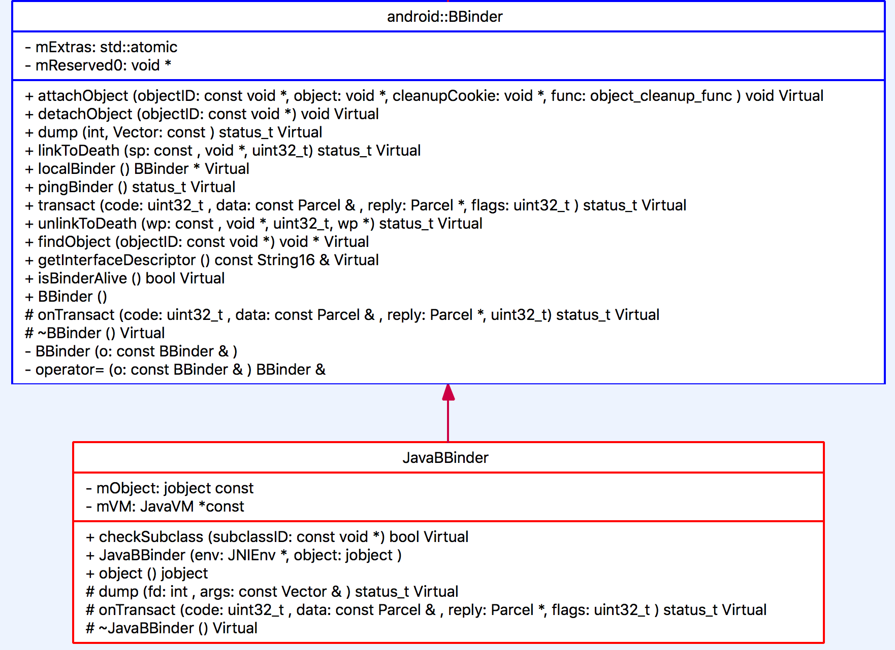

`JavaBBinder::onTransact`关键代码如下：
```C++
virtual status_t onTransact(
   uint32_t code, const Parcel& data, Parcel* reply, uint32_t flags = 0)
{
   JNIEnv* env = javavm_to_jnienv(mVM);

   IPCThreadState* thread_state = IPCThreadState::self();
   const int32_t strict_policy_before = thread_state->getStrictModePolicy();

   jboolean res = env->CallBooleanMethod(mObject, gBinderOffsets.mExecTransact,
       code, reinterpret_cast<jlong>(&data), reinterpret_cast<jlong>(reply), flags);
   ...
}
```
请注意这段代码中的这一行：
```C++
jboolean res = env->CallBooleanMethod(mObject, gBinderOffsets.mExecTransact,
  code, reinterpret_cast<jlong>(&data), reinterpret_cast<jlong>(reply), flags);
```
这一行代码其实是在调用mObject上offset为`mExecTransact`的方法。这里的几个参数说明如下：
- mObject 指向了Java端的Binder对象
- `gBinderOffsets.mExecTransact`指向了Binder类的`execTransact`方法
- data 调用`execTransact`方法的参数
- code, data, reply, flags都是传递给调用方法`execTransact`的参数

而`JNIEnv.CallBooleanMethod`这个方法是由虚拟机实现的。即：虚拟机会提供native方法来调用一个Java Object上的方法。

这样，就在C++层的`JavaBBinder::onTransact`中调用了Java层`Binder::execTransact`方法。而在`Binder::execTransact`方法中，又调用了自身的`onTransact`方法，由此保证整个过程串联了起来：
```Java
private boolean execTransact(int code, long dataObj, long replyObj,
       int flags) {
   Parcel data = Parcel.obtain(dataObj);
   Parcel reply = Parcel.obtain(replyObj);
   boolean res;
   try {
       res = onTransact(code, data, reply, flags);
   } catch (RemoteException|RuntimeException e) {
       ...
       if ((flags & FLAG_ONEWAY) != 0) {
           ...
       } else {
           reply.setDataPosition(0);
           reply.writeException(e);
       }
       res = true;
   } catch (OutOfMemoryError e) {
       RuntimeException re = new RuntimeException("Out of memory", e);
       reply.setDataPosition(0);
       reply.writeException(re);
       res = true;
   }
   checkParcel(this, code, reply, "Unreasonably large binder reply buffer");
   reply.recycle();
   data.recycle();

   StrictMode.clearGatheredViolations();

   return res;
}
```

### Java Binder服务举例

和C++层一样，这里我们还是通过一个具体的实例来看一下Java层的Binder服务是如何实现的。

下图是ActivityManager实现的类图：

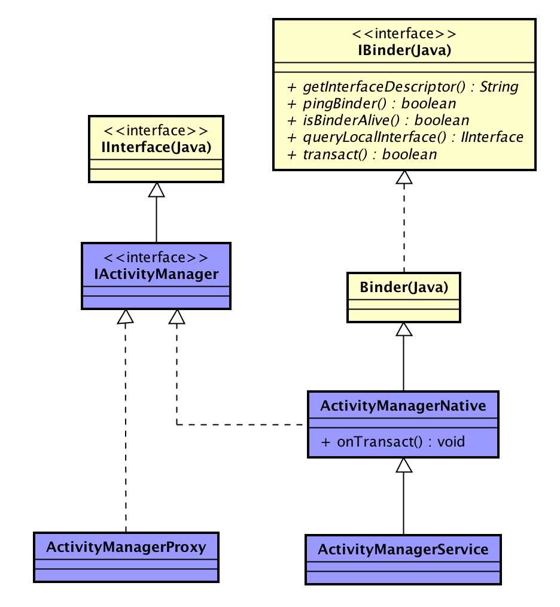

下面是上图中几个类的说明：

| 类名                     | 说明            |
| ---------------------- | ------------- |
| IActivityManager       | Binder服务的公共接口 |
| ActivityManagerProxy   | 供客户端调用的远程接口   |
| ActivityManagerNative  | Binder服务实现的基类 |
| ActivityManagerService | Binder服务的真正实现 |

看过Binder C++层实现之后，对于这个结构应该也是很容易理解的，组织结构和C++层服务的实现是一模一样的。

对于Android应用程序的开发者来说，不会直接接触到上图中的几个类，而是使用`android.app.ActivityManager`中的接口。

这里我们就来看一下，`android.app.ActivityManager`中的接口与上图的实现是什么关系。我们选取其中的一个方法来看一下：
```Java
public void getMemoryInfo(MemoryInfo outInfo) {
   try {
       ActivityManagerNative.getDefault().getMemoryInfo(outInfo);
   } catch (RemoteException e) {
       throw e.rethrowFromSystemServer();
   }
}
```
这个方法的实现调用了`ActivityManagerNative.getDefault()`中的方法，因此我们在来看一下`ActivityManagerNative.getDefault()`返回到到底是什么。
```Java
static public IActivityManager getDefault() {
   return gDefault.get();
}

private static final Singleton<IActivityManager> gDefault = new Singleton<IActivityManager>() {
   protected IActivityManager create() {
       IBinder b = ServiceManager.getService("activity");
       if (false) {
           Log.v("ActivityManager", "default service binder = " + b);
       }
       IActivityManager am = asInterface(b);
       if (false) {
           Log.v("ActivityManager", "default service = " + am);
       }
       return am;
   }
};
```
这段代码中其实是先通过`IBinder b = ServiceManager.getService("activity");`获取ActivityManager的Binder对象（“activity”是ActivityManagerService的Binder服务标识），接着我们再来看一下`asInterface(b)`的实现：
```Java
static public IActivityManager asInterface(IBinder obj) {
   if (obj == null) {
       return null;
   }
   IActivityManager in =
       (IActivityManager)obj.queryLocalInterface(descriptor);
   if (in != null) {
       return in;
   }

   return new ActivityManagerProxy(obj);
}
```
这里应该是比较明白了：首先通过`queryLocalInterface`确定有没有本地Binder，如果有的话直接返回，否则创建一个ActivityManagerProxy对象。很显然，假设在ActivityManagerService所在的进程调用这个方法，那么`queryLocalInterface`将直接返回本地Binder，而假设在其他进程中调用，这个方法将返回空，由此导致其他调用获取到的对象其实就是ActivityManagerProxy。而在拿到ActivityManagerProxy对象之后在调用其方法所走的路线我想读者应该也能明白了：那就是通过Binder驱动跨进程调用ActivityManagerService中的方法。

这里的`asInterface`方法的实现会让我们觉得似曾相识。是的，因为这里的实现方式和C++层的实现是一样的模式。

### Java层的ServiceManager

源码路径：
```
frameworks/base/core/java/android/os/IServiceManager.java
frameworks/base/core/java/android/os/ServiceManager.java
frameworks/base/core/java/android/os/ServiceManagerNative.java
frameworks/base/core/java/com/android/internal/os/BinderInternal.java
frameworks/base/core/jni/android_util_Binder.cpp
```
有Java端的Binder服务，自然也少不了Java端的ServiceManager。我们先看一下Java端的ServiceManager的结构：

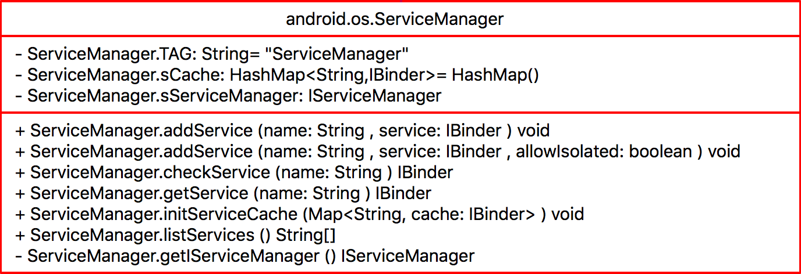

通过这个类图我们看到，Java层的ServiceManager和C++层的接口是一样的。

然后我们再选取addService方法看一下实现：
```Java
public static void addService(String name, IBinder service, boolean allowIsolated) {
   try {
       getIServiceManager().addService(name, service, allowIsolated);
   } catch (RemoteException e) {
       Log.e(TAG, "error in addService", e);
   }
}
    
private static IServiceManager getIServiceManager() {
   if (sServiceManager != null) {
       return sServiceManager;
   }

   // Find the service manager
   sServiceManager = ServiceManagerNative.asInterface(BinderInternal.getContextObject());
   return sServiceManager;
}
```
很显然，这段代码中，最关键就是下面这个调用：
```Java
ServiceManagerNative.asInterface(BinderInternal.getContextObject());
```
然后我们需要再看一下`BinderInternal.getContextObject()`和`ServiceManagerNative.asInterface`两个方法。

`BinderInternal.getContextObject()`是一个JNI方法，其实现代码在android_util_Binder.cpp中：
```C++
static jobject android_os_BinderInternal_getContextObject(JNIEnv* env, jobject clazz)
{
    sp<IBinder> b = ProcessState::self()->getContextObject(NULL);
    return javaObjectForIBinder(env, b);
}
```
而`ServiceManagerNative.asInterface`的实现和其他的Binder服务是一样的套路：
```Java
static public IServiceManager asInterface(IBinder obj)
{
   if (obj == null) {
       return null;
   }
   IServiceManager in =
       (IServiceManager)obj.queryLocalInterface(descriptor);
   if (in != null) {
       return in;
   }
   
   return new ServiceManagerProxy(obj);
}
```
先通过`queryLocalInterface`查看能不能获得本地Binder，如果无法获取，则创建并返回ServiceManagerProxy对象。

而ServiceManagerProxy自然也是和其他Binder Proxy一样的实现套路：
```Java
public void addService(String name, IBinder service, boolean allowIsolated)
       throws RemoteException {
   Parcel data = Parcel.obtain();
   Parcel reply = Parcel.obtain();
   data.writeInterfaceToken(IServiceManager.descriptor);
   data.writeString(name);
   data.writeStrongBinder(service);
   data.writeInt(allowIsolated ? 1 : 0);
   mRemote.transact(ADD_SERVICE_TRANSACTION, data, reply, 0);
   reply.recycle();
   data.recycle();
}
```
有了上文的讲解，这段代码应该都是比较容易理解的了。

## 四、 关于AIDL

作为Binder机制的最后一个部分内容，我们来讲解一下开发者经常使用的AIDL机制是怎么回事。

AIDL全称是Android Interface Definition Language，它是Android SDK提供的一种机制。借助这个机制，应用可以提供跨进程的服务供其他应用使用。AIDL的详细说明可以参见[官方开发文档](https://developer.android.com/guide/components/aidl.html )。

这里，我们就以官方文档上的例子看来一下AIDL与Binder框架的关系。

开发一个基于AIDL的Service需要三个步骤：
1. 定义一个.aidl文件
2. 实现接口
3. 暴露接口给客户端使用

aidl文件使用Java语言的语法来定义，每个.aidl文件只能包含一个interface，并且要包含interface的所有方法声明。

默认情况下，AIDL支持的数据类型包括：
- 基本数据类型（即int，long，char，boolean等）
- String
- CharSequence
- List（List的元素类型必须是AIDL支持的）
- Map（Map中的元素必须是AIDL支持的）

对于AIDL中的接口，可以包含0个或多个参数，可以返回void或一个值。所有非基本类型的参数必须包含一个描述是数据流向的标签，可能的取值是：`in`，`out`或者`inout`。

下面是一个aidl文件的示例：
```Java
// IRemoteService.aidl
package com.example.android;

// Declare any non-default types here with import statements

/** Example service interface */
interface IRemoteService {
    /** Request the process ID of this service, to do evil things with it. */
    int getPid();

    /** Demonstrates some basic types that you can use as parameters
     * and return values in AIDL.
     */
    void basicTypes(int anInt, long aLong, boolean aBoolean, float aFloat,
            double aDouble, String aString);
}
```
这个文件中包含了两个接口 ：
- getPid 一个无参的接口，返回值类型为int
- basicTypes，包含了几个基本类型作为参数的接口，无返回值

对于包含.aidl文件的工程，Android IDE（以前是Eclipse，现在是Android Studio）在编译项目的时候，会为aidl文件生成对应的Java文件。在这个生成的Java文件中，包括了：
- 一个名称为IRemoteService的interface，该interface继承自android.os.IInterface并且包含了我们在aidl文件中声明的接口方法
- IRemoteService中包含了一个名称为Stub的静态内部类，这个类是一个抽象类，它继承自android.os.Binder并且实现了IRemoteService接口。这个类中包含了一个onTransact方法
- Stub内部又包含了一个名称为Proxy的静态内部类，Proxy类同样实现了IRemoteService接口

仔细看一下Stub类和Proxy两个中包含的方法，是不是觉得很熟悉？是的，这里和前面介绍的服务实现是一样的模式。这里我们列一下各层类的对应关系：

| C++   | Java层     | AIDL            |
| ----- | --------- | --------------- |
| BpXXX | XXXProxy  | IXXX.Stub.Proxy |
| BnXXX | XXXNative | IXXX.Stub       |

为了整个结构的完整性，最后我们还是来看一下生成的Stub和Proxy类中的实现逻辑。

**Stub是提供给开发者实现业务的父类，而Proxy实现了对外提供的接口。Stub和Proxy两个类都有一个`asBinder`的方法。**

Stub类中的asBinder实现就是返回自身对象：
```Java
@Override
public android.os.IBinder asBinder() {
	return this;
}
```
而Proxy中`asBinder`的实现是返回构造函数中获取的mRemote对象，相关代码如下：
```Java
private android.os.IBinder mRemote;

Proxy(android.os.IBinder remote) {
	mRemote = remote;
}

@Override
public android.os.IBinder asBinder() {
	return mRemote;
}
```
而这里的mRemote对象其实就是远程服务在当前进程的标识。

上文我们说了，Stub类是用来提供给开发者实现业务逻辑的父类，开发者者继承自Stub然后完成自己的业务逻辑实现，例如这样：
```Java
private final IRemoteService.Stub mBinder = new IRemoteService.Stub() {
   public int getPid(){
       return Process.myPid();
   }
   public void basicTypes(int anInt, long aLong, boolean aBoolean,
       float aFloat, double aDouble, String aString) {
       // Does something
   }
};
```
而这个Proxy类，就是用来给调用者使用的对外接口。我们可以看一下Proxy中的接口到底是如何实现的：

Proxy中getPid方法实现如下所示：
```Java
@Override
public int getPid() throws android.os.RemoteException {
	android.os.Parcel _data = android.os.Parcel.obtain();
	android.os.Parcel _reply = android.os.Parcel.obtain();
	int _result;
	try {
		_data.writeInterfaceToken(DESCRIPTOR);
		mRemote.transact(Stub.TRANSACTION_getPid, _data, _reply, 0);
		_reply.readException();
		_result = _reply.readInt();
	} finally {
		_reply.recycle();
		_data.recycle();
	}
	return _result;
}
```
这里就是通过Parcel对象以及`transact`调用对应远程服务的接口。而在Stub类中，生成的`onTransact`方法对应的处理了这里的请求：
```Java
@Override
public boolean onTransact(int code, android.os.Parcel data, android.os.Parcel reply, int flags)
		throws android.os.RemoteException {
	switch (code) {
	case INTERFACE_TRANSACTION: {
		reply.writeString(DESCRIPTOR);
		return true;
	}
	case TRANSACTION_getPid: {
		data.enforceInterface(DESCRIPTOR);
		int _result = this.getPid();
		reply.writeNoException();
		reply.writeInt(_result);
		return true;
	}
	case TRANSACTION_basicTypes: {
		data.enforceInterface(DESCRIPTOR);
		int _arg0;
		_arg0 = data.readInt();
		long _arg1;
		_arg1 = data.readLong();
		boolean _arg2;
		_arg2 = (0 != data.readInt());
		float _arg3;
		_arg3 = data.readFloat();
		double _arg4;
		_arg4 = data.readDouble();
		java.lang.String _arg5;
		_arg5 = data.readString();
		this.basicTypes(_arg0, _arg1, _arg2, _arg3, _arg4, _arg5);
		reply.writeNoException();
		return true;
	}
	}
	return super.onTransact(code, data, reply, flags);
}
```
`onTransact`所要做的就是：
- 根据code区分请求的是哪个接口
- 通过data来获取请求的参数
- 调用由子类实现的抽象方法

有了前文的讲解，对于这部分内容应当不难理解了。

## 参考资料和推荐读物

- [Android Binder](https://www.nds.rub.de/media/attachments/files/2012/03/binder.pdf)
- [Android Interface Definition Language](https://developer.android.com/guide/components/aidl.html)
- [Android Bander设计与实现 - 设计篇](http://blog.csdn.net/universus/article/details/6211589)
- [Binder系列—开篇](http://gityuan.com/2015/10/31/binder-prepare/)
- [彻底理解Android Binder通信架构](http://gityuan.com/2016/09/04/binder-start-service/)
- [binder驱动——-之内存映射篇](http://blog.csdn.net/xiaojsj111/article/details/31422175)
- [Android Binder机制(一) Binder的设计和框架](http://wangkuiwu.github.io/2014/09/01/Binder-Introduce/)
- [Android Binder 分析——内存管理](http://light3moon.com/2015/01/28/Android%20Binder%20%E5%88%86%E6%9E%90%E2%80%94%E2%80%94%E5%86%85%E5%AD%98%E7%AE%A1%E7%90%86/)
- [Binder驱动](http://www.cnblogs.com/Doing-what-I-love/p/5530173.html)
- [老罗的Android之旅](http://blog.csdn.net/luoshengyang/article/details/6633311)
- [老罗的Android之旅](http://blog.csdn.net/luoshengyang/article/details/6629298)

### 原文

http://qiangbo.space/2017-01-15/AndroidAnatomy_Binder_Driver/
http://qiangbo.space/2017-02-12/AndroidAnatomy_Binder_CPP/
http://qiangbo.space/2017-03-15/AndroidAnatomy_Binder_Java/