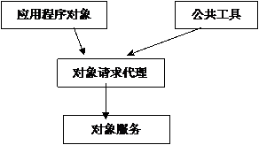
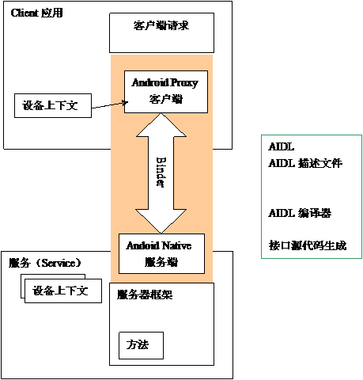
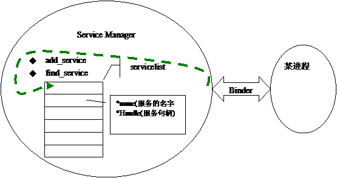
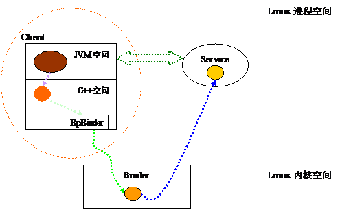
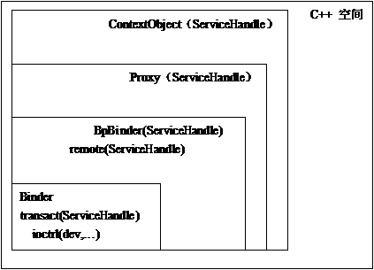
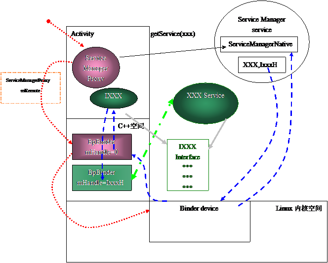

## IPC框架分析 Binder，Service，Service manager

首先从宏观的角度观察Binder,Service,Service Manager，并阐述各自的概念。从Linux的概念空间中，Android的设计Activity托管在不同的的进程，Service也都是托管在不同的进程，不同进程间的Activity,Service之间要交换数据属于IPC。Binder就是为了Activity通讯而设计的一个轻量级的IPC框架。

在代码分析中，发现Android中只是把Binder理解成进程间通讯的实现，有点狭隘，而是应该站在公共对象请求代理这个高度来理解Binder，Service的概念，这样我们就会看到不一样的格局，从这个高度来理解设计意图，我们才会对Android中的一些天才想法感到惊奇。从Android的外特性概念空间中，我们看不到进程的概念，而是Activity，Service，AIDL，INTENT。一般的如果我作为设计者，在我们的根深蒂固的想法中，这些都是如下的C/S架构，客户端和服务端直接通过Binder交互数据，打开Binder写入数据，通过Binder读取数据，通讯就可以完成了。

该注意到Android的概念中，Binder是一个很低层的概念，上面一层根本都看不到Binder，而是Activity跟一个Service的对象直接通过方法调用，获取服务。
这个就是Android提供给我们的外特性：在Android中，要完成某个操作，所需要做的就是请求某个有能力的服务对象去完成动作，而无需知道这个通讯是怎样工作的，以及服务在哪里。所以Andoid的IPC在本质上属于对象请求代理架构，Android的设计者用CORBA的概念将自己包装了一下，实现了一个微型的轻量级CORBA架构，这就是Andoid的IPC设计的意图所在，它并不是仅仅解决通讯，而是给出了一个架构，一种设计理念，这就是Android的闪光的地方。Android的Binder更多考虑了数据交换的便捷，并且只是解决本机的进程间的通讯，所以不像CORBA那样复杂，所以叫做轻量级。

所以要理解Android的IPC架构，就需要了解CORBA的架构。而CORBA的架构在本质上可以使用下面图来表示：


在服务端，多了一个代理器，更为抽象一点我们可以下图来表示。



分析和CORBA的大体理论架构，我给出下面的Android的对象代理结构。



在结构图中，我们可以较为清楚的把握Android的IPC包含了如下的概念：
- 设备上下文（ContextObject）
>设备上下文包含关于客服端，环境或者请求中没有作为参数传递个操作的上下文信息，应用程序开发者用ContextObject接口上定义的操作来创建和操作上下文。

- Android代理：这个是指代理对象
- Binder Linux内核提供的Binder通讯机制

Android的外特性空间是不需要知道服务在那里，只要通过代理对象完成请求，但是我们要探究Android是如何实现这个架构，首先要问的是在Client端要完成云服务端的通讯，首先应该知道服务在哪里？我们首先来看看Service Manger管理了那些数据。Service Manager提供了add service,check service两个重要的方法，并且维护了一个服务列表记录登记的服务名称和句柄。



Service manager service使用0来标识自己。并且在初始化的时候，通过binder设备使用BINDER_SET_CONTEXT_MGR ioctl将自己变成了CONTEXT_MGR。Svclist中存储了服务的名字和Handle，这个Handle作为Client端发起请求时的目标地址。服务通过add_service方法将自己的名字和Binder标识handle登记在svclist中。而服务请求者，通过check_service方法，通过服务名字在service list中获取到service 相关联的Binder的标识handle,通过这个Handle作为请求包的目标地址发起请求。

我们理解了Service Manager的工作就是登记功能，现在再回到IPC上，客服端如何建立连接的？我们首先回到通讯的本质：IPC。从一般的概念来讲，Android设计者在Linux内核中设计了一个叫做Binder的设备文件，专门用来进行Android的数据交换。所有从数据流来看Java对象从Java的VM空间进入到C++空间进行了一次转换，并利用C++空间的函数将转换过的对象通过driver/binder设备传递到服务进程，从而完成进程间的IPC。这个过程可以用下图来表示。



这里数据流有几层转换过程。
- 从JVM空间传到c++空间，这个是靠JNI使用ENV来完成对象的映射过程。
- 从c++空间传入内核Binder设备，使用ProcessState类完成工作。
- Service从内核中Binder设备读取数据。

Android设计者需要利用面向对象的技术设计一个框架来屏蔽掉这个过程。要让上层概念空间中没有这些细节。Android设计者是怎样做的呢？我们通过c++空间代码分析，看到有如下空间概念包装(ProcessState@(ProcessState.cpp)



在ProcessState类中包含了通讯细节，利用open_binder打开Linux设备dev/binder,通过ioctrl建立的基本的通讯框架。利用上层传递下来的servicehandle来确定请求发送到那个Service。通过分析我终于明白了BnXXX，BpXXX的命名含义，Bn-代表Native，而Bp代表Proxy。一旦理解到这个层次，ProcessState就容易弄明白了。

下面我们看JVM概念空间中对这些概念的包装。为了通篇理解设备上下文，我们需要将Android VM概念空间中的设备上下文和C++空间总的设备上下文连接起来进行研究。

为了在上层使用统一的接口，在JVM层面有两个东西。在Android中，为了简化管理框架，引入了ServiceManger这个服务。所有的服务都是从ServiceManager开始的，只用通过Service Manager获取到某个特定的服务标识构建代理IBinder。在Android的设计中利用Service Manager是默认的Handle为0，只要设置请求包的目标句柄为0，就是发给Service Manager这个Service的。在做服务请求时，Android建立一个新的Service Manager Proxy。Service Manager Proxy使用ContexObject作为Binder和Service Manager Service（服务端）进行通讯。

Android代码一般的获取Service建立本地代理的用法如下：
`IXXX  mIxxx=IXXXInterface.Stub.asInterface(ServiceManager.getService("xxx"));`
例如：使用输入法服务：
```Java
IInputMethodManager mImm=
    IInputMethodManager.Stub.asInterface(ServiceManager.getService("input_method"));
```

这些服务代理获取过程分解如下：

- 通过调用GetContextObject调用获取设备上下对象。注意在AndroidJVM概念空间的ContextObject只是 与Service Manger Service通讯的代理Binder有对应关系。这个跟c++概念空间的GetContextObject意义是不一样的。
  注意看看关键的代码
```C++
    BinderInternal.getContextObject（）    @BinderInteral.java
    NATIVE JNI:getContextObject()   @android_util_Binder.cpp
    android_os_BinderInternal_getContextObject   @android_util_Binder.cpp
    ProcessState::self()->getCotextObject(0)  @processState.cpp
    getStrongProxyForHandle(0)  @
    NEW BpBinder(0)
```

注意`ProcessState::self()->getCotextObject(0) @processtate.cpp`，就是该函数在进程空间建立了ProcessState对象，打开了Binder设备dev/binder,并且传递了参数0，这个0代表了与Service Manager这个服务绑定。
- 通过调用`ServiceManagerNative.asInterface(ContextObject)`建立一个代理ServiceManger。

`mRemote = ContextObject(BpBinder)`

这样就建立起来ServiceManagerProxy通讯框架。
- 客户端通过调用ServiceManager的getService的方法建立一个相关的代理Binder。
```C++
ServiceMangerProxy.remote.transact(GET_SERVICE)
    IBinder=ret.ReadStrongBinder() -》这个就是JVM空间的代理Binder
        JNI Navite: android_os_Parcel_readStrongBinder()    @android_util_binder.cpp
            Parcel->readStrongBinder()  @pacel.cpp
                unflatten_binder  @pacel.cpp
                    getStrongProxyForHandle(flat_handle)
                        NEW BpBinder(flat_handle)-》这个就是底层c++空间新建的代理Binder。
```
整个建立过程可以使用如下的示意图来表示：



Activity为了建立一个IPC，需要建立两个连接：访问Servicemanager Service的连接，IXXX具体XXX Service的代理对象与XXXService的连接。这两个连接对应c++空间ProcessState中BpBinder。对IXXX的操作最后就是对BpBinder的操作。由于我们在写一个Service时，在一个Package中写了Service Native部分和Service Proxy部分，而Native和Proxy都实现相同的接口：IXXX Interface,但是一个在服务端，一个在客服端。客户端调用的方式是使用remote->transact方法向Service发出请求，而在服务端的onTransact中则是处理这些请求。所以在Android Client空间就看到这个效果：只需要调用代理对象方法就达到了对远程服务的调用目的，实际上这个调用路径好长好长。

我们其实还一部分没有研究，就是同一个进程之间的对象传递与远程传递是区别的。同一个进程间专递服务地和对象，就没有代理BpBinder产生，而只是对象的直接应用了。应用程序并不知道数据是在同一进程间传递还是不同进程间传递，这个只有内核中的Binder知道，所以内核Binder驱动可以将Binder对象数据类型从BINDER_TYPE_BINDER修改为BINDER_TYPE_HANDLE或者BINDER_TYPE_WEAK_HANDLE作为引用传递。

[详细了解一下Binder](./IPC.md)