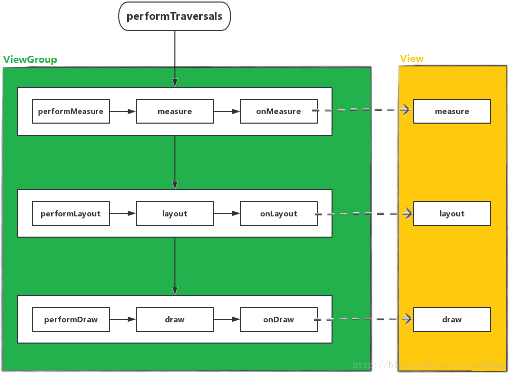
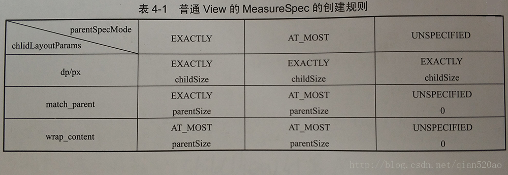
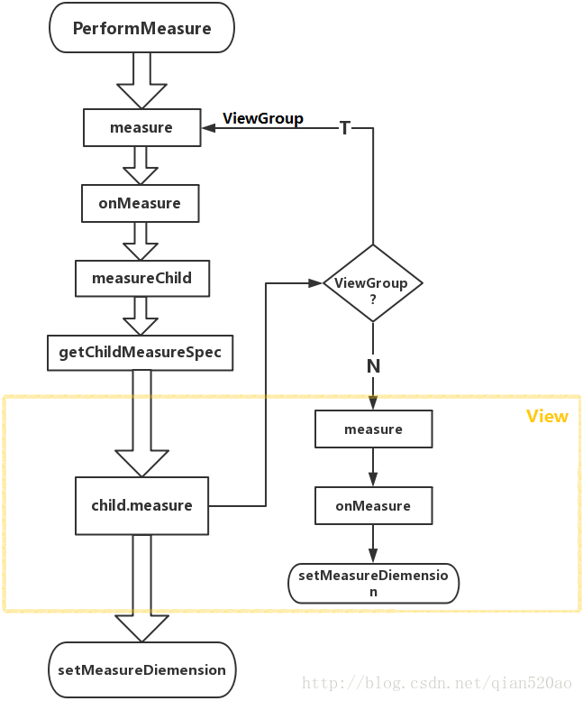
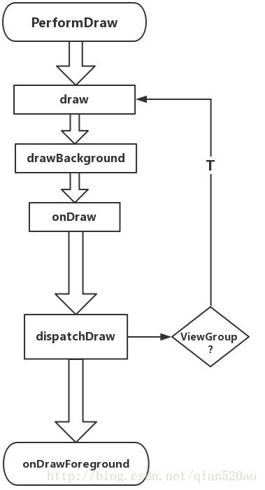
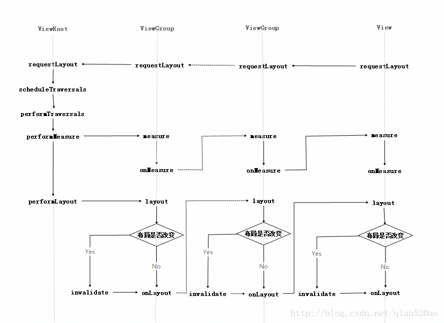

# About View

> 来源：[凶残的程序员](http://blog.csdn.net/qian520ao/article/details/78657084)

## 目录

    前言
    ViewRootImpl
        performTraversals
        measure
            MeasureSpec
            DecorView
                performTraversals
                measureHierarchy
                performMeasure
                measure
                onMeasure
                    ViewGroup - FrameLayout - onMeasure
                    View - onMeasure
        layout
        小结
        draw
    invalidate
        View的脏区域和实心控件
        View
        ViewGroup
        ViewRootImpl
    requestLayout
    总结

## 前言

在上一篇Window机制探索中我们知道，`ViewRootImpl`在整个View体系中起着中流砥柱的作用，它是控件树正常运作的动力所在，并且有如下几个重要功能点。

    连接WindowManager和DecorView的纽带。
    向DecorView派发输入事件
    完成View的绘制(measure,layout,draw)。
    负责与WMS交互通讯，调整窗口大小及布局。

## ViewRootImpl


我们沿用Window机制探索中Window的添加流程图，我们所要分析的绘制机制，便从`ViewRootImpl`中的`setView()`方法展开。

```Java
//ViewRootImpl 

    public void setView(View view, WindowManager.LayoutParams attrs, View panelParentView) {
                // Schedule the first layout -before- adding to the window
                // manager, to make sure we do the relayout before receiving
                // any other events from the system.
                requestLayout();
    }

    @Override
    public void requestLayout() {
        if (!mHandlingLayoutInLayoutRequest) {
            checkThread();//检查是否在主线程
            mLayoutRequested = true;//mLayoutRequested 是否measure和layout布局。
            scheduleTraversals();
        }
    }

    void scheduleTraversals() {
        if (!mTraversalScheduled) {
            mTraversalScheduled = true;
            mTraversalBarrier = mHandler.getLooper().getQueue().postSyncBarrier();

            //post一个runnable处理-->mTraversalRunnable
            mChoreographer.postCallback(
                    Choreographer.CALLBACK_TRAVERSAL, mTraversalRunnable, null);
            ``````
        }
    }

    final class TraversalRunnable implements Runnable {
        @Override
        public void run() {
            doTraversal();
        }
    }
    final TraversalRunnable mTraversalRunnable = new TraversalRunnable();

    void doTraversal() {
            mHandler.getLooper().getQueue().removeSyncBarrier(mTraversalBarrier);

            performTraversals();//View的绘制流程正式开始。
    }
```

在`scheduleTraversals`方法中，通过`mHandle`发送一个`runnable`，在`run()`方法中去处理绘制流程，这一点和`ActivityThread`的`H`类相似，因为我们知道`ViewRootImpl`中`W`类是`Binder`的Native端，用来接收WmS处理操作，因为W类的接收方法是在线程池中的，所以我们可以通过Handler将事件处理切换到主线程中。 

### performTraversals

`ViewRootImpl`在其创建过程中通过`requestLayout()`向主线程发送了一条触发遍历操作的消息，遍历操作是指`performTraversals()`方法。它是一个包罗万象的方法。`ViewRootImpl`中接收的各种变化，如来自WmS的窗口属性变化、来自控件树的尺寸变化及重绘请求等都引发`performTraversals()`的调用，并在其中完成处理。View类及其子类中的`onMeasure()`、`onLayout()`、`onDraw()`等回调也都是在`performTraversals()`的执行过程中直接或间接的引发。也正是如此，一次次的`performTraversals()`调用驱动着控件树有条不紊的工作，一旦此方法无法正常执行，整个控件树都将处于僵死状态。因此`performTraversals()`函数可以说是`ViewRootImpl`的心跳。



*View首次绘制流程*

首先我们看一下`performTraversals()`首次绘制的大致流程，如上图所示：`performTraversals()`会依次调用`performMeasure`、`performLayout`、`performDraw`三个方法，这三个方法便是View绘制流程的精髓所在。

- `performMeasure`: 会调用`measure`方法，在`measure`方法中又会调用`onMeasure`方法，在`onMeasure`方法中则会对所有的子元素进行measure过程，这个时候measure流程就从父容器传到子元素中了，这样就完成了一次measure过程。measure完成以后，可以通过`getMeasuredWidth`和`getMeasureHeight`方法来获取到View测量后的宽高。

- `performLayout`: 和`performMeasure`同理。Layout过程决定了View的四个顶点的坐标和实际View的宽高，完成以后，可以通过`getTop/Bottom/Left/Right`拿到View的四个顶点位置，并可以通过`getWidth`和`getHeight`方法来拿到View的最终宽高。

- `performDraw`: 和`performMeasure`同理，唯一不同的是，`performDraw`的传递过程是在`draw`方法中通过`dispatchDraw`来实现的。Draw过程则决定了View的显示，只有draw方法完成以后View的内容才能呈现在屏幕上。

我们知道，View的绘制流程是从顶级View也就是DecorView「ViewGroup」开始，一层一层从ViewGroup至子View遍历测绘，我们先纵观`performTraversals()`全局，认识View绘制的一个整体架构，后面我们会补充说明部分重要代码。如 : `view.invalidate`、`view.requestLayout`、`view.post(runnable)`等。

```Java
//ViewRootImpl

    private void performTraversals() {

            //调用performMeasure(childWidthMeasureSpec, childHeightMeasureSpec);
            measureHierarchy(host, lp, res,desiredWindowWidth, desiredWindowHeight);

            performLayout(lp, mWidth, mHeight);
            performDraw();
    }
```

### measure

#### MeasureSpec

View的测量过程中，还需要理解`MeasureSpec`，`MeasureSpec`决定了一个View的尺寸规格，并且View的`MeasureSpec`受自身的`LayoutParams`(一般是xml布局中width和height)和父容器`MeasureSpec`的影响。

`MeasureSpec`代表一个32位的int值，高2位代表SpecMode，低30位代表SpecSize。

- SpecMode ： 测量模式，有UNSPECIFIED、 EXACTLY、AT_MOST三种。
- SpecSize : 在某种测量模式下的尺寸和大小。

SpecMode 有如下三种取值:

- `UNSPECIFIED`: 父容器对子View的尺寸不作限制，通常用于系统内部。（listView和scrollView等）
- `EXACTLY`: SpecSize 表示View的最终大小，因为父容器已经检测出View所需要的精确大小，它对应LayoutParams中的match_parent和具体的数值这两种模式。
- `AT_MOST`: SpecSize 表示父容器的可用大小，View的大小不能大于这个值。它对应LayoutParams中的wrap_content。

#### MeasureSpec和LayoutParams

子View的`MeasureSpec==LayoutParams+margin+padding+父容器的MeasureSpec`

对于普通View（DecorView略有不同），其MeasureSpec由父容器的MeasureSpec和自身的LayoutParams共同决定，MeasureSpec一旦确定后，onMeasure中就可以确定View的测量宽高。

那么针对不同父容器和View本身不同的LayoutParams，View就可以有多种MeasureSpec，我们从子View的角度来分析。

    1. View宽/高采用 固定宽高 的时候，不管父容器的MeasureSpec是什么，View的MeasureSpec都是EXACTLY并且其大小遵循LayoutParams中的大小。

    2. View宽/高采用 wrap_content 的时候 ，不管父容器的模式是EXACTLY还是AT_MOST，View的模式总是AT_MOST，并且大小不能超过父容器的剩余空间（SpecSize,可用大小）。

    3. View宽/高采用 match_parent 的时候 :
    I 如果父容器的模式是EXACTLY，那么View也是EXACTLY并且其大小是父容器的剩余空间（SpecSize,最终大小）；
    II 如果父容器的模式是AT_MOST，那么View也是AT_MOST并且其大小不会超过父容器的剩余空间（SpecSize,可用大小）。



### DecorView

有了上面的理论知识铺垫之后，我们来看一下DecorView的measure过程。

#### performTraversals

```Java
//ViewRootImpl

   private void performTraversals() {
        final View host = mView;

        int desiredWindowWidth;//decorView宽度
        int desiredWindowHeight;//decorView高度

        if (mFirst) {
            if (shouldUseDisplaySize(lp)) {
                //窗口的类型中有状态栏和，所以高度需要减去状态栏
                Point size = new Point();
                mDisplay.getRealSize(size);
                desiredWindowWidth = size.x;
                desiredWindowHeight = size.y;
            } else {
                //窗口的宽高即整个屏幕的宽高
                Configuration config = mContext.getResources().getConfiguration();
                desiredWindowWidth = dipToPx(config.screenWidthDp);
                desiredWindowHeight = dipToPx(config.screenHeightDp);
            }

            //在onCreate中view.post(runnable)和此方法有关
            host.dispatchAttachedToWindow(mAttachInfo, 0);
        }


        boolean layoutRequested = mLayoutRequested && (!mStopped || mReportNextDraw);
        if (layoutRequested) {
            ``````
            //创建了DecorView的MeasureSpec，并调用performMeasure
             measureHierarchy(host, lp, res,desiredWindowWidth, desiredWindowHeight);
        }
```

在ViewRootImpl中，我们如上分析一下主要代码，在`measureHierarchy()`方法中，创建了DecorView的`MeasureSpec`。

#### measureHierarchy

```Java
//ViewRootImpl

    private boolean measureHierarchy(final View host, final WindowManager.LayoutParams lp,
            final Resources res, final int desiredWindowWidth, final int desiredWindowHeight) {

        int childWidthMeasureSpec;
        int childHeightMeasureSpec;
        boolean windowSizeMayChange = false;

        boolean goodMeasure = false;

        //针对设置WRAP_CONTENT的dialog，开始协商,缩小布局参数
        if (lp.width == ViewGroup.LayoutParams.WRAP_CONTENT) {
            // On large screens, we don't want to allow dialogs to just
            // stretch to fill the entire width of the screen to display
            // one line of text.  First try doing the layout at a smaller
            // size to see if it will fit.        

            int baseSize = 0;
            if (mTmpValue.type == TypedValue.TYPE_DIMENSION) {
                baseSize = (int)mTmpValue.getDimension(packageMetrics);
            }

                childWidthMeasureSpec = getRootMeasureSpec(baseSize, lp.width);
                childHeightMeasureSpec = getRootMeasureSpec(desiredWindowHeight, lp.height);

                performMeasure(childWidthMeasureSpec, childHeightMeasureSpec);

                goodMeasure = true;
        }

        ``````

        if (!goodMeasure) {//DecorView,宽度基本都为match_parent
            childWidthMeasureSpec = getRootMeasureSpec(desiredWindowWidth, lp.width);
            childHeightMeasureSpec = getRootMeasureSpec(desiredWindowHeight, lp.height);

            performMeasure(childWidthMeasureSpec, childHeightMeasureSpec);

            if (mWidth != host.getMeasuredWidth() || mHeight != host.getMeasuredHeight()) {
                windowSizeMayChange = true;
            }
        }

        return windowSizeMayChange;
    }


    //创建measureSpec
    private static int getRootMeasureSpec(int windowSize, int rootDimension) {
        int measureSpec;
        switch (rootDimension) {

        case ViewGroup.LayoutParams.MATCH_PARENT:
            // Window can't resize. Force root view to be windowSize.
            measureSpec = MeasureSpec.makeMeasureSpec(windowSize, MeasureSpec.EXACTLY);
            break;
        case ViewGroup.LayoutParams.WRAP_CONTENT:
            // Window can resize. Set max size for root view.
            measureSpec = MeasureSpec.makeMeasureSpec(windowSize, MeasureSpec.AT_MOST);
            break;
        default:
            // Window wants to be an exact size. Force root view to be that size.
            measureSpec = MeasureSpec.makeMeasureSpec(rootDimension, MeasureSpec.EXACTLY);
            break;
        }
        return measureSpec;
    }
```

`measureHierarchy()`用于测量整个控件树，传入的参数`desiredWindowWidth`和`desiredWindowHeight`在前面方法中根据当前窗口的不同情况（状态栏）挑选而出，不过`measureHierarchy()`有自己的考量方法，让窗口布局更优雅，（针对`wrap_content`的dialog），所以设置了`wrap_content`的Dialog，有可能执行多次测量。（DecorView的xml布局中，宽高基本都为`match_parent`）

通过上述代码，DecorView的MeasureSpec的产生过程就很明确了，具体来说其遵守如下规则，根据它的LayoutParams中的宽高的参数来划分 : （与上面所说的MeasureSpec和LayoutParams同理）

- LayoutParams.MATCH_PARENT : EXACTLY（精确模式），大小就是窗口的大小；
- LayoutParams.WRAP_CONTENT ： AT_MOST (最大模式)，大小不确定，但是不能超过窗口的大小，暂定为窗口大小；
- 固定大小（写死的值） ： EXACTLY（精确模式），大小就是当前写死的数值。

#### performMeasure

```Java
//ViewRootImpl -->measureHierarchy

    //该方法很简单，直接调用mView.measure()方法
    private void performMeasure(int childWidthMeasureSpec, int childHeightMeasureSpec) {

            mView.measure(childWidthMeasureSpec, childHeightMeasureSpec);
    }
```

    在`view.measure()`的方法里，仅当给与的MeasureSpec发生变化时，或要求强制重新布局时，才会进行测量。

    强制重新布局：控件树中的一个子控件内容发生变化时，需要重新测量和布局的情况，在这种情况下，这个子控件的父控件（以及父控件的父控件）所提供的MeasureSpec必定与上次测量时的值相同，因而导致从`ViewRootImpl`到这个控件的路径上，父控件的`measure()`方法无法得到执行，进而导致子控件无法重新测量其布局和尺寸。

    解决途径 : 因此，当子控件因内容发生变化时，从子控件到父控件回溯到ViewRootImpl，并依次调用父控件的`requestLayout()`方法。这个方法会在`mPrivateFlags`中加入标记`PFLAG_FORCE_LAYOUT`，从而使得这些父控件的`measure()`方法得以顺利执行，进而这个子控件有机会进行重新布局与测量。这便是强制重新布局的意义所在。

#### measure

```Java
//View

    //final类，子类不能重写该方法
    public final void measure(int widthMeasureSpec, int heightMeasureSpec) {

            ``````
            onMeasure(widthMeasureSpec, heightMeasureSpec);
    }

    //ViewGroup并没有重写该方法
    protected void onMeasure(int widthMeasureSpec, int heightMeasureSpec) {
        setMeasuredDimension(getDefaultSize(getSuggestedMinimumWidth(), widthMeasureSpec),
                getDefaultSize(getSuggestedMinimumHeight(), heightMeasureSpec));

    }
```

`view.measure()`方法其实没有实现任何测量的算法，它的作用在于判断是否需要引发`onMeasure()`的调用，并对`onMeasure()`行为的正确性进行检查。

#### onMeasure

ViewGroup是一个抽象类，并没有重写`onMeasure()`方法，就要具体实现类去实现该方法。因为我们的顶级View是DecorView，是一个FrameLayout，所以我们从FrameLayout开始继续我们的主线任务。

*ViewGroup -> FrameLayout -> onMeasure()*

```Java
//FrameLayout


    @Override
    protected void onMeasure(int widthMeasureSpec, int heightMeasureSpec) {
        int count = getChildCount();

        int maxHeight = 0;
        int maxWidth = 0;
        int childState = 0;

        for (int i = 0; i < count; i++) {
            final View child = getChildAt(i);

            //遍历子View，只要子View不是GONE便处理
            if (mMeasureAllChildren || child.getVisibility() != GONE) {

                //子View结合父View的MeasureSpec和自己的LayoutParams算出子View自己的MeasureSpec
                //如果当前child也是ViewGroup，也继续遍历它的子View
                //如果当前child是View，便根据这个MeasureSpec测量自己
                measureChildWithMargins(child, widthMeasureSpec, 0, heightMeasureSpec, 0);
               ``````
            }
        }

          ``````
        //父View等所有的子View测量结束之后，再来测量自己
        setMeasuredDimension(``````);

    }
```

我们知道ViewGroup的measure任务主要是测量所有的子View，测量完毕之后根据合适的宽高再测量自己。

在FrameLayout的`onMeasure()`方法中，会通过`measureChildWithMargins()`方法遍历子View，并且如果FrameLayout宽高的MeasureSpec是AT_MOST，那么FrameLayout计算自身宽高就会受到子View的影响，可能使用最大子View的宽高。

不同ViewGroup实现类有不同的测量方式，例如LinearLayout自身的高度可能是子View高度的累加。

`measureChildWithMargins()`方法为ViewGroup提供的方法，根据父View的MeasureSpec和子View的LayoutParams，算出子View自己的MeasureSpec。

```Java
//ViewGroup

    protected void measureChildWithMargins(View child,
            int parentWidthMeasureSpec, int widthUsed,
            int parentHeightMeasureSpec, int heightUsed) {
        final MarginLayoutParams lp = (MarginLayoutParams) child.getLayoutParams();

        final int childWidthMeasureSpec = getChildMeasureSpec(parentWidthMeasureSpec,
                mPaddingLeft + mPaddingRight + lp.leftMargin + lp.rightMargin
                        + widthUsed, lp.width);

        final int childHeightMeasureSpec = getChildMeasureSpec(parentHeightMeasureSpec,
                mPaddingTop + mPaddingBottom + lp.topMargin + lp.bottomMargin
                        + heightUsed, lp.height);

        child.measure(childWidthMeasureSpec, childHeightMeasureSpec);
    }
```

> 上述方法会对子元素进行measure，在调用子元素的measure方法之前会先通过`getChildMeasureSpec`方法来得到子元素的MeasureSpec。显然子元素的MeasureSpec的创建与父容器的MeasureSpec和子元素本身的LayoutParams有关，此外还和View的margin和padding有关，如果对该理论知识印象不太深刻建议滑到上个段落 — MeasureSpec ，再来看以下代码，事半功倍。

`getChildMeasureSpec`方法的主要作用是根据父容器的MeasureSpec同时结合View本身的LayoutParams来确定子元素的MeasureSpec。

*View -> onMeasure*

回顾一下上面的measure段落，因为具体实现的ViewGroup会重写onMeasure()，因为ViewGroup是一个抽象类，其测量过程的onMeasure()方法需要具体实现类去实现，这么做的原因在于不同的ViewGroup实现类有不同的布局特性，比如说FrameLayout，RelativeLayout，LinearLayout都有不同的布局特性，因此ViewGroup无法对onMeasure()做同一处理。

但是对于普通的View只需完成自身的测量工作即可，所以可以看到View的onMeasure方法很简洁。

```Java
//View

    //final类，子类不能重写该方法
    public final void measure(int widthMeasureSpec, int heightMeasureSpec) {

            ``````

            onMeasure(widthMeasureSpec, heightMeasureSpec);
    }

    //ViewGroup并没有重写该方法
    protected void onMeasure(int widthMeasureSpec, int heightMeasureSpec) {
        setMeasuredDimension(
        getDefaultSize(getSuggestedMinimumWidth(), widthMeasureSpec),
        getDefaultSize(getSuggestedMinimumHeight(), heightMeasureSpec));

    }


    public static int getDefaultSize(int size, int measureSpec) {
        int result = size;
        int specMode = MeasureSpec.getMode(measureSpec);
        int specSize = MeasureSpec.getSize(measureSpec);

        switch (specMode) {
        case MeasureSpec.UNSPECIFIED:
            result = size;
            break;
        case MeasureSpec.AT_MOST:
        case MeasureSpec.EXACTLY:
            result = specSize;
            break;
        }
        return result;
    }
```

> 从`getDefaultSize()`方法的实现来看，对于AT_MOST和EXACTLY这两种情况View的宽高都由specSize决定，也就是说如果我们直接继承View的自定义控件需要重写`onMeasure`方法并设置wrap_content时自身的大小，否则在布局中使用wrap_content就相当于使用match_parent。



### layout

子View具体layout的位置都是相对于父容器而言的，View的layout过程和measure同理，也是从顶级View开始，递归的完成整个空间树的布局操作。

    经过前面的测量，控件树中的控件对于自己的尺寸显然已经了然于胸。而且父控件对于子控件的位置也有了眉目，所以经过测量过程后，布局阶段会把测量结果转化为控件的实际位置与尺寸。控件的实际位置与尺寸由View的mLeft，mTop，mRight，mBottom 等4个成员变量存储的坐标值来表示。

    并且需要注意的是： View的mLeft，mTop，mRight，mBottom 这些坐标值是以父控件左上角为坐标原点进行计算的。倘若需要获取控件在窗口坐标系中的位置可以使用`View.GetLocationWindow()`或者是`View.getRawX()/Y()`。

```Java
//ViewRootImpl

    private void performLayout(WindowManager.LayoutParams lp, int desiredWindowWidth,int desiredWindowHeight) {

        final View host = mView;

        host.layout(0, 0, host.getMeasuredWidth(), host.getMeasuredHeight());

    }
```
```Java
//ViewGroup

    //尽管ViewGroup也重写了layout方法
    //但是本质上还是会通过super.layout()调用View的layout()方法
    @Override
    public final void layout(int l, int t, int r, int b) {
        if (!mSuppressLayout && (mTransition == null || !mTransition.isChangingLayout())) {

            //如果无动画，或者动画未运行
            super.layout(l, t, r, b);
        } else {
            //等待动画完成时再调用requestLayout()
            mLayoutCalledWhileSuppressed = true;
        }
    }

//View

    public void layout(int l, int t, int r, int b) {
        int oldL = mLeft;
        int oldT = mTop;
        int oldB = mBottom;
        int oldR = mRight;

        //如果布局有变化，通过setFrame重新布局
        boolean changed = isLayoutModeOptical(mParent) ?
                setOpticalFrame(l, t, r, b) : setFrame(l, t, r, b);

        if (changed || (mPrivateFlags & PFLAG_LAYOUT_REQUIRED) == PFLAG_LAYOUT_REQUIRED) {

            //如果这是一个ViewGroup，还会遍历子View的layout()方法
            //如果是普通View，通知具体实现类布局变更通知
            onLayout(changed, l, t, r, b);


            //清除PFLAG_LAYOUT_REQUIRED标记
            mPrivateFlags &= ~PFLAG_LAYOUT_REQUIRED;

            ``````
            //布局监听通知
        }

        //清除PFLAG_FORCE_LAYOUT标记
        mPrivateFlags &= ~PFLAG_FORCE_LAYOUT;
    }
```

通过代码可以看到尽管ViewGroup也重写了`layout()`方法，但是本质上还是会走View的`layout()`。

在View的`layout()`方法里，首先通过` setFrame()`（`setOpticalFrame()`也走`setFrame()`）将l、t、r、b分别设置到mLeft、mTop、mRight、和mBottom，这样就可以确定子View在父容器的位置了，上面也说过了，这些位置是相对父容器的。

然后调用`onLayout()`方法，使具体实现类接收到布局变更通知。如果此类是ViewGroup，还会遍历子View的`layout()`方法使其更新布局。如果调用的是`onLayout()`方法，这会导致子View无法调用`setFrame()`，从而无法更新控件坐标信息。

```Java
//View

    protected void onLayout(boolean changed, int l, int t, int r, int b) {}

//ViewGroup

    //abstract修饰，具体实现类必须重写该方法
    @Override
    protected abstract void onLayout(boolean changed,int l, int t, int r, int b);
```

### 小结

对比测量measure和布局layout两个过程有助于加深对它们的理解。(摘自《深入理解Android卷III》)

    measure确定的是控件的尺寸，并在一定程度上确定了子控件的位置。而布局则是针对测量结果来实施，并最终确定子控件的位置。

    measure结果对布局过程没有约束力。虽说子控件在onMeasure()方法中计算出了自己应有的尺寸，但是由于layout()方法是由父控件调用，因此控件的位置尺寸的最终决定权掌握在父控件手中，测量结果仅仅只是一个参考。

    因为measure过程是后根遍历(DecorView最后setMeasureDiemension())，所以子控件的测量结果影响父控件的测量结果。

    而Layout过程是先根遍历(layout()一开始就调用setFrame()完成DecorView的布局)，所以父控件的布局结果会影响子控件的布局结果。

    完成performLayout()后，空间树的所有控件都已经确定了其最终位置，就剩下绘制了。

### draw

我们先纯粹的看View的draw过程，因为这个过程相对上面measure和layout比较简单。

View的draw过程遵循如下几步 ：

- 绘制背景drawBackground();
- 绘制自己onDraw();
- 如果是ViewGroup则绘制子View，dispatchDraw();
- 绘制装饰（滚动条）和前景，onDrawForeground();

```Java
//View

    public void draw(Canvas canvas) {
        final int privateFlags = mPrivateFlags;

        //检查是否是"实心(不透明)"控件。（后面有补充）
        final boolean dirtyOpaque = (privateFlags & PFLAG_DIRTY_MASK) == PFLAG_DIRTY_OPAQUE &&
                (mAttachInfo == null || !mAttachInfo.mIgnoreDirtyState);
        mPrivateFlags = (privateFlags & ~PFLAG_DIRTY_MASK) | PFLAG_DRAWN;

        /*
         * Draw traversal performs several drawing steps which must be executed
         * in the appropriate order:
         *
         *      1. Draw the background
         *      2. If necessary, save the canvas' layers to prepare for fading
         *      3. Draw view's content
         *      4. Draw children
         *      5. If necessary, draw the fading edges and restore layers
         *      6. Draw decorations (scrollbars for instance)
         */

        // Step 1, draw the background, if needed
        int saveCount;
        //非"实心"控件，将会绘制背景
        if (!dirtyOpaque) {
            drawBackground(canvas);
        }

        // skip step 2 & 5 if possible (common case)
        final int viewFlags = mViewFlags;
        boolean horizontalEdges = (viewFlags & FADING_EDGE_HORIZONTAL) != 0;
        boolean verticalEdges = (viewFlags & FADING_EDGE_VERTICAL) != 0;

        //如果控件不需要绘制渐变边界，则可以进入简便绘制流程
        if (!verticalEdges && !horizontalEdges) {
            // Step 3, draw the content
            if (!dirtyOpaque) onDraw(canvas);//非"实心"，则绘制控件本身

            // Step 4, draw the children
            dispatchDraw(canvas);//如果当前不是ViewGroup，此方法则是空实现

            // Overlay is part of the content and draws beneath Foreground
            if (mOverlay != null && !mOverlay.isEmpty()) {
                mOverlay.getOverlayView().dispatchDraw(canvas);
            }

            // Step 6, draw decorations (foreground, scrollbars)
            onDrawForeground(canvas);//绘制装饰和前景

            // we're done...
            return;
        }

        ``````
    }
```



至此View的工作流程的大致整体已经描述完毕了，是否感觉意犹未尽，我们再补充2个知识点作为餐后甜点。

## invalidate

我们知道`invalidate()`(在主线程)和`postInvalidate()`(可以在子线程)都是用于请求View重绘的方法，那么它是如何实现的呢？

    invalidate()方法必须在主线程执行，而scheduleTraversals()引发的遍历也是在主线程执行。所以调用invalidate()方法并不会使得遍历立即开始，因为在调用invalidate()的方法执行完毕之前（准确的说是主线程的Looper处理完其他消息之前），主线程根本没有机会处理scheduleTraversals()所发出的消息。

    这种机制带来的好处是 ： 在一个方法里可以连续调用多个控件的invalidate()方法，而不用担心会由于多次重绘而产生的效率问题。

    另外多次调用invalidate()方法会使得ViewRootImpl多次接收到设置脏区域的请求，ViewRootImpl会将这些脏区域累加到mDirty中，进而在随后的遍历中，一次性的完成所有脏区域的重绘。

    窗口第一次绘制时候，ViewRootImpl的mFullRedrawNeeded成员将会被设置为true，也就是说mDirty所描述的区域将会扩大到整个窗口，进而实现完整重绘。

### View的脏区域和”实心”控件

增加两个知识点，能够更好的理解View的重绘过程。

    为了保证绘制的效率，控件树仅对需要重绘的区域进行绘制。这部分区域成为”脏区域”Dirty Area。

    当一个控件的内容发生变化而需要重绘时，它会通过View.invalidate()方法将其需要重绘的区域沿着控件树自下而上的交给ViewRootImpl，并保存在ViewRootImpl的mDirty成员中，最后通过scheduleTraversals()引发一次遍历，进而进行重绘工作，这样就可以保证仅位于mDirty所描述的区域得到重绘，避免了不必要的开销。

    View的isOpaque()方法返回值表示此控件是否为”实心”的，所谓”实心”控件，是指在onDraw()方法中能够保证此控件的所有区域都会被其所绘制的内容完全覆盖。对于”实心”控件来说，背景和子元素（如果有的话）是被其onDraw()的内容完全遮住的，因此便可跳过遮挡内容的绘制工作从而提升效率。

    简单来说透过此控件所属的区域无法看到此控件下的内容，也就是既没有半透明也没有空缺的部分。因为自定义ViewGroup控件默认是”实心”控件，所以默认不会调用drawBackground()和onDraw()方法，因为一旦ViewGroup的onDraw()方法，那么就会覆盖住它的子元素。但是我们仍然可以通过调用setWillNotDraw(false)和setBackground()方法来开启ViewGroup的onDraw()功能。

下面我们从View的invalidate方法，自下(View)而上(ViewRootImpl)的分析。

invalidate : 使无效； damage : 损毁；dirty : 脏；

### View

```Java
//View


    public void invalidate() {
        invalidate(true);
    }

    void invalidate(boolean invalidateCache) {
        invalidateInternal(0, 0, mRight - mLeft, mBottom - mTop, invalidateCache, true);
    }

    void invalidateInternal(int l, int t, int r, int b, boolean invalidateCache,
            boolean fullInvalidate) {

        //如果VIew不可见，或者在动画中
        if (skipInvalidate()) {
            return;
        }

        //根据mPrivateFlags来标记是否重绘
        if ((mPrivateFlags & (PFLAG_DRAWN | PFLAG_HAS_BOUNDS)) == (PFLAG_DRAWN | PFLAG_HAS_BOUNDS)
                || (invalidateCache && (mPrivateFlags & PFLAG_DRAWING_CACHE_VALID) == PFLAG_DRAWING_CACHE_VALID)
                || (mPrivateFlags & PFLAG_INVALIDATED) != PFLAG_INVALIDATED
                || (fullInvalidate && isOpaque() != mLastIsOpaque)) {
            if (fullInvalidate) {//上面传入为true，表示需要全部重绘
                mLastIsOpaque = isOpaque();//
                mPrivateFlags &= ~PFLAG_DRAWN;//去除绘制完毕标记。
            }

            //添加标记，表示View正在绘制。PFLAG_DRAWN为绘制完毕。
            mPrivateFlags |= PFLAG_DIRTY;

            //清除缓存，表示由当前View发起的重绘。
            if (invalidateCache) {
                mPrivateFlags |= PFLAG_INVALIDATED;
                mPrivateFlags &= ~PFLAG_DRAWING_CACHE_VALID;
            }

            //把需要重绘的区域传递给父View
            final AttachInfo ai = mAttachInfo;
            final ViewParent p = mParent;
            if (p != null && ai != null && l < r && t < b) {
                final Rect damage = ai.mTmpInvalRect;
                //设置重绘区域(区域为当前View在父容器中的整个布局)
                damage.set(l, t, r, b);
                p.invalidateChild(this, damage);
            }
            ``````
        }
    }
```

上述代码中，会设置一系列的标记位到mPrivateFlags中，并且通过父容器的invalidateChild方法，将需要重绘的脏区域传给父容器。（ViewGroup和ViewRootImpl都继承了ViewParent类，该类中定义了子元素与父容器间的调用规范。）

### ViewGroup

```Java
//ViewGroup


    @Override
    public final void invalidateChild(View child, final Rect dirty) {
        ViewParent parent = this;

        final AttachInfo attachInfo = mAttachInfo;
        if (attachInfo != null) {

                RectF boundingRect = attachInfo.mTmpTransformRect;
                boundingRect.set(dirty);

                ``````  
               //父容器根据自身对子View的脏区域进行调整

                transformMatrix.mapRect(boundingRect);
                dirty.set((int) Math.floor(boundingRect.left),
                        (int) Math.floor(boundingRect.top),
                        (int) Math.ceil(boundingRect.right),
                        (int) Math.ceil(boundingRect.bottom));

            // 这里的do while方法，不断的去调用父类的invalidateChildInParent方法来传递重绘请求
            //直到调用到ViewRootImpl的invalidateChildInParent（责任链模式）
            do {
                View view = null;
                if (parent instanceof View) {
                    view = (View) parent;
                }

                if (drawAnimation) {
                    if (view != null) {
                        view.mPrivateFlags |= PFLAG_DRAW_ANIMATION;
                    } else if (parent instanceof ViewRootImpl) {
                        ((ViewRootImpl) parent).mIsAnimating = true;
                    }
                }

                //如果父类是"实心"的，那么设置它的mPrivateFlags标识
                // If the parent is dirty opaque or not dirty, mark it dirty with the opaque
                // flag coming from the child that initiated the invalidate
                if (view != null) {
                    if ((view.mViewFlags & FADING_EDGE_MASK) != 0 &&
                            view.getSolidColor() == 0) {
                        opaqueFlag = PFLAG_DIRTY;
                    }
                    if ((view.mPrivateFlags & PFLAG_DIRTY_MASK) != PFLAG_DIRTY) {
                        view.mPrivateFlags = (view.mPrivateFlags & ~PFLAG_DIRTY_MASK) | opaqueFlag;
                    }
                }

                //***往上递归调用父类的invalidateChildInParent***
                parent = parent.invalidateChildInParent(location, dirty);

                //设置父类的脏区域
                //父容器会把子View的脏区域转化为父容器中的坐标区域
                if (view != null) {
                    // Account for transform on current parent
                    Matrix m = view.getMatrix();
                    if (!m.isIdentity()) {
                        RectF boundingRect = attachInfo.mTmpTransformRect;
                        boundingRect.set(dirty);
                        m.mapRect(boundingRect);
                        dirty.set((int) Math.floor(boundingRect.left),
                                (int) Math.floor(boundingRect.top),
                                (int) Math.ceil(boundingRect.right),
                                (int) Math.ceil(boundingRect.bottom));
                    }
                }
            } 
            while (parent != null);
        }
    }
```

### ViewRootImpl

我们先验证一下最上层ViewParent为什么是ViewRootImpl

```Java
//ViewRootImpl

    public void setView(View view, WindowManager.LayoutParams attrs, View panelParentView) {
               view.assignParent(this);
    }

//View
    void assignParent(ViewParent parent) {
        if (mParent == null) {
            mParent = parent;
        } else if (parent == null) {
            mParent = null;
        } else {
            throw new RuntimeException("view " + this + " being added, but"
                    + " it already has a parent");
        }
    }
```
在ViewRootImpl的setView方法中，由于传入的View正是DecorView，所以最顶层的ViewParent即ViewRootImpl。另外ViewGroup在addView方法中，也会调用assignParent()方法，设定子元素的父容器为它本身。

由于最上层的ViewParent是ViewRootImpl，所以我们可以查看ViewRootImpl的invalidateChildInParent方法即可。

```Java
//ViewRootImpl

    @Override
    public ViewParent invalidateChildInParent(int[] location, Rect dirty) {
        //检查线程，这也是为什么invalidate一定要在主线程的原因
        checkThread();

        if (dirty == null) {
            invalidate();//有可能需要绘制整个窗口
            return null;
        } else if (dirty.isEmpty() && !mIsAnimating) {
            return null;
        }

        ``````

        invalidateRectOnScreen(dirty);

        return null;
    }


    //设置mDirty并执行View的工作流程
    private void invalidateRectOnScreen(Rect dirty) {
        final Rect localDirty = mDirty;
        if (!localDirty.isEmpty() && !localDirty.contains(dirty)) {
            mAttachInfo.mSetIgnoreDirtyState = true;
            mAttachInfo.mIgnoreDirtyState = true;
        }

        // Add the new dirty rect to the current one
        localDirty.union(dirty.left, dirty.top, dirty.right, dirty.bottom);    
        //在这里，mDirty的区域就变为方法中的dirty，即要重绘的脏区域

        ``````
        if (!mWillDrawSoon && (intersected || mIsAnimating)) {
            scheduleTraversals();//执行View的工作流程
        }
    }
```
什么？执行invalidate()方法居然会引起scheduleTraversals()！那么也就是说invalidate()会导致perforMeasure()、performLayout()、perforDraw()的调用了？？？

这个scheduleTraversals()很眼熟，我们一出场就在requestLayout()中见过，并且我们还说了mLayoutRequested用来表示是否measure和layout。

```Java
//ViewRootImpl

    @Override
    public void requestLayout() {
        if (!mHandlingLayoutInLayoutRequest) {
            checkThread();//检查是否在主线程
            mLayoutRequested = true;//mLayoutRequested 是否measure和layout布局。
            scheduleTraversals();
        }
    }

    private void performTraversals() {

        boolean layoutRequested = mLayoutRequested && (!mStopped || mReportNextDraw);
        if (layoutRequested) {
            measureHierarchy(```);//measure
        }

        final boolean didLayout = layoutRequested && (!mStopped || mReportNextDraw);
        if (didLayout) {
            performLayout(lp, mWidth, mHeight);//layout
        }

        boolean cancelDraw = mAttachInfo.mTreeObserver.dispatchOnPreDraw() || !isViewVisible;
        if (!cancelDraw && !newSurface) {
            performDraw();//draw
        }
    } 
```

因为我们invalidate的时候，并没有设置mLayoutRequested，所以放心，它只走performDraw()流程，并且在draw()流程中会清除mDirty区域。

并且只有设置了标识为的View才会调用draw方法进而调用onDraw()，减少开销。「源码工程师各方面的考虑肯定比一般人更周到，我们写的是代码，他们写的是艺术。」


## requestLayout

看完了invalidate()流程之后，requestLayout()流程就比较好上手了。

我们在measure阶段提到过 ：


    在view.measure()的方法里，仅当给与的MeasureSpec发生变化时，或要求强制重新布局时，才会进行测量。

    强制重新布局： 控件树中的一个子控件内容发生变化时，需要重新测量和布局的情况，在这种情况下，这个子控件的父控件（以及父控件的父控件）所提供的MeasureSpec必定与上次测量时的值相同，因而导致从ViewRootImpl到这个控件的路径上，父控件的measure()方法无法得到执行，进而导致子控件无法重新测量其布局和尺寸。（在父容器measure中遍历子元素）

    解决途径: 因此，当子控件因内容发生变化时，从子控件到父控件回溯到ViewRootImpl，并依次调用父控件的requestLayout()方法。这个方法会在mPrivateFlags中加入标记PFLAG_FORCE_LAYOUT，从而使得这些父控件的measure()方法得以顺利执行，进而这个子控件有机会进行重新布局与测量。这便是强制重新布局的意义所在。

下面我们看View的requestLayout()方法

```Java
//View

    @CallSuper
    public void requestLayout() {
        if (mMeasureCache != null) mMeasureCache.clear();

        ``````

        // 增加PFLAG_FORCE_LAYOUT标记，在measure时会校验此属性
        mPrivateFlags |= PFLAG_FORCE_LAYOUT;
        mPrivateFlags |= PFLAG_INVALIDATED;

        // 父类不为空&&父类没有请求重新布局(是否有PFLAG_FORCE_LAYOUT标志)
        //这样同一个父容器的多个子View同时调用requestLayout()就不会增加开销
        if (mParent != null && !mParent.isLayoutRequested()) {
            mParent.requestLayout();
        }

    }
```

因为上面说过了，最顶层的ViewParent是ViewRootImpl。

```Java
//ViewRootImpl

    @Override
    public void requestLayout() {
        if (!mHandlingLayoutInLayoutRequest) {
            checkThread();
            mLayoutRequested = true;
            scheduleTraversals();
        }
    }
```

同样，requestLayout()方法会调用scheduleTraversals();，因为设置了mLayoutRequested =true标识，所以在performTraversals()中调用performMeasure()，performLayout()，但是由于没有设置mDirty，所以不会走performDraw()流程。

但是，requestLayout()方法就一定不会导致onDraw()的调用吗？

在上面layout()方法中说道 : 

    在View的layout()方法里，首先通过 setFrame()（setOpticalFrame()也走setFrame()）将l、t、r、b分别设置到mLeft、mTop、mRight、和mBottom，这样就可以确定子View在父容器的位置了，上面也说过了，这些位置是相对父容器的。

```Java
//View -->  layout()


    protected boolean setFrame(int left, int top, int right, int bottom) {
        boolean changed = false;


        if (mLeft != left || mRight != right || mTop != top || mBottom != bottom) {
            //布局坐标改变了
            changed = true;

            int oldWidth = mRight - mLeft;
            int oldHeight = mBottom - mTop;
            int newWidth = right - left;
            int newHeight = bottom - top;
            boolean sizeChanged = (newWidth != oldWidth) || (newHeight != oldHeight);

            // Invalidate our old position
            invalidate(sizeChanged);//调用invalidate重新绘制视图


            if (sizeChanged) {
                sizeChange(newWidth, newHeight, oldWidth, oldHeight);
            }

            ``````
        }
        return changed;
    }
```

看完代码我们就很清晰的知道，如果layout布局有变化，那么它也会调用invalidate()重绘自身。

下面再借用Idtk绘制的layout流程图



## 总结

至此，View的工作流程分析完毕，文章如果有错误或者不妥之处，还望评论提出。

理清整体流程对我们android的布局，绘制，自定义View，和分析bug都有一个提升。

有兴趣的还可以继续观看Android源码分析

## 参考

《Android开发艺术探索》
《深入理解Android》卷III

[深入理解Android之View的绘制流程](http://www.jianshu.com/p/060b5f68da79)
[Android View的绘制流程](http://www.jianshu.com/p/5a71014e7b1b)
[Idtk 的博客](http://www.idtkm.com/)