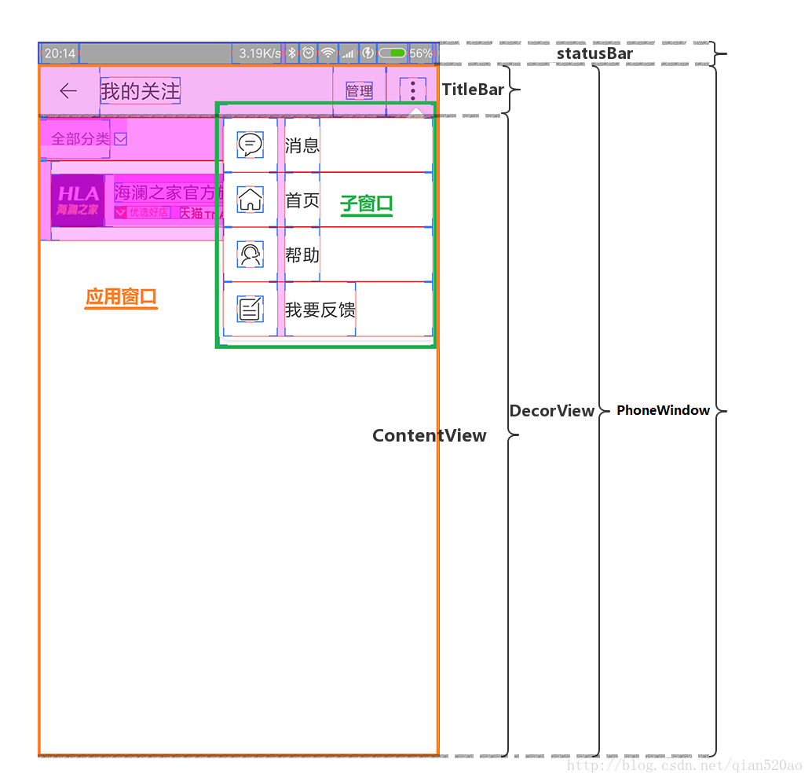
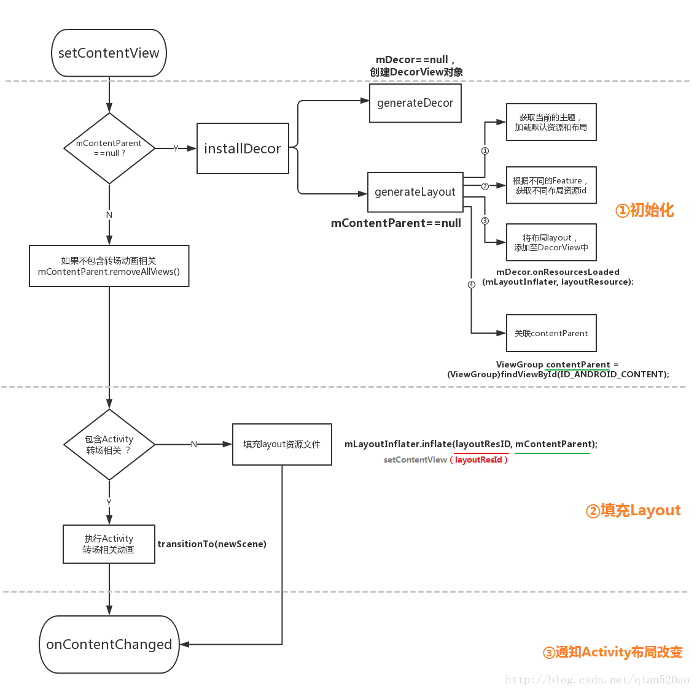
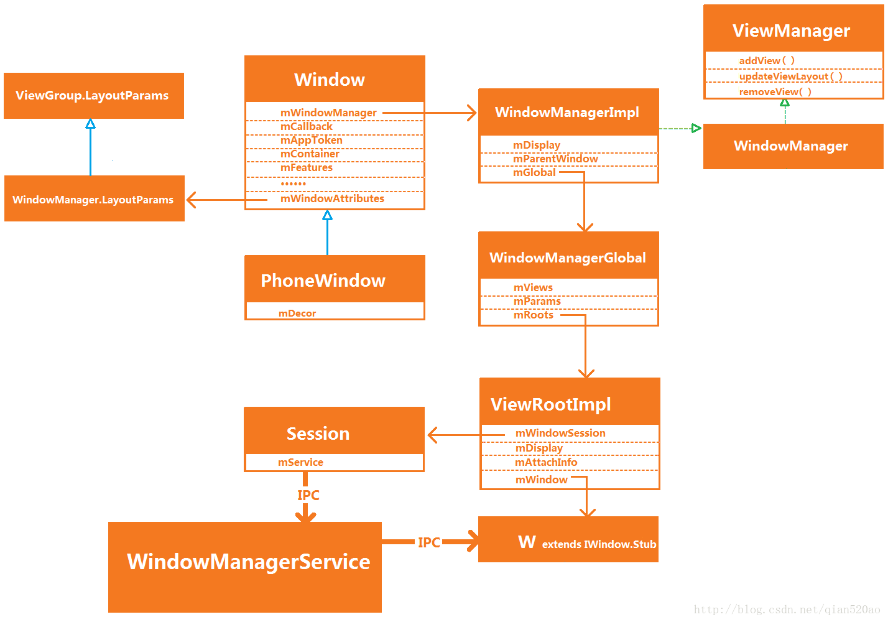
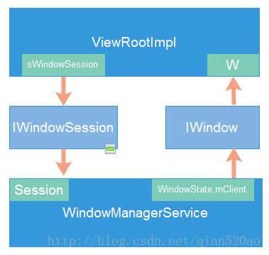
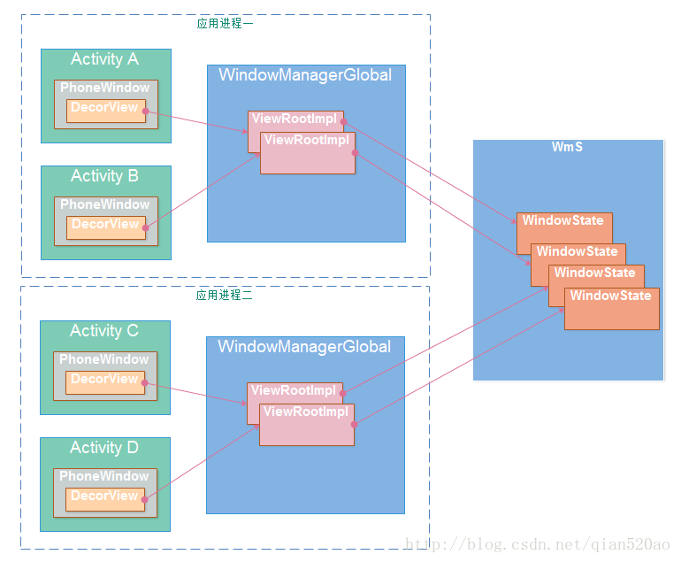

# About Window

> 来源：[凶残的程序员](http://blog.csdn.net/qian520ao/article/details/78555397)

## 目录

    Window的概念
    setContentView
        installDecor
        generateLayout
    Window的类型
        应用窗口
        子窗口
        系统窗口
    Window的内部机制Activity
        Window的创建过程
        Window的添加过程
    Window的token
        Activity的attach
        创建windowManager
        WindowManagerGlobal
        ViewRootImpl
        Session
        WmS
    总结
        参考

## Window的概念

Android手机中所有的视图都是通过Window来呈现的，像常用的Activity，Dialog，PopupWindow，Toast，他们的视图都是附加在Window上的，所以可以这么说 ——「Window是View的直接管理者。」




### Window

一个顶级窗口查看和行为的一个抽象基类。这个类的实例作为一个顶级View添加到Window Manager。它提供了一套标准的UI方法，比如添加背景，标题等等。当你需要用到Window的时候，你应该使用它的唯一实现类PhoneWindow。

```Java
/**
 * Abstract base class for a top-level window look and behavior policy.  An
 * instance of this class should be used as the top-level view added to the
 * window manager. It provides standard UI policies such as a background, title
 * area, default key processing, etc.
 *
 * <p>The only existing implementation of this abstract class is
 * android.view.PhoneWindow, which you should instantiate when needing a
 * Window.
 */
public abstract class Window {
    ``````
    public abstract View getDecorView();

    @Nullable
    public View findViewById(@IdRes int id) {
        return getDecorView().findViewById(id);
    } 

    public abstract void setContentView(View view);
    ``````
}
```

### PhoneWindow

每一个Activity都包含一个Window对象，而Window是一个抽象类，具体实现是PhoneWindow。在Activity中的setContentView实际上是调用PhoneWindow的setContentView方法。并且PhoneWindow中包含着成员变量DecorView。

```Java
//Activity 
    public void setContentView(@LayoutRes int layoutResID) {
        getWindow().setContentView(layoutResID);
        initWindowDecorActionBar();
    }

//getWindow获取到的是mWindow         
//在attach方法里,mWindow = new PhoneWindow(this, window);
```

### DecorView(FrameLayout)

作为顶级View,DecorView一般情况下它内部会包含一个竖直方向的LinearLayout，上面的标题栏(titleBar)，下面是内容栏。通常我们在Activity中通过`setContentView`所设置的布局文件就是被加载到id为`android.R.id.content`的内容栏里(FrameLayout)，

```Java
public class DecorView extends FrameLayout implements RootViewSurfaceTaker, WindowCallbacks {
        ``````
}
```

## setContentView


```Java
//PhoneWindow

    @Override
    public void setContentView(int layoutResID) {
        if (mContentParent == null) {

//①初始化
        //创建DecorView对象和mContentParent对象 
            installDecor();
        } else if (!hasFeature(FEATURE_CONTENT_TRANSITIONS)) {
            mContentParent.removeAllViews();//Activity转场动画相关
        }

//②填充Layout
        if (hasFeature(FEATURE_CONTENT_TRANSITIONS)) {
            final Scene newScene = Scene.getSceneForLayout(mContentParent, layoutResID,
                    getContext());
            transitionTo(newScene);//Activity转场动画相关
        } else {
        //将Activity设置的布局文件，加载到mContentParent中
            mLayoutInflater.inflate(layoutResID, mContentParent);
        }

        //让DecorView的内容区域延伸到systemUi下方，防止在扩展时被覆盖，达到全屏、沉浸等不同体验效果。
        mContentParent.requestApplyInsets();

//③通知Activity布局改变
        final Callback cb = getCallback();
        if (cb != null && !isDestroyed()) {

        //触发Activity的onContentChanged方法  
            cb.onContentChanged();
        }
        mContentParentExplicitlySet = true;
    }
```

1. 初始化 ： Activity第一次调用`setContentView`，则会调用`installDecor()`方法创建DecorView对象和`mContentParent`对象。`FEATURE_CONTENT_TRANSITIONS`表示是否使用转场动画。如果内容已经加载过，并且不需要动画，则会调用`removeAllViews`移除内容以便重新填充Layout。
2. 填充Layout ： 初始化完毕，如果设置了`FEATURE_CONTENT_TRANSITIONS`，就会创建Scene完成转场动画。否则使用布局填充器将布局文件填充至`mContentParent`。到此为止，Activity的布局文件已经添加到DecorView里面了，所以可以理解Activity的`setContentView`方法的由来，因为布局文件是添加到DecorView的`mContentParent`中，所以方法名为`setContentView`无可厚非。「开头第一张图的contentView」

### installDecor

```Java
//PhoneWindow  --> setContentView()

private void installDecor() {
        if (mDecor == null) {
        //调用该方法创建new一个DecorView
            mDecor = generateDecor();

        ``````  
        }else {
            mDecor.setWindow(this);
        }

        if (mContentParent == null) {
        //根据主题theme设置对应的xml布局文件以及Feature(包括style,layout,转场动画,属性等)到DecorView中。
        //并将mContentParent绑定至id为ID_ANDROID_CONTENT(com.android.internal.R.id.content)的ViewGroup
        //mContentParent在DecorView添加的xml文件中
            mContentParent = generateLayout(mDecor);

            // Set up decor part of UI to ignore fitsSystemWindows if appropriate.
            mDecor.makeOptionalFitsSystemWindows();

                `````` 
            //添加其他资源
            //设置转场动画
        }
}
```

### generateLayout

```Java
//PhoneWindow --> setContentView()  -->installDecor() 


 protected ViewGroup generateLayout(DecorView decor) {
        // Apply data from current theme.
        //获取当前的主题，加载默认资源和布局
        TypedArray a = getWindowStyle();

        ``````
        //根据theme的设定，找到对应的Feature(包括style,layout,转场动画，属性等)
        if (a.getBoolean(R.styleable.Window_windowNoTitle, false)) {
            requestFeature(FEATURE_NO_TITLE);//无titleBar
        } 

        ``````

        if (a.getBoolean(R.styleable.Window_windowFullscreen, false)) {
            setFlags(FLAG_FULLSCREEN, FLAG_FULLSCREEN & (~getForcedWindowFlags()));//设置全屏
        }

        if (a.getBoolean(R.styleable.Window_windowTranslucentStatus,
                false)) {
            setFlags(FLAG_TRANSLUCENT_STATUS, FLAG_TRANSLUCENT_STATUS
                    & (~getForcedWindowFlags()));//透明状态栏
        }

        //根据当前主题，设定不同的Feature
        ``````

        int layoutResource;
        int features = getLocalFeatures();

        //由于布局较多，我们拿有titleBar的例子来看
        if ((features & (1 << FEATURE_NO_TITLE)) == 0) {

            ``````
                layoutResource = R.layout.screen_title;

        } 
        ``````
        else {//无titleBar
            layoutResource = R.layout.screen_simple;
        }

        mDecor.startChanging();

        //将布局layout，添加至DecorView中
        mDecor.onResourcesLoaded(mLayoutInflater, layoutResource);

        //从布局中获取`ID_ANDROID_CONTENT`，并关联至contentParent
        ViewGroup contentParent = (ViewGroup)findViewById(ID_ANDROID_CONTENT);

        ``````
        //配置完成，DecorView根据已有属性调整布局状态
        mDecor.finishChanging();

        return contentParent;
    }
```

```xml
//sdk\platforms\android-25\data\res\layout\screen_simple.xml 

<LinearLayout xmlns:android="http://schemas.android.com/apk/res/android" 
    android:layout_width="match_parent" 
    android:layout_height="match_parent" 
    android:fitsSystemWindows="true" 
    android:orientation="vertical"> 
    <ViewStub android:id="@+id/action_mode_bar_stub" 
              android:inflatedId="@+id/action_mode_bar" 
              android:layout="@layout/action_mode_bar" 
              android:layout_width="match_parent" 
              android:layout_height="wrap_content" 
              android:theme="?attr/actionBarTheme" /> 
    <FrameLayout 
         android:id="@android:id/content" 
         android:layout_width="match_parent" 
         android:layout_height="match_parent" 
         android:foregroundInsidePadding="false" 
         android:foregroundGravity="fill_horizontal|top" 
         android:foreground="?android:attr/windowContentOverlay" /> 
</LinearLayout> 

//sdk\platforms\android-25\data\res\layout\screen_title.xml 

<LinearLayout xmlns:android="http://schemas.android.com/apk/res/android" 
    android:orientation="vertical" 
    android:fitsSystemWindows="true"> 
    <!-- Popout bar for action modes --> 
    <ViewStub android:id="@+id/action_mode_bar_stub" 
              android:inflatedId="@+id/action_mode_bar" 
              android:layout="@layout/action_mode_bar" 
              android:layout_width="match_parent" 
              android:layout_height="wrap_content" 
              android:theme="?attr/actionBarTheme" /> 
    <FrameLayout 
        android:layout_width="match_parent"  
        android:layout_height="?android:attr/windowTitleSize" 
        style="?android:attr/windowTitleBackgroundStyle"> 
        <TextView android:id="@android:id/title"  
            style="?android:attr/windowTitleStyle" 
            android:background="@null" 
            android:fadingEdge="horizontal" 
            android:gravity="center_vertical" 
            android:layout_width="match_parent" 
            android:layout_height="match_parent" /> 
    </FrameLayout> 
    <FrameLayout android:id="@android:id/content" 
        android:layout_width="match_parent"  
        android:layout_height="0dip" 
        android:layout_weight="1" 
        android:foregroundGravity="fill_horizontal|top" 
        android:foreground="?android:attr/windowContentOverlay" /> 
</LinearLayout>
```

首先根据当前的主题，加载默认资源和布局，根据相关的FEATURE获取资源布局layout文件。然后将布局添加到DecorView中，并且将contentParent与布局中id为`ID_ANDROID_CONTENT`的FrameLayout绑定。所以我们可以通过`findViewById(com.android.internal.R.id.content)`获取到contentView。



## Window的类型

添加窗口是通过`WindowManagerGlobal`的`addView`方法操作的，这里有三个必要参数。view，params，display。

- display : 表示要输出的显示设备。
- view : 表示要显示的View，一般是对该view的上下文进行操作。(`view.getContext()`)
- params : 类型为`WindowManager.LayoutParams`，即表示该View要展示在窗口上的布局参数。其中有一个重要的参数type，用来表示窗口的类型。

```Java
//WindowManagerGlobal

public void addView(View view, ViewGroup.LayoutParams params,
            Display display, Window parentWindow) {
        if (view == null) {
            throw new IllegalArgumentException("view must not be null");
        }
        if (display == null) {
            throw new IllegalArgumentException("display must not be null");
        }
        if (!(params instanceof WindowManager.LayoutParams)) {
            throw new IllegalArgumentException("Params must be WindowManager.LayoutParams");
        }
        ``````
}
```

打开`WindowManager`类，看到静态内部类。

```Java
//WindowManager

public static class LayoutParams extends ViewGroup.LayoutParams implements Parcelable {
    ``````
}
```

可以看到在`LayoutParams`中，有2个比较重要的参数: flags,type。

我们简要的分析一下flags,该参数表示Window的属性，它有很多选项，通过这些选项可以控制Window的显示特性，这里主要介绍几个比较常用的选项。

- `FLAG_NOT_FOCUSABLE`
    表示Window不需要获取焦点，也不需要接收各种输入事件，此标记会同时启用FLAG_NOT_TOUCH_MODAL，最终事件会直接传递给下层具有焦点的Window。

- `FLAG_NOT_TOUCH_MODAL`
    系统会将当前Window区域以外的单击事件传递给底层的Window，当前Window区域以内的单击事件则自己处理，这个标记很重要，一般来说都需要开启此标记，否则其他Window将无法接收到单击事件。

- `FLAG_SHOW_WHEN_LOCKED`
    开启此模式可以让Window显示在锁屏的界面上。

    > Type参数表示Window的类型，Window有三种类型，分别是应用Window、子Window、系统Window。应用类Window对应着一个Activity。子Window不能单独存在，它需要附属在特定的父Window之中，比如常见的PopupWindow就是一个子Window。有些系统Window是需要声明权限才能创建的Window，比如Toast和系统状态栏这些都是系统Window。

### 应用窗口

Activity 对应的窗口类型是应用窗口， 所有 Activity 默认的窗口类型是`TYPE_BASE_APPLICATION`。
`WindowManager`的`LayoutParams`的默认类型是`TYPE_APPLICATION`。 Dialog 并没有设置type，所以也是默认的窗口类型即`TYPE_APPLICATION`。

```Java
//WindowManager  LayoutParams的默认构造方法

public LayoutParams() {
    super(LayoutParams.MATCH_PARENT, LayoutParams.MATCH_PARENT);
    type = TYPE_APPLICATION;
    format = PixelFormat.OPAQUE;
}
```

|           type层级            |                    类型                    |
| :-------------------------: | :--------------------------------------: |
| FIRST_APPLICATION_WINDOW=1  |            开始应用程序窗口，第一个普通应用窗口            |
|   TYPE_BASE_APPLICATION=1   |      所有程序窗口的base窗口，其他应用程序窗口都显示在它上面       |
|     TYPE_APPLICATION=2      | 普通应用程序窗口，token必须设置为Activity的token来指定窗口属于谁 |
| TYPE_APPLICATION_STARTING=3 |     应用程序启动时先显示此窗口，当真正的窗口配置完成后，关闭此窗口      |
| LAST_APPLICATION_WINDOW=99  |                 最后一个应用窗口                 |

### 子窗口

子窗口不能单独存在，它需要附属在特定的父Window之中，例如开篇第一张图，绿色框框即为popupWindow，它就是子窗口，类型一般为`TYPE_APPLICATION_PANEL`。之所以称为子窗口，即它的父窗口显示时，子窗口才显示。父窗口不显示，它也不显示。追随父窗口。
那么问题又来了，我们能否在Acitivty的`onCreate()`中创建popupWindow并显示呢？
|                type层级                 |                 类型                  |
| :-----------------------------------: | :---------------------------------: |
|         FIRST_SUB_WINDOW=1000         |               第一个子窗口                |
|      TYPE_APPLICATION_PANEL=1000      |      应用窗口的子窗口,popupWindow的默认类型      |
|      TYPE_APPLICATION_MEDIA=1001      |                媒体窗口                 |
|    TYPE_APPLICATION_SUB_PANEL=1002    |      TYPE_APPLICATION_PANE的子窗口      |
| TYPE_APPLICATION_ATTACHED_DIALOG=1003 | 对话框，类似于面板窗口(OptionMenu,ContextMenu) |
|  TYPE_APPLICATION_MEDIA_OVERLAY=1004  |    媒体信息，显示在媒体层和程序窗口之间，需要实现半透明效果     |
|         LAST_SUB_WINDOW=1999          |               最后一个子窗口               |

### 系统窗口

系统窗口跟应用窗口不同，不需要对应 Activity。跟子窗口不同，不需要有父窗口。一般来讲，系统窗口应该由系统来创建的，例如发生异常，ANR时的提示框，又如系统状态栏，屏保等。但是，Framework 还是定义了一些，可以被应用所创建的系统窗口，如`TYPE_TOAST`，`TYPE_INPUT_METHOD`，`TYPE_WALLPAPTER`等等。

|             type层级              |                 类型                  |
| :-----------------------------: | :---------------------------------: |
|    FIRST_SYSTEM_WINDOW=2000     |               第一个系统窗口               |
|      TYPE_STATUS_BAR=2000       |         状态栏，只能有一个状态栏，位于屏幕顶端         |
|      TYPE_SEARCH_BAR =2001      |                 搜索栏                 |
|         TYPE_PHONE=2002         |            电话窗口，它用于电话交互             |
|     TYPE_SYSTEM_ALERT=2003      |          系统警告，出现在应用程序窗口之上           |
|       TYPE_KEYGUARD=2004        |                锁屏窗口                 |
|         TYPE_TOAST=2005         |           信息窗口，用于显示Toast            |
|    TYPE_SYSTEM_OVERLAY=2006     | 系统顶层窗口，显示在其他内容之上，此窗口不能获得输入焦点，否则影响锁屏 |
|    TYPE_PRIORITY_PHONE=2007     |            当锁屏时显示的来电显示窗口            |
|     TYPE_SYSTEM_DIALOG=2008     |                系统对话框                |
|    TYPE_KEYGUARD_DIALOG=2009    |              锁屏时显示的对话框              |
|     TYPE_SYSTEM_ERROR=2010      |              系统内部错误提示               |
|     TYPE_INPUT_METHOD=2011      |         输入法窗口，显示于普通应用/子窗口之上         |
|  TYPE_INPUT_METHOD_DIALOG=2012  |            输入法中备选框对应的窗口             |
|       TYPE_WALLPAPER=2013       |                墙纸窗口                 |
|   TYPE_STATUS_BAR_PANEL=2014    |             滑动状态条后出现的窗口             |
| TYPE_SECURE_SYSTEM_OVERLAY=2015 |              安全系统覆盖窗口               |
|               ……                |                 ……                  |
|     LAST_SYSTEM_WINDOW=2999     |              最后一个系统窗口               |

那么，这个type层级到底有什么作用呢？

> Window是分层的，每个Window都有对应的z-ordered，（z轴，从1层层叠加到2999，你可以将屏幕想成三维坐标模式）层级大的会覆盖在层级小的Window上面。

> 在三类Window中，应用Window的层级范围是1~99。子Window的层级范围是1000~1999，系统Window的层级范围是2000~2999，这些层级范围对应着`WindowManager.LayoutParams`的type参数。如果想要Window位于所有Window的最顶层，那么采用较大的层级即可。另外有些系统层级的使用是需要声明权限的。

## Window的内部机制(Activity)

整体关系图



> `Window`是一个抽象的概念，每一个`Window`都对应着一个`View`和一个`ViewRootImpl`，`Window`和`View`通过`ViewRootImpl`来建立联系，因此`Window`并不是不存在的，它是以`View`的形式存在。这点从`ViewManager`的定义也可以看得出来，它只提供三个接口方法：`addView`、`updateViewLayout`、`removeView`，这些方法都是针对`View`的。这说明`View`才是`Window`存在的实体。

### Window的创建过程

首先要分析Window的创建过程，就必须了解Activity的启动过程。

Activity的启动过程很复杂，最终会由`ActivityThread`中的`handleLaunchActivity()`来完成整个启动过程。

在这个方法中会通过`performLaunchActivity()`方法创建Activity，`performLaunchActivity()`内部通过类加载器创建Activity的实例对象，并调用其`attach()`方法为其关联运行过程中所依赖的一系列上下文环境变量以及创建与绑定窗口。
具体不在赘述，更多Activity启动细节请移步[Activity的启动过程](http://blog.csdn.net/qian520ao/article/details/78156214)。

```Java
//ActivityThread

private void handleLaunchActivity(ActivityClientRecord r, Intent customIntent) {
    ``````
    //获取WindowManagerService的Binder引用(proxy端)。
    WindowManagerGlobal.initialize();

    //会调用Activity的onCreate,onStart,onResotreInstanceState方法
    Activity a = performLaunchActivity(r, customIntent);
    if (a != null) {
        ``````
        //会调用Activity的onResume方法.
        handleResumeActivity(r.token, false, r.isForward,
                !r.activity.mFinished && !r.startsNotResumed, r.lastProcessedSeq, reason);

        ``````
    } 

}

    private Activity performLaunchActivity(ActivityClientRecord r, Intent customIntent) {

        //通过类加载器创建Activity
        Activity activity = mInstrumentation.newActivity(cl, component.getClassName(), r.intent);

        ``````        

        //通过LoadedApk的makeApplication方法来创建Application对象
        Application app = r.packageInfo.makeApplication(false, mInstrumentation);


        if (activity != null) {
            ``````
            activity.attach(appContext, this, getInstrumentation(), r.token,
                    r.ident, app, r.intent, r.activityInfo, title, r.parent,
                    r.embeddedID, r.lastNonConfigurationInstances, config,
                    r.referrer, r.voiceInteractor, window);
            ``````

            //onCreate
            mInstrumentation.callActivityOnCreate(activity, r.state);

            //onStart
            activity.performStart();

        }
        return activity;
    }
```

在Activity的`attach()`方法里，系统会创建Activity所属的`Window`对象并为其设置回调接口，由于Activity实现了`Window`的`Callback`接口，因此当`Window`接收到外界的状态改变时就会回调Activity的方法。`Callback`接口中的方法很多，下面举几个比较眼熟的方法。

```Java
public interface Callback {

        public boolean dispatchTouchEvent(MotionEvent event);

        public View onCreatePanelView(int featureId);

        public boolean onMenuItemSelected(int featureId, MenuItem item);

        public void onContentChanged();

        public void onWindowFocusChanged(boolean hasFocus);

        public void onAttachedToWindow();

        public void onDetachedFromWindow();
    }
```

```Java
//Activity


final void attach(``````) {
        //绑定上下文
        attachBaseContext(context);

        //创建Window,PhoneWindow是Window的唯一具体实现类
        mWindow = new PhoneWindow(this, window);//此处的window==null，但不影响
        mWindow.setWindowControllerCallback(this);
        mWindow.setCallback(this);
        ``````
        //设置WindowManager
        mWindow.setWindowManager(
                (WindowManager)context.getSystemService(Context.WINDOW_SERVICE),
                mToken, mComponent.flattenToString(),
                (info.flags & ActivityInfo.FLAG_HARDWARE_ACCELERATED) != 0);
        if (mParent != null) {
            mWindow.setContainer(mParent.getWindow());
        }
        //创建完后通过getWindowManager就可以得到WindowManager实例
        mWindowManager = mWindow.getWindowManager();//其实它是WindowManagerImpl

    }


    @Override
    public Object getSystemService(@ServiceName @NonNull String name) {
        ``````
        if (WINDOW_SERVICE.equals(name)) {
            return mWindowManager;
        } 
        return super.getSystemService(name);
    }
```

看到这里是不是有点懵，Activity的`getSystemService`根本没有创建`WindowManager`，那么`mWindow.setWindowManager()`设置的岂不是空的`WindowManager`，那这样它的下一步`mWindowManager = mWindow.getWindowManager()`岂不是无线空循环？

因为`PhoneWindow`中并没有`setWindowManager()`方法，所以我们打开`Window`类看看。

```Java
//Window


    public void setWindowManager(WindowManager wm, IBinder appToken, String appName,
            boolean hardwareAccelerated) {
        mAppToken = appToken;
        mAppName = appName;
        mHardwareAccelerated = hardwareAccelerated
                || SystemProperties.getBoolean(PROPERTY_HARDWARE_UI, false);
        if (wm == null) {
            wm = (WindowManager)mContext.getSystemService(Context.WINDOW_SERVICE);
        }

        //在此处创建mWindowManager 
        mWindowManager = ((WindowManagerImpl)wm).createLocalWindowManager(this);
    }


//在WindowManagerImpl类中
    public WindowManagerImpl createLocalWindowManager(Window parentWindow) {
        return new WindowManagerImpl(mContext, parentWindow);
    }
```

类似于`PhoneWindow`和`Window`的关系，`WindowManager`是一个接口，具体的实现是`WindowManagerImpl`。

到了这里`Window`已经创建完毕，在上面的`performLaunchActivity()`方法中我们可以看到调用了`onCreate()`方法：

```Java
//ActivityThread --> performLaunchActivity

            mInstrumentation.callActivityOnCreate(activity, r.state);
```

在Activity的`onCreate`方法里，我们通过`setContentView()`将view添加到`DecorView`的`mContentParent`中，也就是将资源布局文件和phoneWindow关联。所以在`PhoneWindow`的最后，因为Activity实现了`Callback`接口，便可以通过下面代码通知Activity视图已经发生改变。

```Java
//PhoneWindow  -->  setContentView

callback.onContentChanged();
```

> 经过了上面几个过程，`Window`和`DecorView`已经被创建并初始化完毕，Activity的布局文件也成功添加到了`DecorView`的`mContentParent`中，但这个时候的`DecorView`还没有被`WindowManager`正式添加到`Window`中。

> 这里需要理解的是，Window更多表示的是一种抽象功能集合，虽然说早在Activity的`attach`方法中window就已经被创建了，但是这个时候由于`DecorView`并没有被`WindowManager`识别，所以这个时候的Window暂时无法提供具体功能。

    总的来说，Window可以成功使用有2个标志:
    1. View绘制完毕，可以呈现给用户。
    2. View可以接收外界信息（触摸事件等）。

### Window的添加过程

PhoneWindow 只是负责处理一些应用窗口通用的逻辑(设置标题栏，导航栏等)。但是真正完成把一个 View，作为窗口添加到 WmS 的过程是由 WindowManager 来完成的。WindowManager 的具体实现是 WindowManagerImpl。

下面我们继续来分析`handleLaunchActivity()`方法中`handleResumeActivity()`的执行过程。

```Java
//ActivityThread

final void handleResumeActivity(IBinder token,
            boolean clearHide, boolean isForward, boolean reallyResume, int seq, String reason) {

        //把activity数据记录更新到ActivityClientRecord
        ActivityClientRecord r = mActivities.get(token);

        r = performResumeActivity(token, clearHide, reason);

        if (r != null) {

            if (r.window == null && !a.mFinished && willBeVisible) {
                r.window = r.activity.getWindow();
                View decor = r.window.getDecorView();
                decor.setVisibility(View.INVISIBLE);//不可见
                ViewManager wm = a.getWindowManager();
                WindowManager.LayoutParams l = r.window.getAttributes();
                a.mDecor = decor;
                l.type = WindowManager.LayoutParams.TYPE_BASE_APPLICATION;

             ``````
                if (a.mVisibleFromClient && !a.mWindowAdded) {
                    a.mWindowAdded = true;
                    wm.addView(decor, l);//把decor添加到窗口上（划重点）
                }

            } 
                //屏幕参数发生了改变
                performConfigurationChanged(r.activity, r.tmpConfig);

                WindowManager.LayoutParams l = r.window.getAttributes();

                    if (r.activity.mVisibleFromClient) {
                        ViewManager wm = a.getWindowManager();
                        View decor = r.window.getDecorView();
                        wm.updateViewLayout(decor, l);//更新窗口状态
                    }


                ``````
                if (r.activity.mVisibleFromClient) {
                    //已经成功添加到窗口上了（绘制和事件接收），设置为可见
                    r.activity.makeVisible();
                }


            //通知ActivityManagerService，Activity完成Resumed
             ActivityManagerNative.getDefault().activityResumed(token);
        } 
    }
```

在上面代码中，首先配置`ActivityClientRecord`，之后将`DecorView`设置为`INVISIBLE`，因为View并未绘制完成，当前的`DecorView`只是一个有结构的空壳。

然后通过WindowManagerImpl将DecorView正式的添加到窗口上`wm.addView(decor, l);`，这一步非常非常重要，因为它包括了2个比较重要和常见的过程：Window的添加过程和View的绘制流程。

下面画一张图来看看整体添加流程，留一个大致的概括印象。


> 窗口的添加过程如上图所示，我们知道 WmS 运行在单独的进程中。这里 IWindowSession 执行的 addtoDisplay 操作应该是 IPC 调用。接下来的Window添加过程，我们会知道每个应用窗口创建时，最终都会创建一个 ViewRootImpl 对象。

> ViewRootImpl 是一很重要的类，类似 ApplicationThread 负责跟AmS通信一样，ViewRootImpl 的一个重要职责就是跟 WmS 通信，它通静态变量 sWindowSession（IWindowSession实例）与 WmS 进行通信。

> 每个应用进程，仅有一个 sWindowSession 对象，它对应了 WmS 中的 Session 子类，WmS 为每一个应用进程分配一个 Session 对象。WindowState 类有一个 IWindow mClient 参数，是由 Session 调用 addToDisplay 传递过来的，对应了 ViewRootImpl 中的 W 类的实例。

> 简单的总结一下，ViewRootImpl通过IWindowSession远程IPC通知WmS，并且由W类接收WmS的远程IPC通知。（这个W类和ActivityThread的H类同样精悍的命名，并且也是同样的工作职责！）

图解完Window的添加过程，对整个流程有一个印象和思路，那么下面继续分析源码。

在上面的`handleResumeActivity()`方法中，我们看到源码通过`wm.addView(decor, l);`操作`DecorView`和`WindowManager.LayoutParams`。上面讲解也说过，因为WindowManager是接口，真正具体实现类是`WindowManagerImpl`。如果Window中类的关系还不太清楚的可以再回到上面的「Window的内部机制」看图解。

```Java
//WindowManagerImpl

    private final WindowManagerGlobal mGlobal = WindowManagerGlobal.getInstance();

    @Override
    public void addView(@NonNull View view, @NonNull ViewGroup.LayoutParams params) {
        applyDefaultToken(params);
        mGlobal.addView(view, params, mContext.getDisplay(), mParentWindow);
    }

    @Override
    public void updateViewLayout(@NonNull View view, @NonNull ViewGroup.LayoutParams params) {
        applyDefaultToken(params);
        mGlobal.updateViewLayout(view, params);
    }

    @Override
    public void removeView(View view) {
        mGlobal.removeView(view, false);
    }
```

我们看到这个`WindowManagerImpl`原来也是一个吃空饷的家伙！对于Window(或者可以说是View)的操作都是交由`WindowManagerGlobal`来处理，`WindowManagerGlobal`以工厂的形式向外提供自己的实例。这种工作模式是桥接模式，将所有的操作全部委托给`WindowManagerGlobal`来实现。

在`WindowManagerImpl`的全局变量中通过单例模式初始化了`WindowManagerGlobal`，也就是说一个进程就只有一个`WindowManagerGlobal`对象。

```Java
//WindowManagerGlobal

   public void addView(View view, ViewGroup.LayoutParams params,
            Display display, Window parentWindow) {
        if (view == null) {
            throw new IllegalArgumentException("view must not be null");
        }
        if (display == null) {
            throw new IllegalArgumentException("display must not be null");
        }
        if (!(params instanceof WindowManager.LayoutParams)) {
            throw new IllegalArgumentException("Params must be WindowManager.LayoutParams");
        }


        final WindowManager.LayoutParams wparams = (WindowManager.LayoutParams) params;
        if (parentWindow != null) {
            //调整布局参数，并设置token
            parentWindow.adjustLayoutParamsForSubWindow(wparams);
        } 

        ViewRootImpl root;
        View panelParentView = null;

        synchronized (mLock) {


            int index = findViewLocked(view, false);
            if (index >= 0) {
                if (mDyingViews.contains(view)) {
                    //如果待删除的view中有当前view，删除它
                    // Don't wait for MSG_DIE to make it's way through root's queue.
                    mRoots.get(index).doDie();
                }
                // The previous removeView() had not completed executing. Now it has.
                //之前移除View并没有完成删除操作，现在正式删除该view
            }

            //如果这是一个子窗口个(popupWindow)，找到它的父窗口。
            //最本质的作用是使用父窗口的token(viewRootImpl的W类，也就是IWindow)
            if (wparams.type >= WindowManager.LayoutParams.FIRST_SUB_WINDOW &&
                    wparams.type <= WindowManager.LayoutParams.LAST_SUB_WINDOW) {
                final int count = mViews.size();
                for (int i = 0; i < count; i++) {
                    if (mRoots.get(i).mWindow.asBinder() == wparams.token) {
                        panelParentView = mViews.get(i);
                    }
                }
            }
            //创建ViewRootImpl，并且将view与之绑定
            root = new ViewRootImpl(view.getContext(), display);

            view.setLayoutParams(wparams);

            mViews.add(view);//将当前view添加到mViews集合中
            mRoots.add(root);//将当前ViewRootImpl添加到mRoots集合中
            mParams.add(wparams);//将当前window的params添加到mParams集合中
        }

          ``````
            //通过ViewRootImpl的setView方法，完成view的绘制流程，并添加到window上。
            root.setView(view, wparams, panelParentView);
    }
```

在上面代码中有2个比较重要的知识点

- 1. 在WindowManagerGlobal中有如下几个重要的集合
```Java
    //存储所有Window对应的View
    private final ArrayList<View> mViews = new ArrayList<View>();

    //存储所有Window对应的ViewRootImpl
    private final ArrayList<ViewRootImpl> mRoots = new ArrayList<ViewRootImpl>();

    //存储所有Window对应的布局参数
    private final ArrayList<WindowManager.LayoutParams> mParams =
            new ArrayList<WindowManager.LayoutParams>();

    //存储正被删除的View对象（已经调用removeView但是还未完成删除操作的Window对象）     
    private final ArraySet<View> mDyingViews = new ArraySet<View>();
```
- 2. token
    在源码中token一般代表的是`Binder`对象，作用于IPC进程间数据通讯。并且它也包含着此次通讯所需要的信息，在`ViewRootImpl`里，token用来表示`mWindow`(W类，即IWindow)，并且在WmS中只有符合要求的token才能让Window正常显示。所以上面提出的问题"我们能否在Acitivty的onCreate()中创建popupWindow并显示呢？"就与之有关，我们暂时把token放一边，走完Window的添加过程先。(最后分析token)

言归正传，我们继续看代码。

在`WindowManagerGlobal`的`addView()`方法里，最后调用`ViewRootImpl`的`setView`方法，处理添加过程。

```Java
//WindowManagerGlobal  -->  addView

    //创建ViewRootImpl，并且将view与之绑定
     root = new ViewRootImpl(view.getContext(), display);

    //通过ViewRootImpl的setView方法，完成view的绘制流程，并添加到window上。
    root.setView(view, wparams, panelParentView);
```

通过上面这个代码可知，`WindowManagerGlobal`将`View`的处理操作全权交给`ViewRootImpl`，而且上面我们也提到了，`View`成功添加到`Window`，无非就是展现视图和用户交互。

在`ViewRootImpl`的`setView()`方法中，将会完成上面2个艰巨而又伟大的任务。 

```Java
//ViewRootImpl 

  public void setView(View view, WindowManager.LayoutParams attrs, View panelParentView) {

                int res; 

                // Schedule the first layout -before- adding to the window
                // manager, to make sure we do the relayout before receiving
                // any other events from the system.
                requestLayout();//View的绘制流程

                if ((mWindowAttributes.inputFeatures
                        & WindowManager.LayoutParams.INPUT_FEATURE_NO_INPUT_CHANNEL) == 0) {
                    //创建InputChannel
                    mInputChannel = new InputChannel();
                }

                try {

                    //通过WindowSession进行IPC调用，将View添加到Window上
                    //mWindow即W类，用来接收WmS信息
                    //同时通过InputChannel接收触摸事件回调
                    res = mWindowSession.addToDisplay(mWindow, mSeq, mWindowAttributes,
                            getHostVisibility(), mDisplay.getDisplayId(),
                            mAttachInfo.mContentInsets, mAttachInfo.mStableInsets,
                            mAttachInfo.mOutsets, mInputChannel);
                }

                ``````

                    //处理触摸事件回调
                    mInputEventReceiver = new WindowInputEventReceiver(mInputChannel,
                            Looper.myLooper());

                ``````
    }
```

在`ViewRootImpl`的`setView()`方法里，执行`requestLayout()`方法完成View的绘制流程（下篇文章专门讲解），并且通过`WindowSession`将`View`和`nputChannel`添加到WmS中，从而将`View`添加到`Window`上并且接收触摸事件。

通过`mWindowSession`来完成`Window`的添加过程 ，`mWindowSession`的类型是`IWindowSession`，是一个`Bindler`对象，真正的实现类是`Session`，也就是`Window`的添加是一次IPC调用。(`mWindowSession`在`ViewRootImpl`的构造函数中通过`WindowManagerGlobal.getWindowSession();`创建)

同时将`mWindow`（即`W extends IWindow.Stub`）发送给WmS，用来接收WmS信息。


图片摘自[腾讯 Bugly](http://dev.qq.com/topic/5923ef85bdc9739041a4a798)

```Java
//Session

    final WindowManagerService mService;

   @Override
    public int addToDisplay(IWindow window, int seq, WindowManager.LayoutParams attrs,
            int viewVisibility, int displayId, Rect outContentInsets, Rect outStableInsets,
            Rect outOutsets, InputChannel outInputChannel) {

        return mService.addWindow(this, window, seq, attrs, viewVisibility, displayId,
                outContentInsets, outStableInsets, outOutsets, outInputChannel);
```

如此一来，Window的添加请求就交给WmS去处理了，在WmS内部会为每一个应用保留一个单独的`Session`在WmS 端会创建一个`WindowState`象用来表示当前添加的窗口。 WmS负责管理这里些 `WindowState`对象。至此，Window的添加过程就结束了。

至于Window的删除和更新过程，举一反三，也是使用`WindowManagerGlobal`对`ViewRootImpl`的操作，最终也是通过`Session`的IPC跨进程通信通知到WmS。整个过程的本质都是同出一辙的。


图片摘自[腾讯 Bugly](http://dev.qq.com/topic/5923ef85bdc9739041a4a798)

## Window的token

在`WindowManager`的`LayoutParams`中，与`type`同等重要的还有`token`。

上面说到：在源码中token一般代表的是`Binder`对象，作用于IPC进程间数据通讯。并且它也包含着此次通讯所需要的信息，在`ViewRootImpl`里，`token`用来表示`mWindow`(W类，即IWindow)，并且在WmS中只有符合要求的token才能让Window正常显示。

先剧透一下，在Window中，`token`(`LayoutParams`中的`token`)分为以下2种情况

- 应用窗口 : token表示的是activity的`mToken(ActivityRecord)`
- 子窗口 : token表示的是父窗口的W对象，也就是`mWindow(IWindow)`

### Activity的`attach()`

我们通过源码分析token的流程，顺带再巩固一遍Window的创建流程。

在Activity的attach()方法中
```Java
//Activity

 final void attach(Context context, ActivityThread aThread,
            Instrumentation instr, IBinder token, int ident,
            Application application, Intent intent, ActivityInfo info,
            CharSequence title, Activity parent, String id,
            NonConfigurationInstances lastNonConfigurationInstances,
            Configuration config, String referrer, IVoiceInteractor voiceInteractor,
            Window window) {

        attachBaseContext(context);

        mToken = token;//ActivityRecord

        mWindow = new PhoneWindow(this, window);

        ``````
        mWindow.setWindowManager(
                (WindowManager)context.getSystemService(Context.WINDOW_SERVICE),
                mToken, mComponent.flattenToString(),
                (info.flags & ActivityInfo.FLAG_HARDWARE_ACCELERATED) != 0);
        if (mParent != null) {
            mWindow.setContainer(mParent.getWindow());
        }
        mWindowManager = mWindow.getWindowManager();
    }
```

### 创建WindowManager

在Window中创建`WindowManager`，并且全局变量`mAppToken`就是上面代码传入的`mToken(ActivityRecord)`
```Java
//Window

    private IBinder mAppToken;//Activity的mToken

    public void setWindowManager(WindowManager wm, IBinder appToken, String appName,
            boolean hardwareAccelerated) {

        mAppToken = appToken;

        mWindowManager = ((WindowManagerImpl)wm).createLocalWindowManager(this);
    }
```
```Java
//WindowManagerImpl

    public WindowManagerImpl createLocalWindowManager(Window parentWindow) {

        //parentWindow就是activity的Window
        return new WindowManagerImpl(mContext, parentWindow);
    }

    @Override
    public void addView(@NonNull View view, @NonNull ViewGroup.LayoutParams params) {
        applyDefaultToken(params);
        mGlobal.addView(view, params, mContext.getDisplay(), mParentWindow);
    }
```

我们拿出上面的关系图，目前已经分析了`WindowManagerImpl`，接下来就是`WindowManagerGlobal`的`addView()`方法。


### WindowManagerGlobal

```Java
//WindowManagerGlobal

public void addView(View view, ViewGroup.LayoutParams params,
            Display display, Window parentWindow) {

        ``````
        final WindowManager.LayoutParams wparams = (WindowManager.LayoutParams) params;

        //parentWindow就是Acitivty的Window
        if (parentWindow != null) {
            //①调整布局参数，并设置token
            parentWindow.adjustLayoutParamsForSubWindow(wparams);
        } 


        ViewRootImpl root;
        View panelParentView = null;

        synchronized (mLock) {
            //②如果这是一个子窗口个(popupWindow)，找到它的父窗口。
            //②最本质的作用是使用父窗口的token(viewRootImpl的W类，也就是IWindow)
            if (wparams.type >= WindowManager.LayoutParams.FIRST_SUB_WINDOW &&
                    wparams.type <= WindowManager.LayoutParams.LAST_SUB_WINDOW) {
                final int count = mViews.size();
                for (int i = 0; i < count; i++) {
                    if (mRoots.get(i).mWindow.asBinder() == wparams.token) {
                        panelParentView = mViews.get(i);
                        //从mRoots找到相同的W类，再从mViews找到父View
                    }
                }
            }

            //③创建ViewRootImpl，并且将view与之绑定
            root = new ViewRootImpl(view.getContext(), display);

            view.setLayoutParams(wparams);

            mViews.add(view);
            mRoots.add(root);
            mParams.add(wparams);
        }
            //④通过ViewRootImpl的setView方法，完成view的绘制流程，并添加到window上。
            root.setView(view, wparams, panelParentView);
    }
```

我们一步一步分析，先看①，`parentWindow.adjustLayoutParamsForSubWindow(wparams);`

```Java
//Window

    void adjustLayoutParamsForSubWindow(WindowManager.LayoutParams wp) {

        //如果它是子窗口
        if (wp.type >= WindowManager.LayoutParams.FIRST_SUB_WINDOW &&
                wp.type <= WindowManager.LayoutParams.LAST_SUB_WINDOW) {
            if (wp.token == null) {
                View decor = peekDecorView();
                if (decor != null) {
                    wp.token = decor.getWindowToken();//分析View的getWindowToken
                }
            }

        }
        ``````
        else {
            //应用窗口（dialog的情况）
            //此时的wp.token即为mAppToken
            if (wp.token == null) {
                wp.token = mContainer == null ? mAppToken : mContainer.mAppToken;
            }
        }

    }
```

我们看到如果是应用窗口，`wp.token==null`的情况，就会给他赋值`mAppToken`，而这个`mAppToken`就是我们上面在Activity的`attach()方`法中传入的`mToken`!

我们再分析子窗口的`token，接上面的`decor.getWindowToken()`

```Java
//View 

    AttachInfo mAttachInfo;
    /**
     * Retrieve a unique token identifying the window this view is attached to.
     * @return Return the window's token for use in
     * {@link WindowManager.LayoutParams#token WindowManager.LayoutParams.token}.
     */
    public IBinder getWindowToken() {
        return mAttachInfo != null ? mAttachInfo.mWindowToken : null;
    }
```

### ViewRootImpl

那么View的`mAttachInfo`又是如何赋值的呢？我们接着看第③`root = new ViewRootImpl(view.getContext(), display);`

```Java
//ViewRootImpl类

    public ViewRootImpl(Context context, Display display) {
        mWindowSession = WindowManagerGlobal.getWindowSession();

        mWindow = new W(this);//W是用于接收WmS通知的

        mAttachInfo = new View.AttachInfo(mWindowSession, mWindow, display, this, mHandler, this);

         ``````
    }

//View类

        AttachInfo(IWindowSession session, IWindow window, Display display,
                ViewRootImpl viewRootImpl, Handler handler, Callbacks effectPlayer) {
            mSession = session;
            mWindow = window;
            mWindowToken = window.asBinder();//即W类
            mDisplay = display;
            mViewRootImpl = viewRootImpl;
            mHandler = handler;
            mRootCallbacks = effectPlayer;
        }
```

那么，如果这个View是ViewGroup，如何确保它的所有子View都能调用`getWindowToken()`获取到`mAttachInfo`的`mWindowToken`呢？

这里我们涉及一点View的绘制流程看一下源码。

```Java
 // ViewRootImpl

    private void performTraversals() {
       ``````
        if (mFirst) {

            //第一次执行performTraversals时，会把自己的mAttachInfo关联到所有的子View
            host.dispatchAttachedToWindow(mAttachInfo, 0);
        }
    }

//ViewGroup.java

    void dispatchAttachedToWindow(AttachInfo info, int visibility) {

       final int count = mChildrenCount;
       final View[] children = mChildren;
       for (int i = 0; i < count; i++) {
           final View child = children[i];
           //关联到所有子View
           child.dispatchAttachedToWindow(info,visibility | (child.mViewFlags & VISIBILITY_MASK));
      }
    }

//View.java

    void dispatchAttachedToWindow(AttachInfo info, int visibility) {
       mAttachInfo = info;
        ``````
     }
```

### Session

循序渐进，我们走到Session

```Java
    @Override
    public int addToDisplay(IWindow window, int seq, WindowManager.LayoutParams attrs,
            int viewVisibility, int displayId, Rect outContentInsets, Rect outStableInsets,
            Rect outOutsets, InputChannel outInputChannel) {

        //window是在viewRootImpl创建的时候创建的，用来接收WmS消息
        //mWindow = new W(this); 不要和token搞混了！

        return mService.addWindow(this, window, seq, attrs, viewVisibility, displayId,
                outContentInsets, outStableInsets, outOutsets, outInputChannel);
    }
```

### WmS

最终，我们走进大魔王 WindowManagerService看看它到底是如何处理应用窗口以及子窗口。

```Java
//WmS

    public int addWindow(Session session, IWindow client, int seq,
            WindowManager.LayoutParams attrs, int viewVisibility, int displayId,
            Rect outContentInsets, Rect outStableInsets, Rect outOutsets,
            InputChannel outInputChannel) {

    //根据type检查窗口类型是否合法，如果是系统窗口类型，还需要进行权限检查
    int res = mPolicy.checkAddPermission(attrs, appOp);

    ``````

    //如果是子窗口，根据attrs.token(也就是我们说的Window的token)检查父窗口是否合法
    if (type >= FIRST_SUB_WINDOW && type <= LAST_SUB_WINDOW) {
                attachedWindow = windowForClientLocked(null, attrs.token, false);
                if (attachedWindow == null) {
                    //父窗口不存在，直接抛出异常
                     return WindowManagerGlobal.ADD_BAD_SUBWINDOW_TOKEN;
                 }
                 //如果父窗口也是子窗口，GG
                 if (attachedWindow.mAttrs.type >= FIRST_SUB_WINDOW
                       && attachedWindow.mAttrs.type <= LAST_SUB_WINDOW) {

                    return WindowManagerGlobal.ADD_BAD_SUBWINDOW_TOKEN;
                 }
      }
        ``````

    //经过一系列的检查之后，最后会生成窗口在WmS中的表示WindowState，并且把LayoutParams赋值给WindowState的mAttrs
    win = new WindowState(this, session, client, token, attachedWindow, appOp[0], seq, attrs, viewVisibility, displayContent);  

    `````` 
    if (addToken) {
     mTokenMap.put(attrs.token, token);
    } 
    ``````
    //窗口添加成功，W类存放至mWindowMap
     mWindowMap.put(client.asBinder(), win);   

    }

    final WindowState windowForClientLocked(Session session, IBinder client,
            boolean throwOnError) {

        //client为attrs.token，即父类的W类对象
        //如果父类窗口添加成功，那么mWindowMap必定有此client
        WindowState win = mWindowMap.get(client);

        if (win == null) {
            RuntimeException ex = new IllegalArgumentException(
                    "Requested window " + client + " does not exist");
            if (throwOnError) {
                throw ex;//抛出异常
            }
            return null;
        }
        if (session != null && win.mSession != session) {
            RuntimeException ex = new IllegalArgumentException(
                    "Requested window " + client + " is in session " +
                    win.mSession + ", not " + session);
            if (throwOnError) {
                throw ex;
            }
            Slog.w(TAG_WM, "Failed looking up window", ex);
            return null;
        }

        return win;
    }
```

如果子窗口不合法（没有父窗口或者父窗口也是子窗口），那么将会抛出`ADD_BAD_SUBWINDOW_TOKEN`的异常，比如在Activity的`onCreate()`方法中去创建并显示一个popupWindow，至于崩溃原因结合上面所分析的，就能找出原因了。

```Java
//ViewRootImpl

    public void setView(View view, WindowManager.LayoutParams attrs, View panelParentView) {
                    res = mWindowSession.addToDisplay(``````);

                    ``````
                    switch (res) {
                        case WindowManagerGlobal.ADD_BAD_APP_TOKEN:
                        case WindowManagerGlobal.ADD_BAD_SUBWINDOW_TOKEN:
                            throw new WindowManager.BadTokenException(
                                    "Unable to add window -- token " + attrs.token
                                    + " is not valid; is your activity running?");
                    }

            }
```

所以无论是应用窗口，还是子窗口，token 不能为空。否则会抛出异常，并且应用窗口的token 必须是某个 Activity 的`mToken`，子窗口的token 必须是父窗口的`IWindow`对象。而且子窗口还需等父窗口添加成功之后才可添加到Window上。

## 总结

至此，Window的机制已经探索的有些眉目，阅读源码read the fuck source code能够更好的了解到Android的各种机制流程，而且能够熟悉源码编写的码神他们的编写风格，例如`performLaunchActivity()`就是Activity的整体流程开始，`performTraversals()`就是开始绘制View，还有`performMeasure()`、`performLayout()`、`performDraw()`等等，并且探索了Window机制后，我们就能比较容易的上手View的绘制流程。

虽然说阅读源码在短时间内可能没办法体现出多大的作用，但是这是一种循序渐进积累和爆发的过程，只要不断的进步，量变终究能引起质变。


## 参考

腾讯 Bugly的浅析[Android的窗口](http://dev.qq.com/topic/5923ef85bdc9739041a4a798)

Hohohong的[Android窗口系列](http://www.jianshu.com/u/107bd58d5bbb)