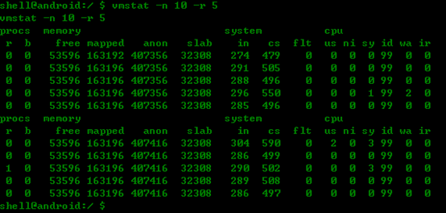

####vmstat命令简介
Vmstat：virtual Meomory Statistics(虚拟内存统计)的缩写。一般这个命令都直接集成到手机的，我们只需要在系统设置中打开adb调试，进入adb shell 执行该命令即可。

####参数查看

执行`vmstat -h`查看，可以看到在使用过程中我们会用到3个参数
```
-n :  每次打印多少行记录
-d :  每行的输入记录间隔时间，单位为s，默认为1s
-r :  输出多少行记录后重新打印记录头信息，默认为20
```

####实现原理

Vmstat是android toolbox提供的众多工具中的一个，源码位于/system/core/toolbox/下的vmstat.c.原理是在一定的实际内读取并分析系统/proc文件系统下的meminfo、stat、vmstat信息并做整理、统计，直观的将信息展现给开发人员。我们一般用来检测系统在该段时间内的系统状态。

####输出结果分析

首先我们先看一下这张截图：



会发现，除了头信息就是对应的数据，这些都代表什么含义呢？

首先分为4个部分统计，procs（进程）memory（内存）system（系统）和CPU。比较关注的几个头信息所包含的列含义：
```
r ：（running）运行队列中的进程数，该值不能长时间大于cpu个数
b ：（blocked）被阻塞的进程数，一般为等待IO动作。这个值会与后面的wa有一些关系

free : 系统空闲可用的内存数 单位kB
mapped: 设备和文件映射的内存大小
anon: 未映射的内存大小
slab: 内核数据缓存的大小，主要监控采用slab策略分配内存的情况

in : (interrupts) 在delay的时间内（默认1秒）系统产生的中断数
cs : (context switch) 在delay的时间内（默认1秒）系统的上下文切换次数
flt : (major page faults) 在delay的时间内（默认1秒）系统产生的缺页错误次数

us : (user time) 用户部分消耗的CPU时间百分比
ni : 被提高优先级的进程在用户模式下的执行CPU时间百分比
sy : (system time) 系统内核部分消耗的CPU时间百分比
id : (idle time) 系统空闲时间百分比
wa : (IO wait) CPU在等待IO完成时间占比，如果该值持续高，则存在IO瓶颈
ir : (interrupt) 系统中断服务占比CPU百分比
```

####问题结果分析

对应输出一些值，可以看到目前系统处于一种什么状态，下面就列举一些：

1. 运行进程队列 r：

运行队列中的进程数远大于CPU个数，则说明系统运行比较缓慢、CPU较忙，有进程一直在等待运行。
>定位方向：需要根据运行关机及系统整体状况（频率设置是否正常，系统中断是否过多，是否有什么特殊操作程序等）分析系统是否存在问题。

2. 阻塞进程队列 b：

阻塞队列进程数大于0，则说明等待IO的进程可能比较多。
>定位方向：确定运行场景，是否存在过多的文件操作（网页浏览，下载等），是否由于文件读写过慢或文件系统缓存被频繁刷出导致。

3. 空闲内存 free：

该值忽大忽小或持续比较小，则潜在文件cache被换出。
>定位方向：Android对Memory的使用是尽量将memory都用起来（有多少用多少），当内存不够时，由OOMKiller来根据优先级将后台cached进程杀掉以释放内存。Free 的值不是越大越好，而是在内存最大利用率时最好。当波动较大时，需要注意，文件cache对系统性能和流畅度影响很大。

4. 中断个数 in：

在运行中，该值变化很大，则系统存在中断过多，影响性能。
>定位方向：可以在主界面静置状态下观察中断数A，玩游戏时观察中断B，如果中断值比玩游戏时高出很多,需要分析哪个模块产生过多的中断，具体可以通过查看/proc/interrupts下的中断增长情况。

5. 上下文切换 cs：

在运行中，该值变化很大，则系统存在过多的中断。
>定位方向：先定位中断问题，如果都正常，则需要确认调度测试及时钟中断是否存在影响。

6. 用户空间CPU时间占比 us：

在运行中，该值较大，则用户基础太忙，或存在死循环。
>定位方向：结合top命令分析，找出该进程。如果高于95%，则要进一步确认该进程的代码是否陷入了死循环。

7. 内核空间CPU时间占比 sy:

在运行中，该值比较大，可能系统比较忙活使用了过多的忙等待。
>定位方向：该值一般不超过20%的情况，如果高于则要检查驱动或内核模块，是否实现逻辑存在问题。

8. CPU空闲时间占比 id：

在运行中，该值较小或为0，则系统处于繁忙状态。
>定位方向：需要分析其他几个CPU占比，进行分析。该值若大，说明CPU工作能强，当然也可能就是工作少导致，此时系统响应会比较好。

9. CPU等待IO时间占比 wa：

在运行中，该值大于0，则系统的IO开销较大，系统在等待IO。
>定位方向：系统在等待IO的时间内CPU无事可做，只能等待IO完成才能继续工作，若该值过多，对系统的流畅度影响很大，如果达到5%，根据前面的经验，用户会感觉到明显的卡顿。该问题出现时，需要分析其他数据，一般为文件的读写导致，还有系统文件缓存被换出导致。一般能很快降下来就没有问题。

10. 中断服务CPU时间占比 ir：

在运行中，该值较大，则中断占比太高，消耗资源，影响系统响应。
>定位方向：结合中断次数，定位具体是过多还是处理太长导致。在正常情况下，该值极少能到1%。
