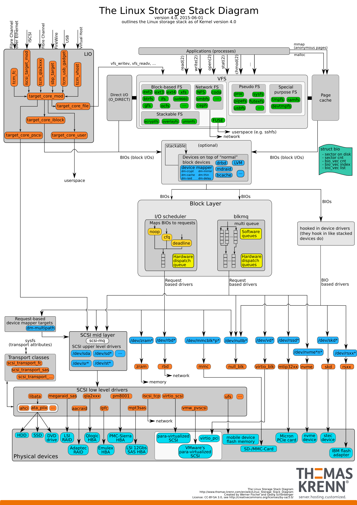

# Linux的IO调度

> 版权声明： 本文章内容在非商业使用前提下可无需授权任意转载、发布。
> 转载、发布请务必注明作者和其微博、微信公众号地址，以便读者询问问题和甄误反馈，共同进步。
> 微博ID：**orroz**
> 微信公众号：**Linux系统技术**

IO调度发生在Linux内核的IO调度层。这个层次是针对Linux的整体IO层次体系来说的。从`read()`或者`write()`系统调用的角度来说，Linux整体IO体系可以分为七层，它们分别是：
1. VFS层：虚拟文件系统层。由于内核要跟多种文件系统打交道，而每一种文件系统所实现的数据结构和相关方法都可能不尽相同，所以，内核抽象了这一层，专门用来适配各种文件系统，并对外提供统一操作接口。
2. 文件系统层：不同的文件系统实现自己的操作过程，提供自己特有的特征，具体不多说了，大家愿意的话自己去看代码即可。
3. 页缓存层：负责真对page的缓存。
4. 通用块层：由于绝大多数情况的io操作是跟块设备打交道，所以Linux在此提供了一个类似vfs层的块设备操作抽象层。下层对接各种不同属性的块设备，对上提供统一的Block IO请求标准。
5. IO调度层：因为绝大多数的块设备都是类似磁盘这样的设备，所以有必要根据这类设备的特点以及应用的不同特点来设置一些不同的调度算法和队列。以便在不同的应用环境下有针对性的提高磁盘的读写效率，这里就是大名鼎鼎的Linux电梯所起作用的地方。针对机械硬盘的各种调度方法就是在这实现的。
6. 块设备驱动层：驱动层对外提供相对比较高级的设备操作接口，往往是C语言的，而下层对接设备本身的操作方法和规范。
7. 块设备层：这层就是具体的物理设备了，定义了各种真对设备操作方法和规范。

有一个已经整理好的[Linux IO结构图](https://www.thomas-krenn.com/de/wikiDE/images/b/ba/Linux-storage-stack-diagram_v4.0.png)，非常经典，一图胜千言：

