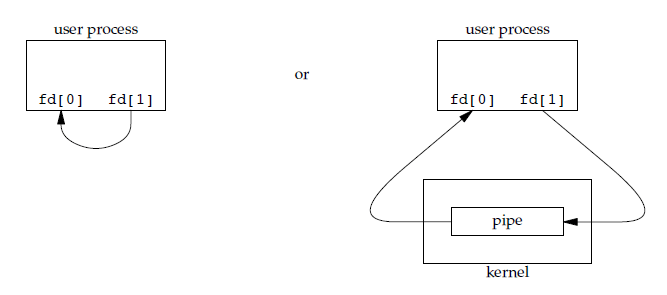
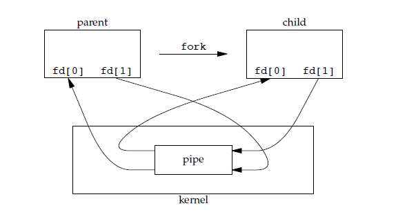

# Linux的进程间通信-管道

> 版权声明： 本文章内容在非商业使用前提下可无需授权任意转载、发布。
> 转载、发布请务必注明作者和其微博、微信公众号地址，以便读者询问问题和甄误反馈，共同进步。
> 微博ID：**orroz**
> 微信公众号：**Linux系统技术**

#### 前言

管道是UNIX环境中历史最悠久的进程间通信方式。本文主要说明在Linux环境上如何使用管道。阅读本文可以帮你解决以下问题：

1. 什么是管道和为什么要有管道？
2. 管道怎么分类？
3. 管道的实现是什么样的？
4. 管道有多大？
5. 管道的大小是不是可以调整？如何调整？

#### 什么是管道？

管道，英文为pipe。这是一个我们在学习Linux命令行的时候就会引入的一个很重要的概念。它的发明人是道格拉斯.麦克罗伊，这位也是UNIX上早期shell的发明人。他在发明了shell之后，发现系统操作执行命令的时候，经常有需求要将一个程序的输出交给另一个程序进行处理，这种操作可以使用输入输出重定向加文件搞定，比如：
```
[zorro@zorro-pc pipe]$ ls -l /etc/ > etc.txt
[zorro@zorro-pc pipe]$ wc -l etc.txt
183 etc.txt
```
但是这样未免显得太麻烦了。所以，管道的概念应运而生。目前在任何一个shell中，都可以使用“|”连接两个命令，shell会将前后两个进程的输入输出用一个管道相连，以便达到进程间通信的目的：
```
[zorro@zorro-pc pipe]$ ls -l /etc/ | wc -l
183
```
对比以上两种方法，我们也可以理解为，管道本质上就是一个文件，前面的进程以写方式打开文件，后面的进程以读方式打开。这样前面写完后面读，于是就实现了通信。实际上管道的设计也是遵循UNIX的“一切皆文件”设计原则的，它本质上就是一个文件。Linux系统直接把管道实现成了一种文件系统，借助VFS给应用程序提供操作接口。

虽然实现形态上是文件，但是管道本身并不占用磁盘或者其他外部存储的空间。在Linux的实现上，它占用的是内存空间。所以，Linux上的管道就是一个操作方式为文件的内存缓冲区。

#### 管道的分类和使用

Linux上的管道分两种类型：

1. 匿名管道
2. 命名管道

这两种管道也叫做有名或无名管道。匿名管道最常见的形态就是我们在shell操作中最常用的”|”。它的特点是只能在父子进程中使用，父进程在产生子进程前必须打开一个管道文件，然后fork产生子进程，这样子进程通过拷贝父进程的进程地址空间获得同一个管道文件的描述符，以达到使用同一个管道通信的目的。此时除了父子进程外，没人知道这个管道文件的描述符，所以通过这个管道中的信息无法传递给其他进程。这保证了传输数据的安全性，当然也降低了管道了通用性，于是系统还提供了命名管道。

我们可以使用mkfifo或mknod命令来创建一个命名管道，这跟创建一个文件没有什么区别：
```
[zorro@zorro-pc pipe]$ mkfifo pipe
[zorro@zorro-pc pipe]$ ls -l pipe
prw-r--r-- 1 zorro zorro 0 Jul 14 10:44 pipe
```
可以看到创建出来的文件类型比较特殊，是p类型。表示这是一个管道文件。有了这个管道文件，系统中就有了对一个管道的全局名称，于是任何两个不相关的进程都可以通过这个管道文件进行通信了。比如我们现在让一个进程写这个管道文件：
```
[zorro@zorro-pc pipe]$ echo xxxxxxxxxxxxxx > pipe
```
此时这个写操作会阻塞，因为管道另一端没有人读。这是内核对管道文件定义的默认行为。此时如果有进程读这个管道，那么这个写操作的阻塞才会解除：
```
[zorro@zorro-pc pipe]$ cat pipe
xxxxxxxxxxxxxx
```
大家可以观察到，当我们cat完这个文件之后，另一端的echo命令也返回了。这就是命名管道。

Linux系统无论对于命名管道和匿名管道，底层都用的是同一种文件系统的操作行为，这种文件系统叫pipefs。大家可以在`/etc/proc/filesystems`文件中找到你的系统是不是支持这种文件系统：
```
[zorro@zorro-pc pipe]$ cat /proc/filesystems |grep pipefs
nodev pipefs
```
观察完了如何在命令行中使用管道之后，我们再来看看如何在系统编程中使用管道。

##### PIPE

我们可以把匿名管道和命名管道分别叫做PIPE和FIFO。这主要因为在系统编程中，创建匿名管道的系统调用是`pipe()`，而创建命名管道的函数是`mkfifo()`。使用`mknod()`系统调用并指定文件类型为为`S_IFIFO`也可以创建一个FIFO。

使用`pipe()`系统调用可以创建一个匿名管道，这个系统调用的原型为：
```
#include <unistd.h> int pipe(int pipefd[2]);
```
这个方法将会创建出两个文件描述符，可以使用pipefd这个数组来引用这两个描述符进行文件操作。`pipefd[0]`是读方式打开，作为管道的读描述符。`pipefd[1]`是写方式打开，作为管道的写描述符。从管道写端写入的数据会被内核缓存直到有人从另一端读取为止。我们来看一下如何在一个进程中使用管道，虽然这个例子并没有什么意义：
```
[zorro@zorro-pc pipe]$ cat pipe.c
#include <stdlib.h>
#include <stdio.h>
#include <unistd.h>
#include <string.h>

#define STRING "hello world!"

int main()
{
    int pipefd[2];
    char buf[BUFSIZ];

    if (pipe(pipefd) == -1) {
        perror("pipe()");
        exit(1);
    }

    if (write(pipefd[1], STRING, strlen(STRING)) < 0) {
        perror("write()");
        exit(1);
    }

    if (read(pipefd[0], buf, BUFSIZ) < 0) {
        perror("write()");
        exit(1);
    }

    printf("%s\n", buf);

    exit(0);
}
```
这个程序创建了一个管道，并且对管道写了一个字符串之后从管道读取，并打印在标准输出上。用一个图来说明这个程序的状态就是这样的：



一个进程自己给自己发送消息这当然不叫进程间通信，所以实际情况中我们不会在单个进程中使用管道。进程在pipe创建完管道之后，往往都要fork产生子进程，成为如下图表示的样子： 



如图中描述，fork产生的子进程会继承父进程对应的文件描述符。利用这个特性，父进程先pipe创建管道之后，子进程也会得到同一个管道的读写文件描述符。从而实现了父子两个进程使用一个管道可以完成半双工通信。此时，父进程可以通过`fd[1]`给子进程发消息，子进程通过`fd[0]`读。子进程也可以通过`fd[1]`给父进程发消息，父进程用`fd[0]`读。程序实例如下： 
```
[zorro@zorro-pc pipe]$ cat pipe_parent_child.c
#include <stdlib.h>
#include <stdio.h>
#include <unistd.h>
#include <string.h>
#include <sys/types.h>
#include <sys/wait.h>

#define STRING "hello world!"

int main()
{
    int pipefd[2];
    pid_t pid;
    char buf[BUFSIZ];

    if (pipe(pipefd) == -1) {
        perror("pipe()");
        exit(1);
    }

    pid = fork();
    if (pid == -1) {
        perror("fork()");
        exit(1);
    }

    if (pid == 0) {
        /* this is child. */
        printf("Child pid is: %d\n", getpid());
        if (read(pipefd[0], buf, BUFSIZ) < 0) {
            perror("write()");
            exit(1);
        }

        printf("%s\n", buf);

        bzero(buf, BUFSIZ);
        snprintf(buf, BUFSIZ, "Message from child: My pid is: %d", getpid());
        if (write(pipefd[1], buf, strlen(buf)) < 0) {
            perror("write()");
            exit(1);
        }
    } else {
        /* this is parent */
        printf("Parent pid is: %d\n", getpid());

        snprintf(buf, BUFSIZ, "Message from parent: My pid is: %d", getpid());
        if (write(pipefd[1], buf, strlen(buf)) < 0) {
            perror("write()");
            exit(1);
        }

        sleep(1);

        bzero(buf, BUFSIZ);
        if (read(pipefd[0], buf, BUFSIZ) < 0) {
            perror("write()");
            exit(1);
        }

        printf("%s\n", buf);
        wait(NULL);
    }

    exit(0);
}

```


来源：[穷佐罗的Linux书](http://liwei.life/2016/07/18/pipe/)