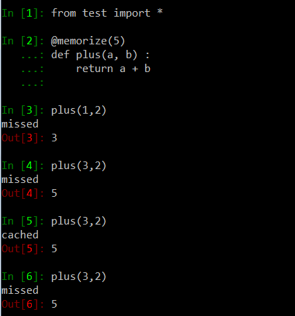

####静态方法装饰器

　　在python中一般关于“静态”有静态变量和静态函数两个东西。静态变量具有全局属性，也就是说它是属于某个类的，而不是这个类所产生的实例。举个例子，下面的示例程序，表示的是统计Test类所创建出的实例个数，其中instancesCount为静态变量。在外部，用函数的方式对静态变量的访问一般有两种情况，一种是通过具体实例访问，另一种是通过类方法直接访问。那么，我们就需要静态方法来实现类的直接访问，即（类名.函数名）的方式。python提供两种方法，一种是通过staticmethod函数将函数转化为静态方法，另一种是通过装饰器的方式，将一个函数装饰成静态方法。
```Python
class Test:
    instanceCount = 0
    def __init__(self):
        Test.instanceCount += 1
    @staticmethod
    def printTotal():
        print Test.instanceCount
    def anotherPrint():
        print Test.instanceCount
    anotherPrint = staticmethod(anotherPrint)
if __name__ == '__main__':
    t1 = Test()
    t2 = Test()
    t3 = Test()
    Test.printTotal()
    Test.anotherPrint()
```
　　提到静态方法的装饰器，那么不得不提的就是类方法的装饰器即classmethod，类方法与静态方法使用起来很相似，都可以通过“类名.函数名”以及“实例名.函数名”的方法使用。但是，区别如下：
>静态方法在定义的时候无需任何其他参数，而类方法则必须传入一个类参数，在调用从父类继承过来的子类的类方法时，子类会传入到类方法中，这是staticmethod所不具备的。

```Python
class test :
    @classmethod
    def echo(cls):
        print cls
class test2(test) :
    passif __name__ == '__main__' :
    test.echo()
    test2.echo()
```
如上面的例子所示，运行结果为：`__main__.test , __main__.test2`。

####一般装饰器

装饰器是个特别有用的机制，@method ，相当于将下面的函数名，作为method的参数传入，然后封装一层后返回一个新的函数。一般的使用方法如下：
```Python
def test(function) :
    def _test2(args):
        print 'Hello'
        function(args)
    return _test2

@test
def echo( args ) :
    print 'world'
```
上面的装饰器例子，相对比较死板，如果装饰器函数也需要参数的话，那么就必须使用第二层封装。如下：
```Python
def hello(fromWho) :
    def _hello(function) :
        def __hello(who) :
            print fromWho ,'say hello to',
            function(who)
        return __hello
    return _hello
@hello('Peter')
def say(who) :
    print who

if __name__ == '__main__' :
    say('David')
```
上例，输出结果为：`Peter say hello to david`

《python高级编程》中提及常见的装饰器包括参数检查，缓存，代理，上下文提供者四种模式。最后，给出一个《python高级编程》里面一个很经典的将装饰器模式应用于缓存的例子。
```Python
import time
import hashlib
import pickle

from itertools import chain

cache = {}

def is_obsolete(entry, duration):
    '''判断是否过期'''return time.time() - entry['time'] > duration

def compute_key(function, args, kwds):
    '''通过sha1算法生成一个key'''
    key = pickle.dumps((function.func_name, args, kwds))
    return hashlib.sha1(key).hexdigest()

def memorize(duration=10):
    def _memorize(function):
        def __memorize(*args, **kwds):
            key = compute_key(function, args, kwds)
            if (key in cache and not is_obsolete(cache[key], duration)):
                print 'cached'return cache[key]['value']
            print 'missed'
            result = function(*args, **kwds)
            cache[key] = {'value':result, 'time':time.time()}
            return result
        return __memorizereturn _memorize
```
测试如下：



来源： [cnblogs](http://www.cnblogs.com/coser/archive/2013/01/28/2581018.html)
