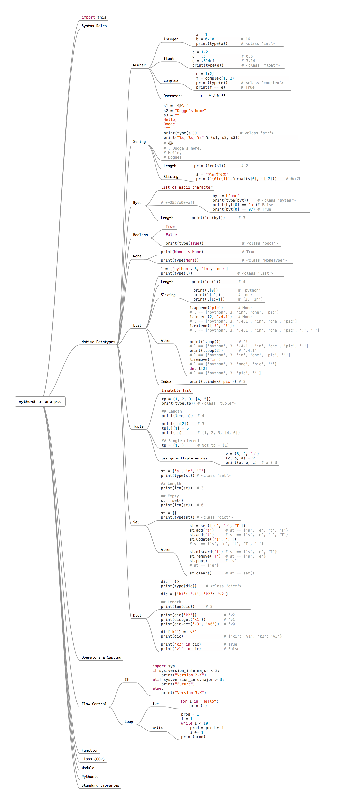

- Python3 in 1 pic



**Python的执行过程**

>当程序执行时，python内部会先将源代码编译成所谓的字节码的形式。字节码是源代码底层的. 与平台无关的表现形式。编译字节码的过程中，会生成一个.pyc的文件，这个文件就是编译之后的字节码。Python真正在运行的就是这个字节码文件，如果生成字节码文件之后没有 再修改过源代码的话，下次程序运行会跳过编译这个步骤，直接运行pyc文件，这是一种启动速度的优化。字节码文件被发送到python虚拟机 （Python Virtual Machine, PVM）上来执行。PVM是python的运行引擎。

>Python字节码不是机器的二进制代码，只是一种中间表示形式，所以python无法运行的和C/C++一样快。

>Python语言有三种主要的实现方式：CPython. Jython和IronPython。

>Python是动态类型的（自动跟踪你的类型而不是要求声明的代码），但也是强类型的（只能对一个对象进行有效的操作）

- 十六进制和八进制表示 0XAF -> 175  , 010 ->8
- math模块 `import math` ，使用的时候`math.sqrt(100)`,当确定自己不会导入多个同名函数的情况下，可以使用`from math import sqrt` ,以后就可以随时使用sqrt函数了。
- 对于虚数的处理，使用cmath（complex math）模块，这样就可以对-1进行sqrt操作了。
- input和raw_input的区别，input会假设用户输入的是合法的Python表达式，使用raw_input函数，它会把所有的输入当做原始数据（raw data），然后将其放在字符串中。除非input有特别的需要，否则应该尽可能使用raw_input函数
- 在字符串前面加r，取消转义
- 列表和元组的主要区别：列表可以修改而元组不能
- 列表的分片，列表[起始点, 终止点之前一点, 步长（默认为1）]
- 字符串不能像列表一样被修改，一般转换为列表然后再进行处理
- 列表a、b，a=a+b的效率要低于`a.extend(b)`，因为前者是在a+b后生成新的列表然后又赋值给a，而后者是在原a的基础上扩展出b的
- pop方法是唯一一个能够修改列表又返回值的方法。`lst.pop()` 返回并删除
- tuple函数将列表转化为元组 tuple([1,2,3])
- 模板字符串：string模块提供一种格式化值的方法：模板字符串。它的工作方式类似于很多UnixShell里的变量替换。 `from string import Template` 。 具体google。
- string模块的join方法是split方法的逆方法。EG：`seq = ['1','2','3','4','5'];sep = ',';s = sep.join(seq)`
- 字符串的title方法，将字符串转换为标题，也就是所有单词的首字母大写，而其他字母小写。`string = "that's all folks.";string.title()=="That'S All Folks."`
- strip方法返回去除两侧（不包括内部）空格的字符串。
- 使用dict的小Demo：
```python
people = {
    'Alice':{
        'phone':1234,
        'address':'beijing'
           },
    'Peter':{
        'phone':4567,
        'address':'shanghai'
            },
    'Micheal':{
        'phone':9012,
        'address':'hangzhou'   
             }
          }
name = raw_input("please input the name : \n")
if(people.has_key(name)==False):
    print "Not exist"
else:
    profile = people[name]
    #use dict to format the string
    print "Phone is : %(phone)s \nAddress is : %(address)s" % profile
```
- 字典的拷贝，字典的普通copy方法是浅拷贝，只是简单的拷贝值，但是如果涉及到应用的拷贝的话，就要考虑使用deepcopy方法进行深拷贝。
- 模块的导入：
```Python
import somemodule
from somemodule import somefunction
from somemodule import somefunction, anthorfunction, yetanthorfunction
from somemodule import *
import math as foobar #使用别名，避免冲突
```
- 交换两个值 `x,y = y,x`
- == 测试相等性，即值是否相等，而 is 用于测试同一性，即是否指向同一个对象
- `a if b else c ;` 如果b为真，则返回a，否则返回c
- 遍历字典
```Python
d = {'x':1,'y':2,'z':3}
#Method1
for key in d:
    print key ,'----->',d[key]
#Method2
for key in d.keys():
    print key ,'----->',d[key]
#Method3
for (key , value) in d.items() :
    print key , '----->' , value
```
- zip函数可以用来进行并行迭代，可以将多个序列"压缩"在一起，然后返回一个元组的列表
```Python
names = ['Peter','Rich','Tom']
ages = [20,23,22]
d = dict(zip(names,ages))
for (name,age) in zip(names,ages):
    print name ,'----', age
print d['Peter']
```
- 在循环中添加else语句，只有在没有调用break语句的时候执行。这样可以方便编写曾经需要flag标记的算法。
- 使用del时候，删除的只是名称，而不是列表本身值，事实上，在python中是没有办法删除值的，系统会自动进行垃圾回收。
- 求斐波那契数列
```Python
def fibs(num):
    'a function document'
    result = [0,1]
    for i in range(num-2):
        result.append(result[-2]+result[-1])
    return result
```
- 抽象函数（参数可以缺省，可以通过*p传递任意数量的参数，传递的是元组；通过**p传递任意数量的参数，传递的是字典）
```Python
def a(*p):
    print p
def b(**p):
    print p
a(1,2,3)
b(a='1',b='2',c='3')
"""
result:
(1, 2, 3)
{'a': '1', 'c': '3', 'b': '2'}
"""
```
- 使用`globals()`函数获取全局变量值，该函数的近亲是vars，它可以返回全局变量的字典（locals返回局部变量的字典）
- 随机函数`random.choice([1,2,3,4])`
- 关于面向对象
```Python
#__metaclass__ = type
class Person:   
    #private variable
    __name = ""
    count = 0
    def setname(self,name):
        self.__name = name
    def getname(self):
        return self.__name
    #private method using '__'
    def __greet(self):
        print "Say hello to %s !"%self.__name
    def greet(self):
        self.__greet()
    def inc(self):
        # ClassName.variableName means the variable belongs to the Class
        # every instance shares the variable
        Person.count+=1
#create instance
p = Person()
p.setname("Peter")
p.inc()
p2 = Person()
p2.setname("Marry")
p2.inc()
print "Name : " , p.getname()
#private method __Method is converted to public method _ClassName__Method
p._Person__greet()
print "Total count of person :  ", Person.count
p.count=12 # change the variable belong to the instance P
print p.count
print p2.count
```
- python支持多重继承，如果一个方法从多个超类继承，那么必须要注意一下超类的顺序（在class语句中）：先继承的类中方法会重写后继承的类中的方法，也就是后来将自动忽略同名的继承。
- 使用`hasattr(tc,'talk')` 判断对象tc时候包含talk属性； 使用`callable(getattr(tc,'talk',None))` 判断对象tc的talk属性是否可以调用，但是在python3.0之后，callable方法已经不再使用了，可以使用 `hasattr(x,'__call__')`代替`callable(x)`；使用setattr可以动态设置对象的属 性，`setattr(tc,'talk',speek)`
- try: except: else: finally: 可以捕捉多个异常，多个异常用元组进行列出，并且可以捕捉对象，
```Python
def test():
    while True:
        try:
            x = raw_input("Please input the x: ")
            y = raw_input("Please input the y: ")
            print int(x)//int(y)
        except ZeroDivisionError as e:
            print "The second number can not be zero"
            print e
        else:
            print "Nothing exception has happened!"
        finally:
            print "Clean up . It will be executed all the time"
```
- 异常和函数：在函数内引发异常时，它就会被传播到函数调用的地方(对于方法也是一样)    
- 构造方法:`def __init__(self , arguments)`
- 子类不会自动调用父类的构造方法
- 查看模块包含的内容可以使用dir函数，它会将对象（以及模块的所有函数、类、变量等）的所有特性列出。`__all__`变量定义了模块的共有接口 （public interface）。更准确的说，它告诉解释器：从模块导入所有名字代表什么含义。eg： `form copy import *` 代码你只能访问`__all__`所定义的接口，而如果想访问其他接口的话，就必须显式地实现，`from copy import PyStringMap`
- shelve模块的简单使用

```Python
'''
Created on 2011-12-11
A demo for shelve
@author: Peter
'''
import shelve
def store_person(db):
    pid = raw_input("Enter the unique id for the person : ")
    if pid in db :
        print "The id exists , please change "
        return
    person = {}
    person['name'] = raw_input("Enter the name of the person : ")
    person['age'] = raw_input("Enter the age of the person : ")
    person['phone'] = raw_input("Enter the phone number of the person : ")
    db[pid] = person

def lookup_person(db):
    pid = raw_input("Enter the id : ")
    if pid not in db :
        print "This is no that person"
        return
    field = raw_input("What would you like to know ? (name,age,phone) : ")
    field = field.strip().lower()
    print field.capitalize()+":"+db[pid][field]

def enter_command():
    cmd = raw_input("Enter command : ")
    cmd = cmd.strip().lower()
    return cmd
def main():
    database = shelve.open("database.bat")
    try:
        while True:
            cmd = enter_command()
            if cmd == 'store':
                store_person(database)
            elif cmd == 'lookup':
                lookup_person(database)
            elif cmd == 'exit':
                return
    finally:
        database.close()
if __name__  == '__main__':main()
```

来源： [cnblogs](http://www.cnblogs.com/coser/archive/2011/12/11/2284245.html)
