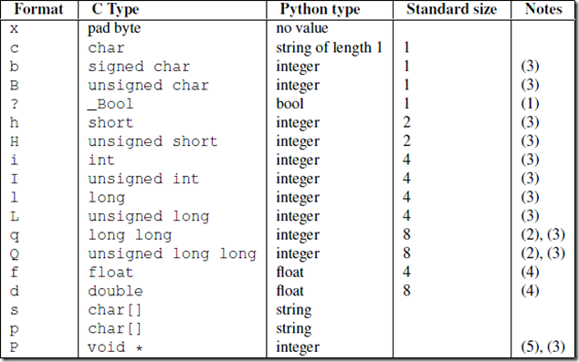

了解c语言的人，一定会知道struct结构体在c语言中的作用，它定义了一种结构，里面包含不同类型的数据(int,char,bool等等)，方便对某一结构对象进行处理。而在网络通信当中，大多传递的数据是以二进制流（binary data）存在的。当传递字符串时，不必担心太多的问题，而当传递诸如int、char之类的基本数据的时候，就需要有一种机制将某些特定的结构体类型打包成二进制流的字符串然后再网络传输，而接收端也应该可以通过某种机制进行解包还原出原始的结构体数据。

python中的struct模块就提供了这样的机制，该模块的主要作用就是对python基本类型值与用python字符串格式表示的C struct类型间的转化（This module performs conversions between Python values and C structs represented as Python strings.）。stuct模块提供了很简单的几个函数，下面是几个例子。

#### 基本的pack和unpack

struct提供用format specifier方式对数据进行打包和解包（Packing and Unpacking）。例如:
```Python
import struct
import binascii
values = (1, 'abc', 2.7)
s = struct.Struct('I3sf')
packed_data = s.pack(*values)
unpacked_data = s.unpack(packed_data)

print 'Original values:', values
print 'Format string :', s.format
print 'Uses :', s.size, 'bytes'
print 'Packed Value :', binascii.hexlify(packed_data)
print 'Unpacked Type :', type(unpacked_data), ' Value:', unpacked_data
```
输出：
```
Original values: (1, 'abc', 2.7)
Format string : I3sf
Uses : 12 bytes
Packed Value : 0100000061626300cdcc2c40
Unpacked Type : <type 'tuple'>  Value: (1, 'abc', 2.700000047683716)
```
代码中，首先定义了一个元组数据，包含int、string、float三种数据类型，然后定义了struct对象，并制定了 `format‘I3sf’`，I 表示int，3s表示三个字符长度的字符串，f 表示 float。最后通过struct的pack和unpack进行打包和解包。通过输出结果可以发现，value被pack之后，转化为了一段二进制字节 串，而unpack可以把该字节串再转换回一个元组，但是值得注意的是对于float的精度发生了改变，这是由一些比如操作系统等客观因素所决定的。打包 之后的数据所占用的字节数与C语言中的struct十分相似。定义format可以参照官方api提供的对照表：

#### 字节顺序

另一方面，打包后的字节顺序默认上是由操作系统的决定的，当然struct模块也提供了自定义字节顺序的功能，可以指定大端存储、小端存储等特定的字节顺序，对于底层通信的字节顺序是十分重要的，不同的字节顺序和存储方式也会导致字节大小的不同。在format字符串前面加上特定的符号即可以表示不同的 字节顺序存储方式，例如采用小端存储 `s = struct.Struct(‘<I3sf’)`就可以了。官方api library 也提供了相应的对照列表：



#### 利用buffer，使用pack_into和unpack_from方法

使用二进制打包数据的场景大部分都是对性能要求比较高的使用环境。而在上面提到的pack方法都是对输入数据进行操作后重新创建了一个内存空间用于返回，也就是说我们每次pack都会在内存中分配出相应的内存资源，这有时是一种很大的性能浪费。struct模块还提供了pack_into() 和 unpack_from()的方法用来解决这样的问题，也就是对一个已经提前分配好的buffer进行字节的填充，而不会每次都产生一个新对象对字节进行存储。
```Python
import struct
import binascii
import ctypes

values = (1, 'abc', 2.7)
s = struct.Struct('I3sf')
prebuffer = ctypes.create_string_buffer(s.size)
print 'Before :',binascii.hexlify(prebuffer)
s.pack_into(prebuffer,0,*values)
print 'After pack:',binascii.hexlify(prebuffer)
unpacked = s.unpack_from(prebuffer,0)
print 'After unpack:',unpacked
```
输出：
```
Before : 000000000000000000000000
After pack: 0100000061626300cdcc2c40
After unpack: (1, 'abc', 2.700000047683716)
```
对比使用pack方法打包，pack_into 方法一直是在对prebuffer对象进行操作，没有产生多余的内存浪费。另外需要注意的一点是，pack_into和unpack_from方法均是对 string buffer对象进行操作，并提供了offset参数，用户可以通过指定相应的offset，使相应的处理变得更加灵活。例如，我们可以把多个对象 pack到一个buffer里面，然后通过指定不同的offset进行unpack：
```Python
import struct
import binascii
import ctypes

values1 = (1, 'abc', 2.7)
values2 = ('defg',101)
s1 = struct.Struct('I3sf')
s2 = struct.Struct('4sI')

prebuffer = ctypes.create_string_buffer(s1.size+s2.size)
print 'Before :',binascii.hexlify(prebuffer)
s1.pack_into(prebuffer,0,*values1)
s2.pack_into(prebuffer,s1.size,*values2)
print 'After pack:',binascii.hexlify(prebuffer)
print s1.unpack_from(prebuffer,0)
print s2.unpack_from(prebuffer,s1.size)
```
输出：
```
Before : 0000000000000000000000000000000000000000
After pack: 0100000061626300cdcc2c406465666765000000
(1, 'abc', 2.700000047683716)
('defg', 101)
```

来源： [cnblogs](http://www.cnblogs.com/coser/archive/2011/12/17/2291160.html)
