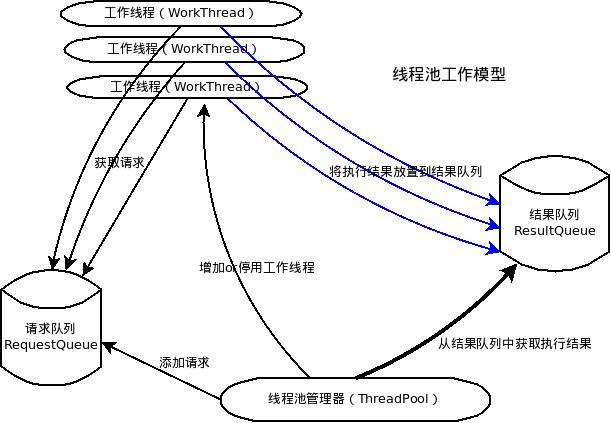

#### 什么是线程池？

诸如web服务器、数据库服务器、文件服务器和邮件服务器等许多服务器应用都面向处理来自某些远程来源的大量短小的任务。构建服务器应用程序的一个过于简单的模型是：每当一个请求到达就创建一个新的服务对象，然后在新的服务对象中为请求服务。但当有大量请求并发访问时，服务器不断的创建和销毁对象的开销很大。所以提高服务器效率的一个手段就是尽可能减少创建和销毁对象的次数，特别是一些很耗资源的对象创建和销毁，这样就引入了“池”的概念，“池”的概念使得人们可以定制一定量的资源，然后对这些资源进行复用，而不是频繁的创建和销毁。

线程池是预先创建线程的一种技术。线程池在还没有任务到来之前，创建一定数量的线程，放入空闲队列中。这些线程都是处于睡眠状态，即均为启动，不消耗CPU，而只是占用较小的内存空间。当请求到来之后，缓冲池给这次请求分配一个空闲线程，把请求传入此线程中运行，进行处理。当预先创建的线程都处于运行状态，即预制线程不够，线程池可以自由创建一定数量的新线程，用于处理更多的请求。当系统比较闲的时候，也可以通过移除一部分一直处于停用状态的线程。

#### 线程池的注意事项

虽然线程池是构建多线程应用程序的强大机制，但使用它并不是没有风险的。在使用线程池时需注意线程池大小与性能的关系，注意并发风险、死锁、资源不足和线程泄漏等问题。
1. 线程池大小。多线程应用并非线程越多越好，需要根据系统运行的软硬件环境以及应用本身的特点决定线程池的大小。一般来说，如果代码结构合理的话，线程数目与CPU 数量相适合即可。如果线程运行时可能出现阻塞现象，可相应增加池的大小；如有必要可采用自适应算法来动态调整线程池的大小，以提高CPU 的有效利用率和系统的整体性能。
2. 并发错误。多线程应用要特别注意并发错误，要从逻辑上保证程序的正确性，注意避免死锁现象的发生。
3. 线程泄漏。这是线程池应用中一个严重的问题，当任务执行完毕而线程没能返回池中就会发生线程泄漏现象。

#### 简单线程池的设计

一个典型的线程池，应该包括如下几个部分：
1. 线程池管理器（ThreadPool），用于启动、停用，管理线程池
2. 工作线程（WorkThread），线程池中的线程
3. 请求接口（WorkRequest），创建请求对象，以供工作线程调度任务的执行
4. 请求队列（RequestQueue）,用于存放和提取请求
5. 结果队列（ResultQueue）,用于存储请求执行后返回的结果

线程池管理器，通过添加请求的方法（putRequest）向请求队列（RequestQueue）添加请求，这些请求事先需要实现请求接口，即传递工作函数、参数、结果处理函数、以及异常处理函数。之后初始化一定数量的工作线程，这些线程通过轮询的方式不断查看请求队列（RequestQueue），只要有请求存在，则会提取出请求，进行执行。然后，线程池管理器调用方法（poll）查看结果队列 （resultQueue）是否有值，如果有值则取出，调用结果处理函数执行。通过以上讲述，不难发现，这个系统的核心资源在于请求队列和结果队列，工作线程通过轮询requestQueue获得人物，主线程通过查看结果队列，获得执行结果。因此，对这个队列的设计，要实现线程同步，以及一定阻塞和超时机制的设计，以防止因为不断轮询而导致的过多cpu开销。在本文中，将会用python语言实现，python的Queue，就是很好的实现了对线程同步机制。



使用Python实现：
```Python
#-*-encoding:utf-8-*-
'''
Created on 2012-3-9
@summary: 线程池
@contact: mailto:zhanglixinseu@gmail.com
@author: zhanglixin
'''
import sys
import threading
import Queue
import traceback

# 定义一些Exception，用于自定义异常处理

class NoResultsPending(Exception):
    """All works requests have been processed"""
    pass

class NoWorkersAvailable(Exception):
    """No worket threads available to process remaining requests."""
    pass

def _handle_thread_exception(request, exc_info):
    """默认的异常处理函数，只是简单的打印"""
    traceback.print_exception(*exc_info)

#classes

class WorkerThread(threading.Thread):
    """后台线程，真正的工作线程，从请求队列(requestQueue)中获取work，
    并将执行后的结果添加到结果队列(resultQueue)"""
    def __init__(self,requestQueue,resultQueue,poll_timeout=5,**kwds):
        threading.Thread.__init__(self,**kwds)
        '''设置为守护进行'''
        self.setDaemon(True)
        self._requestQueue = requestQueue
        self._resultQueue = resultQueue
        self._poll_timeout = poll_timeout
        '''设置一个flag信号，用来表示该线程是否还被dismiss,默认为false'''
        self._dismissed = threading.Event()
        self.start()

    def run(self):
        '''每个线程尽可能多的执行work，所以采用loop，
        只要线程可用，并且requestQueue有work未完成，则一直loop'''
        while True:
            if self._dismissed.is_set():
                break
            try:
                '''
                Queue.Queue队列设置了线程同步策略，并且可以设置timeout。
                一直block，直到requestQueue有值，或者超时
                '''
                request = self._requestQueue.get(True,self._poll_timeout)
            except Queue.Empty:
                continue
            else:
                '''之所以在这里再次判断dimissed，是因为之前的timeout时间里，很有可能，该线程被dismiss掉了'''
                if self._dismissed.is_set():
                    self._requestQueue.put(request)
                    break
                try:
                    '''执行callable，讲请求和结果以tuple的方式放入requestQueue'''
                    result = request.callable(*request.args,**request.kwds)
                    print self.getName()
                    self._resultQueue.put((request,result))
                except:
                    '''异常处理'''
                    request.exception = True
                    self._resultQueue.put((request,sys.exc_info()))

    def dismiss(self):
        '''设置一个标志，表示完成当前work之后，退出'''
        self._dismissed.set()


class WorkRequest:
    '''
    @param callable_:，可定制的，执行work的函数
    @param args: 列表参数
    @param kwds: 字典参数
    @param requestID: id
    @param callback: 可定制的，处理resultQueue队列元素的函数
    @param exc_callback:可定制的，处理异常的函数
    '''
    def __init__(self,callable_,args=None,kwds=None,requestID=None,
                 callback=None,exc_callback=_handle_thread_exception):
        if requestID == None:
            self.requestID = id(self)
        else:
            try:
                self.requestID = hash(requestID)
            except TypeError:
                raise TypeError("requestId must be hashable")    
        self.exception = False
        self.callback = callback
        self.exc_callback = exc_callback
        self.callable = callable_
        self.args = args or []
        self.kwds = kwds or {}

    def __str__(self):
        return "WorkRequest id=%s args=%r kwargs=%r exception=%s" % \
            (self.requestID,self.args,self.kwds,self.exception)

class ThreadPool:
    '''
    @param num_workers:初始化的线程数量
    @param q_size,resq_size: requestQueue和result队列的初始大小
    @param poll_timeout: 设置工作线程WorkerThread的timeout，也就是等待requestQueue的timeout
    '''
    def __init__(self,num_workers,q_size=0,resq_size=0,poll_timeout=5):
        self._requestQueue = Queue.Queue(q_size)
        self._resultQueue = Queue.Queue(resq_size)
        self.workers = []
        self.dismissedWorkers = []
        self.workRequests = {} #设置个字典，方便使用
        self.createWorkers(num_workers,poll_timeout)

    def createWorkers(self,num_workers,poll_timeout=5):
        '''创建num_workers个WorkThread,默认timeout为5'''
        for i in range(num_workers):
            self.workers.append(WorkerThread(self._requestQueue,self._resultQueue,poll_timeout=poll_timeout))

    def dismissWorkers(self,num_workers,do_join=False):
        '''停用num_workers数量的线程，并加入dismiss_list'''
        dismiss_list = []
        for i in range(min(num_workers,len(self.workers))):
            worker = self.workers.pop()
            worker.dismiss()
            dismiss_list.append(worker)
        if do_join :
            for worker in dismiss_list:
                worker.join()
        else:
            self.dismissedWorkers.extend(dismiss_list)

    def joinAllDismissedWorkers(self):
        '''join 所有停用的thread'''
        #print len(self.dismissedWorkers)
        for worker in self.dismissedWorkers:
            worker.join()
        self.dismissedWorkers = []

    def putRequest(self,request ,block=True,timeout=None):
        assert isinstance(request,WorkRequest)
        assert not getattr(request,'exception',None)
        '''当queue满了，也就是容量达到了前面设定的q_size,它将一直阻塞，直到有空余位置，或是timeout'''
        self._requestQueue.put(request, block, timeout)
        self.workRequests[request.requestID] = request

    def poll(self,block = False):
        while True:
            if not self.workRequests:
                raise NoResultsPending
            elif block and not self.workers:
                raise NoWorkersAvailable
            try:
                '''默认只要resultQueue有值，则取出，否则一直block'''
                request , result = self._resultQueue.get(block=block)
                if request.exception and request.exc_callback:
                    request.exc_callback(request,result)
                if request.callback and not (request.exception and request.exc_callback):
                    request.callback(request,result)
                del self.workRequests[request.requestID]
            except Queue.Empty:
                break

    def wait(self):
        while True:
            try:
                self.poll(True)
            except NoResultsPending:
                break

    def workersize(self):
        return len(self.workers)

    def stop(self):
        '''join 所有的thread,确保所有的线程都执行完毕'''
        self.dismissWorkers(self.workersize(),True)
        self.joinAllDismissedWorkers()
```
测试代码：
```Python
#Test a demo
if __name__=='__main__':
    import random
    import time
    import datetime
    def do_work(data):
        time.sleep(random.randint(1,3))
        res = str(datetime.datetime.now()) + "" +str(data)
        return res

    def print_result(request,result):
        print "---Result from request %s : %r" % (request.requestID,result)

    main = ThreadPool(3)
    for i in range(40):
        req = WorkRequest(do_work,args=[i],kwds={},callback=print_result)
        main.putRequest(req)
        print "work request #%s added." % req.requestID

    print '-'*20, main.workersize(),'-'*20

    counter = 0
    while True:
        try:
            time.sleep(0.5)
            main.poll()
            if(counter==5):
                print "Add 3 more workers threads"
                main.createWorkers(3)
                print '-'*20, main.workersize(),'-'*20
            if(counter==10):
                print "dismiss 2 workers threads"
                main.dismissWorkers(2)
                print '-'*20, main.workersize(),'-'*20
            counter+=1
        except NoResultsPending:
            print "no pending results"
            break

    main.stop()
    print "Stop"
```

参考文献：
1. 程序原型：[Threadpool](http://chrisarndt.de/projects/threadpool/)
2. 王华,马亮,顾明.线程池技术研究与应用[J].计算机应用研究
3. 李昊,刘志镜.线程池技术的研究[J].现代电子技术
4. 赵海,李志蜀,韩学为,叶浩.线程池的优化设计[J].四川大学学报(自然科学版)

附:Python的多线程问题

python 的GIL规定每个时刻只能有一个线程访问python虚拟机，所以你要用python的多线程来做计算是很不合算的，但是对于IO密集型的应用，例如网络交互来说，python的多线程还是非常给力的。

如果你是一个计算密集型的任务，非要用python来并行执行的话，有以下几个方法：
1. 使用python的multiprocessing 模块，能够发挥多核的优势。
2. 使用ironPython，但是这个只能在windows下用
3. 使用pypy，这个可以实现真正的多线程。

来源：[cnblogs](http://www.cnblogs.com/coser/archive/2012/03/10/2389264.html)
